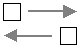

# Enterprise Integration Patterns

---

## Používání návrhových vzorů

---

## Osnova

* Vzory nejsou vynalézány, ale rozpoznávány v praxi
* Každá aplikace je odlišná
* Aplikace se postupně mění
* Komunikace v současnosti: mikroslužby a serverless řešení
* Komunikace po síti není spolehlivá
* Komunikace po síti je pomalá
* Architektura založená na mikroslužbách
* Příklady řešení komunikace ve světě mikroslužeb

---

## Návrhové vzory pro enterprise systémy (1/2)

* Enterprise systém založený na mikroslužbách
* Používá se relativně malá sada ustálených způsobů
    - vzorů
* Vzory nejsou vynalézány, ale rozpoznávány v praxi
* Standardizace
    - slovní popis (slovník)
    - grafická podoba

---

## Návrhové vzory pro enterprise systémy (2/2)

* Snaha vyhnout se slepým uličkám
    - ty již někdo prozkoumal za nás
    - (a zaplatil za to)

---

## Standardizace - slovník

* Message
* Message bus
* Dead letter channel
* Pipe
* Filter
* Message router
* Guaranteed Delivery
* ...

---

## Standardizace - grafika

---

## Mikroslužby

* Vytvářeny různými týmy
    - odlišné ekosystémy (programovací jazyk, prostředky)
    - odlišné způsoby nasazení
* Požadavky + implementace se postupně mění
* Přidávání dalších služeb
* plus další náklady
    - monitoring
    - alerting

---

## Komunikace mezi mikroslužbami

* Koordinace mezi mikroslužbami
* Komunikace mezi mikroslužbami
* Typicky řešeno posíláním zpráv
    - informace o událostech
    - příkazy
    - dotazy
* Synchronní či asynchronní zpracování
* Distribuované transakce

---

## Komunikace mezi mikroslužbami

* Komunikace po síti není spolehlivá
    - potvrzování (?)
    - distribuované transakce (?)
* Komunikace po síti je pomalá

---

---

---

## Komunikační strategie

* Ad-hoc
* Bez nutnosti použití message brokera
* S použitím message brokera
* Využití dalších technologií
    - sběrnice
    - streaming

---

## Komunikace bez message brokera

---

## Požadavek-odpověď

---

## Požadavek-odpověď

---

## Požadavek-odpověď

* často zneužíváno
    - polling
* spojení
    - stálé
    - nebo pro jedinou dvojici požadavek/odpověď

---

## Oboustranná komunikace

* navázání připojení
   - typicky stálé připojení
* dvojice uzlů
* posílání zpráv oběma směry
   - přímé
   - fronty

---

## Surveyor

* poslán požadavek na odpověď
* časový limit
* v časovém intervalu jsou sbírány odpovědi
* service discovery, hlasovací algoritmy atd.

---

## Surveyor

---

## CQS a CQRS

* Command–query separation (CQS)
* Command-query responsibility segregation (CQRS)
    - COMMAND
    - EVENT
    - QUERY

---

## CQS a CQRS

* V EIP:
    - [C] command message
    - [D] document message
    - [E] event message
    - (request-reply messages)

---

## Komunikace využívající message brokera

---

## Message brokeři

* ActiveMQ (Artemis)
* RabbitMQ
* IBM MQ
* Amazon SQS (broker jako služba)
* ...

---

## Komunikační strategie a message brokeři

---

### Publish-subscribe

---

### Publish-subscribe

---

### Publish-subscribe s frontou

---

### Message channel

---

### Point-to-point channel

* Only one receiver consume message

---

### Competing consumers

---

### Push-pull

---

### Message routers

* Fan-in/fan-out lze považovat za speciální případy

[message_routers](images/eip_message_routers.gif)

---

## Apache Kafka

---

## Apache Kafka

* Zcela nezapadá do konceptu EIP
* Některé aspekty Kafky lze namodelovat

---

---

## Apache Camel

* [https://camel.apache.org/components/3.17.x/eips/enterprise-integration-patterns.html](https://camel.apache.org/components/3.17.x/eips/enterprise-integration-patterns.html)

---

---

## Architektura lambda

---

## Architektura kappa
