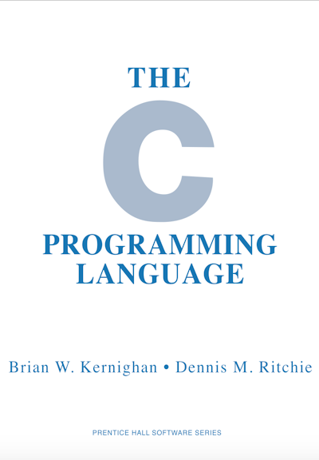
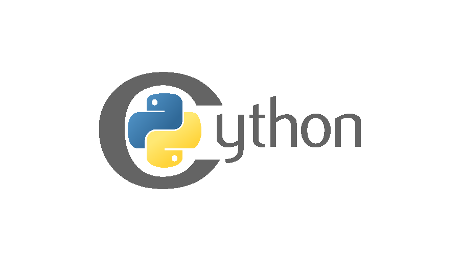

# How to make Python faster

AOT, JIT and noGIL technologies 

---

* Pavel Tišnovský
* tisnik@centrum.cz


---

## Where's the problem?

```python
def add_two_numbers(x, y):
    return x + y


z = add_two_numbers(123, 456)
print(z)
```

---

### Code is too universal

```
  3           0 RESUME                   0

  4           2 LOAD_FAST                0 (x)
              4 LOAD_FAST                1 (y)
              6 BINARY_OP                0 (+)
             10 RETURN_VALUE
```

---

### Code is too universal

```python
import dis

def add_two_numbers(x, y):
    return x + y


class Foo:
    def __init__(self, value):
        self._value = value

    def __add__(self, other):
        return Foo(self._value + other._value)

    def __str__(self):
        return "*" * self._value


def test_adding():
    f1 = Foo(1)
    f2 = Foo(2)

    print(add_two_numbers(123, 456))
    print(add_two_numbers("foo", "bar"))
    print(add_two_numbers([1,2,3], [4,5,6]))
    print(add_two_numbers((1,2,3), (4,5,6)))
    print(add_two_numbers(f1, f2))


test_adding()
dis.dis(add_two_numbers)
dis.dis(test_adding)
```

---

## Where's the problem?

```python
def worker():
    """Some task that takes time."""

# let's try multithreading
threading.Thread(target=worker).start()
threading.Thread(target=worker).start()
threading.Thread(target=worker).start()
# oh no
```

---

### Goal

---



---

# Solutions

* AOT compilers
* JIT compilers
* "no GIL" variants

---

## AOT

* Ahead-of-time compilation
* Performed before execution
    - or part of startup
* More aggressive
    - can be time consuming
* Can be made part of CI/CI
* Can not perform PGO (Profile Guided Optimization)
* Can not fully perform speculative optimizations

---

## JIT

* Just-in-time compilation
* Performed during execution
* Need to be a bit picky
    - too aggressive optimizations lower performance
* Is able to perform PGO (Profile Guided Optimization)
* Is able to perform speculative optimizations
    - can backtrack if things go wrong

---

## Technologies available today

* Cython
* Numba
* Nuitka
* mypyc

---



---

## Cython

* Superset of Python programming language
* Compiled language
    - in fact it is transpiler to C
    - .pyx -> .c -> .so -> launch.py
* Explicit data types are optional
    - type hints
* `nogil`
* Ability to call native functions

---

### Compilation into C

```python
cdef add_two_numbers(x, y):
    return x + y


z = add_two_numbers(123, 456)
print(z)
```

---

### Compilation into C

```python
import cython

@cython.cfunc
def add_two_numbers(x, y):
    return x + y


z = add_two_numbers(123, 456)
print(z)
```

---

### Resulting C code

```C
static PyObject *__pyx_f_13add_numbers_2_add_two_numbers(PyObject *__pyx_v_x, PyObject *__pyx_v_y) {
  PyObject *__pyx_r = NULL;
  __Pyx_RefNannyDeclarations
  PyObject *__pyx_t_1 = NULL;
  int __pyx_lineno = 0;
  const char *__pyx_filename = NULL;
  int __pyx_clineno = 0;
  __Pyx_RefNannySetupContext("add_two_numbers", 1);

  __Pyx_XDECREF(__pyx_r);
  __pyx_t_1 = PyNumber_Add(__pyx_v_x, __pyx_v_y); if (unlikely(!__pyx_t_1)) __PYX_ERR(0, 2, __pyx_L1_error)
  __Pyx_GOTREF(__pyx_t_1);
  __pyx_r = __pyx_t_1;
  __pyx_t_1 = 0;
  goto __pyx_L0;

  /* function exit code */
  __pyx_L1_error:;
  __Pyx_XDECREF(__pyx_t_1);
  __Pyx_AddTraceback("add_numbers_2.add_two_numbers", __pyx_clineno, __pyx_lineno, __pyx_filename);
  __pyx_r = 0;
  __pyx_L0:;
  __Pyx_XGIVEREF(__pyx_r);
  __Pyx_RefNannyFinishContext();
  return __pyx_r;
}
```

---

### Explicit parameter types

```python
cdef add_two_numbers(int x, int y):
    return x + y


z = add_two_numbers(123, 456)
print(z)
```

---

### Explicit parameter types

```python
import cython

@cython.cfunc
def add_two_numbers(x: cython.int, y: cython.int):
    return x + y


z = add_two_numbers(123, 456)
print(z)
```

---

### Resulting C code

```C
static PyObject *__pyx_f_13add_numbers_3_add_two_numbers(int __pyx_v_x, int __pyx_v_y) {
  PyObject *__pyx_r = NULL;
  __Pyx_RefNannyDeclarations
  PyObject *__pyx_t_1 = NULL;
  int __pyx_lineno = 0;
  const char *__pyx_filename = NULL;
  int __pyx_clineno = 0;
  __Pyx_RefNannySetupContext("add_two_numbers", 1);

  __Pyx_XDECREF(__pyx_r);
  __pyx_t_1 = __Pyx_PyInt_From_int((__pyx_v_x + __pyx_v_y)); if (unlikely(!__pyx_t_1)) __PYX_ERR(0, 2, __pyx_L1_error)
  __Pyx_GOTREF(__pyx_t_1);
  __pyx_r = __pyx_t_1;
  __pyx_t_1 = 0;
  goto __pyx_L0;

  /* function exit code */
  __pyx_L1_error:;
  __Pyx_XDECREF(__pyx_t_1);
  __Pyx_AddTraceback("add_numbers_3.add_two_numbers", __pyx_clineno, __pyx_lineno, __pyx_filename);
  __pyx_r = 0;
  __pyx_L0:;
  __Pyx_XGIVEREF(__pyx_r);
  __Pyx_RefNannyFinishContext();
  return __pyx_r;
}
```

---

### Differences

```C
  __pyx_t_1 = PyNumber_Add(__pyx_v_x, __pyx_v_y); if (unlikely(!__pyx_t_1)) __PYX_ERR(0, 2, __pyx_L1_error)
```

```C
  __pyx_t_1 = __Pyx_PyInt_From_int((__pyx_v_x + __pyx_v_y)); if (unlikely(!__pyx_t_1)) __PYX_ERR(0, 2, __pyx_L1_error)
```

---

### Explicit return type

```python
cdef int add_two_numbers(int x, int y):
    return x + y


z = add_two_numbers(123, 456)
print(z)
```

---

### Explicit return type

```python
import cython

@cython.cfunc
def add_two_numbers(x: cython.int, y: cython.int) -> cython.int:
    return x + y


z = add_two_numbers(123, 456)
print(z)
```

---

### Resulting C code

```C
static int __pyx_f_13add_numbers_4_add_two_numbers(int __pyx_v_x, int __pyx_v_y) {
  int __pyx_r;

  __pyx_r = (__pyx_v_x + __pyx_v_y);
  goto __pyx_L0;

  /* function exit code */
  __pyx_L0:;
  return __pyx_r;
}
```

---

### Disable GIL-related locks

```python
cdef int add_two_numbers(int x, int y) nogil:
    return x + y


z = add_two_numbers(123, 456)
print(z)
```

---

### Disable GIL-related locks

```python
import cython

@cython.cfunc
@cython.nogil
def add_two_numbers(x: cython.int, y: cython.int) -> cython.int:
    return x + y


z = add_two_numbers(123, 456)
print(z)
```

---

### Resulting C code

```C
static int __pyx_f_13add_numbers_5_add_two_numbers(int __pyx_v_x, int __pyx_v_y) {
  int __pyx_r;

  __pyx_r = (__pyx_v_x + __pyx_v_y);
  goto __pyx_L0;

  /* function exit code */
  __pyx_L0:;
  return __pyx_r;
}
```

---

### Problems with Python functions

```python
cdef int add_two_numbers(int x, int y) nogil:
    print(x)
    return x + y


z = add_two_numbers(123, 456)
print(z)
```

---

### Compilation errors

```
Error compiling Cython file:
------------------------------------------------------------
...
cdef int add_two_numbers(int x, int y) nogil:
    print(x)
         ^
------------------------------------------------------------

add_numbers_6.pyx:2:9: Discarding owned Python object not allowed without gil

Error compiling Cython file:
------------------------------------------------------------
...
cdef int add_two_numbers(int x, int y) nogil:
    print(x)
         ^
------------------------------------------------------------

add_numbers_6.pyx:2:9: Calling gil-requiring function not allowed without gil

Error compiling Cython file:
------------------------------------------------------------
...
cdef int add_two_numbers(int x, int y) nogil:
    print(x)
         ^
------------------------------------------------------------

add_numbers_6.pyx:2:9: Constructing Python tuple not allowed without gil

Error compiling Cython file:
------------------------------------------------------------
...
cdef int add_two_numbers(int x, int y) nogil:
    print(x)
          ^
------------------------------------------------------------

add_numbers_6.pyx:2:10: Converting to Python object not allowed without gil
```

---

### Use C standard functions

```python
from libc.stdio cimport printf


cdef int add_two_numbers(int x, int y) nogil:
    printf("%i\n", x)
    return x + y


z = add_two_numbers(123, 456)
print(z)
```

---

### Use C standard functions

```python
from cython.cimports.libc.stdio import printf

@cython.cfunc
@cython.nogil
def add_two_numbers(x: cython.int, y: cython.int) -> cython.int:
    printf("%d\n", x)
    return x + y


z = add_two_numbers(123, 456)
print(z)
```

---

### Resulting C code

```C
static int __pyx_f_13add_numbers_7_add_two_numbers(int __pyx_v_x, int __pyx_v_y) {
  int __pyx_r;

  (void)(printf(((char const *)"%i\n"), __pyx_v_x));

  __pyx_r = (__pyx_v_x + __pyx_v_y);
  goto __pyx_L0;

  /* function exit code */
  __pyx_L0:;
  return __pyx_r;
}
```

---


---

## Numba

* Just in time compiler for Python
* Provides `@jit` decorator and more

```python
from numba import jit

@jit
def function():
    pass
```

---


---

## Mypyc

---


---

## Nuitka

---
