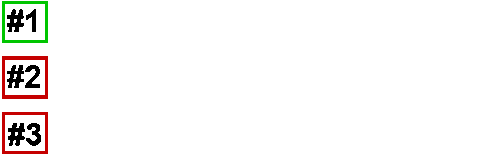

# How to make Python faster

AOT, JIT and noGIL technologies 

---

* Pavel Tišnovský
* tisnik@centrum.cz


---

## Where's the problem?

```python
def add_two_numbers(x, y):
    return x + y


z = add_two_numbers(123, 456)
print(z)
```

---

### Code is too universal

```
  3           0 RESUME                   0

  4           2 LOAD_FAST                0 (x)
              4 LOAD_FAST                1 (y)
              6 BINARY_OP                0 (+)
             10 RETURN_VALUE
```

---

### Code is too universal

```python
import dis

def add_two_numbers(x, y):
    return x + y


class Foo:
    def __init__(self, value):
        self._value = value

    def __add__(self, other):
        return Foo(self._value + other._value)

    def __str__(self):
        return "*" * self._value


def test_adding():
    f1 = Foo(1)
    f2 = Foo(2)

    print(add_two_numbers(123, 456))
    print(add_two_numbers("foo", "bar"))
    print(add_two_numbers([1,2,3], [4,5,6]))
    print(add_two_numbers((1,2,3), (4,5,6)))
    print(add_two_numbers(f1, f2))


test_adding()
dis.dis(add_two_numbers)
dis.dis(test_adding)
```

---

## Where's the problem?

```python
def worker():
    """Some task that takes time."""

# let's try multithreading
threading.Thread(target=worker).start()
threading.Thread(target=worker).start()
threading.Thread(target=worker).start()
# oh no
```

---

### GIL

* Threads just concurrent, not parallel



---

### Goal

---


---

# Solutions

* AOT compilers
* JIT compilers
* "no GIL" variants

---

## AOT

* Ahead-of-time compilation
* Performed before execution
    - or part of startup
* More aggressive
    - can be time consuming
* Can be made part of CI/CI
* Can not perform PGO (Profile Guided Optimization)
* Can not fully perform speculative optimizations

---

## JIT

* Just-in-time compilation
* Performed during execution
* Need to be a bit picky
    - too aggressive optimizations lower performance
* Is able to perform PGO (Profile Guided Optimization)
* Is able to perform speculative optimizations
    - can backtrack if things go wrong

---

## Python w/o GIL

* Recent CPython optimized slightly
* CPython w/o GIL
    - fork of standard CPython
* Most AOT/JIT compilers support "nogil"

---

## Technologies available today

* Cython
* Numba
* Nuitka
* mypyc

---


---

## Cython

* Superset of Python programming language
* Compiled language
    - in fact it is transpiler to C
    - .pyx -> .c -> .so -> launch.py
* Explicit data types are optional
    - type hints
* `nogil`
* Ability to call native functions

---

### Compilation into C

```python
cdef add_two_numbers(x, y):
    return x + y


z = add_two_numbers(123, 456)
print(z)
```

---

### Compilation into C

```python
import cython

@cython.cfunc
def add_two_numbers(x, y):
    return x + y


z = add_two_numbers(123, 456)
print(z)
```

---

### Resulting C code

```C
static PyObject *__pyx_f_13add_numbers_2_add_two_numbers(PyObject *__pyx_v_x, PyObject *__pyx_v_y) {
  PyObject *__pyx_r = NULL;
  __Pyx_RefNannyDeclarations
  PyObject *__pyx_t_1 = NULL;
  int __pyx_lineno = 0;
  const char *__pyx_filename = NULL;
  int __pyx_clineno = 0;
  __Pyx_RefNannySetupContext("add_two_numbers", 1);

  __Pyx_XDECREF(__pyx_r);
  __pyx_t_1 = PyNumber_Add(__pyx_v_x, __pyx_v_y); if (unlikely(!__pyx_t_1)) __PYX_ERR(0, 2, __pyx_L1_error)
  __Pyx_GOTREF(__pyx_t_1);
  __pyx_r = __pyx_t_1;
  __pyx_t_1 = 0;
  goto __pyx_L0;

  /* function exit code */
  __pyx_L1_error:;
  __Pyx_XDECREF(__pyx_t_1);
  __Pyx_AddTraceback("add_numbers_2.add_two_numbers", __pyx_clineno, __pyx_lineno, __pyx_filename);
  __pyx_r = 0;
  __pyx_L0:;
  __Pyx_XGIVEREF(__pyx_r);
  __Pyx_RefNannyFinishContext();
  return __pyx_r;
}
```

---

### Explicit parameter types

```python
cdef add_two_numbers(int x, int y):
    return x + y


z = add_two_numbers(123, 456)
print(z)
```

---

### Explicit parameter types

```python
import cython

@cython.cfunc
def add_two_numbers(x: cython.int, y: cython.int):
    return x + y


z = add_two_numbers(123, 456)
print(z)
```

---

### Resulting C code

```C
static PyObject *__pyx_f_13add_numbers_3_add_two_numbers(int __pyx_v_x, int __pyx_v_y) {
  PyObject *__pyx_r = NULL;
  __Pyx_RefNannyDeclarations
  PyObject *__pyx_t_1 = NULL;
  int __pyx_lineno = 0;
  const char *__pyx_filename = NULL;
  int __pyx_clineno = 0;
  __Pyx_RefNannySetupContext("add_two_numbers", 1);

  __Pyx_XDECREF(__pyx_r);
  __pyx_t_1 = __Pyx_PyInt_From_int((__pyx_v_x + __pyx_v_y)); if (unlikely(!__pyx_t_1)) __PYX_ERR(0, 2, __pyx_L1_error)
  __Pyx_GOTREF(__pyx_t_1);
  __pyx_r = __pyx_t_1;
  __pyx_t_1 = 0;
  goto __pyx_L0;

  /* function exit code */
  __pyx_L1_error:;
  __Pyx_XDECREF(__pyx_t_1);
  __Pyx_AddTraceback("add_numbers_3.add_two_numbers", __pyx_clineno, __pyx_lineno, __pyx_filename);
  __pyx_r = 0;
  __pyx_L0:;
  __Pyx_XGIVEREF(__pyx_r);
  __Pyx_RefNannyFinishContext();
  return __pyx_r;
}
```

---

### Differences

```C
  __pyx_t_1 = PyNumber_Add(__pyx_v_x, __pyx_v_y); if (unlikely(!__pyx_t_1)) __PYX_ERR(0, 2, __pyx_L1_error)
```

```C
  __pyx_t_1 = __Pyx_PyInt_From_int((__pyx_v_x + __pyx_v_y)); if (unlikely(!__pyx_t_1)) __PYX_ERR(0, 2, __pyx_L1_error)
```

---

### Explicit return type

```python
cdef int add_two_numbers(int x, int y):
    return x + y


z = add_two_numbers(123, 456)
print(z)
```

---

### Explicit return type

```python
import cython

@cython.cfunc
def add_two_numbers(x: cython.int, y: cython.int) -> cython.int:
    return x + y


z = add_two_numbers(123, 456)
print(z)
```

---

### Resulting C code

```C
static int __pyx_f_13add_numbers_4_add_two_numbers(int __pyx_v_x, int __pyx_v_y) {
  int __pyx_r;

  __pyx_r = (__pyx_v_x + __pyx_v_y);
  goto __pyx_L0;

  /* function exit code */
  __pyx_L0:;
  return __pyx_r;
}
```

---

### Disable GIL-related locks

```python
cdef int add_two_numbers(int x, int y) nogil:
    return x + y


z = add_two_numbers(123, 456)
print(z)
```

---

### Disable GIL-related locks

```python
import cython

@cython.cfunc
@cython.nogil
def add_two_numbers(x: cython.int, y: cython.int) -> cython.int:
    return x + y


z = add_two_numbers(123, 456)
print(z)
```

---

### Resulting C code

```C
static int __pyx_f_13add_numbers_5_add_two_numbers(int __pyx_v_x, int __pyx_v_y) {
  int __pyx_r;

  __pyx_r = (__pyx_v_x + __pyx_v_y);
  goto __pyx_L0;

  /* function exit code */
  __pyx_L0:;
  return __pyx_r;
}
```

---

### Problems with Python functions

```python
cdef int add_two_numbers(int x, int y) nogil:
    print(x)
    return x + y


z = add_two_numbers(123, 456)
print(z)
```

---

### Compilation errors

```
Error compiling Cython file:
------------------------------------------------------------
...
cdef int add_two_numbers(int x, int y) nogil:
    print(x)
         ^
------------------------------------------------------------

add_numbers_6.pyx:2:9: Discarding owned Python object not allowed without gil

Error compiling Cython file:
------------------------------------------------------------
...
cdef int add_two_numbers(int x, int y) nogil:
    print(x)
         ^
------------------------------------------------------------

add_numbers_6.pyx:2:9: Calling gil-requiring function not allowed without gil

Error compiling Cython file:
------------------------------------------------------------
...
cdef int add_two_numbers(int x, int y) nogil:
    print(x)
         ^
------------------------------------------------------------

add_numbers_6.pyx:2:9: Constructing Python tuple not allowed without gil

Error compiling Cython file:
------------------------------------------------------------
...
cdef int add_two_numbers(int x, int y) nogil:
    print(x)
          ^
------------------------------------------------------------

add_numbers_6.pyx:2:10: Converting to Python object not allowed without gil
```

---

### Use C standard functions

```python
from libc.stdio cimport printf


cdef int add_two_numbers(int x, int y) nogil:
    printf("%i\n", x)
    return x + y


z = add_two_numbers(123, 456)
print(z)
```

---

### Use C standard functions

```python
from cython.cimports.libc.stdio import printf

@cython.cfunc
@cython.nogil
def add_two_numbers(x: cython.int, y: cython.int) -> cython.int:
    printf("%d\n", x)
    return x + y


z = add_two_numbers(123, 456)
print(z)
```

---

### Resulting C code

```C
static int __pyx_f_13add_numbers_7_add_two_numbers(int __pyx_v_x, int __pyx_v_y) {
  int __pyx_r;

  (void)(printf(((char const *)"%i\n"), __pyx_v_x));

  __pyx_r = (__pyx_v_x + __pyx_v_y);
  goto __pyx_L0;

  /* function exit code */
  __pyx_L0:;
  return __pyx_r;
}
```

---


---

## Numba

* Just in time compiler for Python
* Provides `@jit` decorator and more
* Slower startup and warm-up times
    - cause by JITting
* Allow true parallelization
* Other optimizations possible

---

### `@jit` decorator

```python
from numba import jit

@jit
def function():
    pass
```

---

### Simpler and faster `print` function

* Only for numbers and strings
* No `file` argument
* No `sep` argument
* OTOH it is much faster that Python built-in one

---

### Forcing JIT

```python
@jit(nopython=True)
```

---


---

## Mypyc

* AOT compiler
    - a bit similar to Cython
* Heavily based on type hints
    - part of `mypy` package
    - might be problematic for large code base

---


---

## Nuitka

* AOT compiler
* Is able to compile into "one file"
    - can be used to make application distribution
* Does not require type hints everywhere
* (Very) slow compilation process
    - up to 30 minutes for large code base!

---

## Comparisons

* Mandelbrot set computation
    - nested loops
    - conditions
    - heavy floating point operations
    - lists (arrays) access too

---


---

```python
def calc_mandelbrot(width, height, maxiter, palette):
    print("P3")
    print("{w} {h}".format(w=width, h=height))
    print("255")

    cy = -1.5
    for y in range(0, height):
        cx = -2.0
        for x in range(0, width):
            zx = 0.0
            zy = 0.0
            i = 0
            while i < maxiter:
                zx2 = zx * zx
                zy2 = zy * zy
                if zx2 + zy2 > 4.0:
                    break
                zy = 2.0 * zx * zy + cy
                zx = zx2 - zy2 + cx
                i += 1

            r = palette[i % 256][0]
            g = palette[i % 256][1]
            b = palette[i % 256][2]
            print("{r} {g} {b}".format(r=r, g=g, b=b))
            cx += 3.0/width
        cy += 3.0/height
```

---

```python
@cython.cdivision(True)
@cython.nogil
@cython.cfunc
def calc_mandelbrot(width: cython.int, height: cython.int, maxiter: cython.int, palette: cython.p_uchar) -> cython.int:
    zx: cython.double
    zy: cython.double
    zx2: cython.double
    zy2: cython.double
    cx: cython.double
    cy: cython.double
    r: cython.uchar
    g: cython.uchar
    b: cython.uchar
    i: cython.int
    index: cython.int

    printf("P3\n%d %d\n255\n", width, height)

    cy = -1.5
    for y in range(0, height):
        cx = -2.0
        for x in range(0, width):
            zx = 0.0
            zy = 0.0
            i = 0
            while i < maxiter:
                zx2 = zx * zx
                zy2 = zy * zy
                if zx2 + zy2 > 4.0:
                    break
                zy = 2.0 * zx * zy + cy
                zx = zx2 - zy2 + cx
                i += 1

            index = i * 3
            r = palette[index]
            g = palette[index+1]
            b = palette[index+2]
            printf("%d %d %d\n", r, g, b)
            cx += 3.0/width
        cy += 3.0/height
```

---

```C
static int __pyx_f_17mandelbrot_cython_calc_mandelbrot(int __pyx_v_width, int __pyx_v_height, int __pyx_v_maxiter, unsigned char *__pyx_v_palette) {
  double __pyx_v_zx;
  double __pyx_v_zy;
  double __pyx_v_zx2;
  double __pyx_v_zy2;
  double __pyx_v_cx;
  double __pyx_v_cy;
  unsigned char __pyx_v_r;
  unsigned char __pyx_v_g;
  unsigned char __pyx_v_b;
  int __pyx_v_i;
  int __pyx_v_index;
  CYTHON_UNUSED long __pyx_v_y;
  CYTHON_UNUSED long __pyx_v_x;
  int __pyx_r;
  int __pyx_t_1;
  int __pyx_t_2;
  long __pyx_t_3;
  int __pyx_t_4;
  int __pyx_t_5;
  long __pyx_t_6;
  int __pyx_t_7;

  (void)(printf(((char const *)"P3\n%d %d\n255\n"), __pyx_v_width, __pyx_v_height));

  __pyx_v_cy = -1.5;
  __pyx_t_1 = __pyx_v_height;
  __pyx_t_2 = __pyx_t_1;
  for (__pyx_t_3 = 0; __pyx_t_3 < __pyx_t_2; __pyx_t_3+=1) {
    __pyx_v_y = __pyx_t_3;
    __pyx_v_cx = -2.0;
    __pyx_t_4 = __pyx_v_width;
    __pyx_t_5 = __pyx_t_4;
    for (__pyx_t_6 = 0; __pyx_t_6 < __pyx_t_5; __pyx_t_6+=1) {
      __pyx_v_x = __pyx_t_6;
      __pyx_v_zx = 0.0;
      __pyx_v_zy = 0.0;
      __pyx_v_i = 0;
      while (1) {
        __pyx_t_7 = (__pyx_v_i < __pyx_v_maxiter);
        if (!__pyx_t_7) break;
        __pyx_v_zx2 = (__pyx_v_zx * __pyx_v_zx);
        __pyx_v_zy2 = (__pyx_v_zy * __pyx_v_zy);
        __pyx_t_7 = ((__pyx_v_zx2 + __pyx_v_zy2) > 4.0);
        if (__pyx_t_7) {
          goto __pyx_L8_break;
        }
        __pyx_v_zy = (((2.0 * __pyx_v_zx) * __pyx_v_zy) + __pyx_v_cy);
        __pyx_v_zx = ((__pyx_v_zx2 - __pyx_v_zy2) + __pyx_v_cx);
        __pyx_v_i = (__pyx_v_i + 1);
      }
      __pyx_L8_break:;
      __pyx_v_index = (__pyx_v_i * 3);
      __pyx_v_r = (__pyx_v_palette[__pyx_v_index]);
      __pyx_v_g = (__pyx_v_palette[(__pyx_v_index + 1)]);
      __pyx_v_b = (__pyx_v_palette[(__pyx_v_index + 2)]);
      (void)(printf(((char const *)"%d %d %d\n"), __pyx_v_r, __pyx_v_g, __pyx_v_b));
      __pyx_v_cx = (__pyx_v_cx + (3.0 / ((double)__pyx_v_width)));
    }
    __pyx_v_cy = (__pyx_v_cy + (3.0 / ((double)__pyx_v_height)));
  }
  __pyx_r = 0;
  return __pyx_r;
}
```

---

## Benchmarks (1/2)

* native: ANSI C variant (no Python)
    - without and with optimizations enabled
* Python 3.x
    - various Python interpreters
* Mypyc
    - without and with type hints
* Numba
    - original code (no changes no `@jit`) 
    - `@jit` annotation
    - native `print` function

---

## Benchmarks (2/2)

* Nuitka
* Cython
    - basic variant
    - type hints 
    - optimizations + `nogil`

---

## Results

* [Computation time](images/faster-python/Approximation_computation.png)
* [Just AOT compilers](images/faster-python/Approximation_computation_compiled.png)

---

## Startup time influence

* [Startup time influence](images/faster-python/1st.png)
* [Startup + computation](images/faster-python/Startup_time_and_computation.png)
* [Heavy computation](images/faster-python/Extensive_computation.png)
* [Sweet spot for Numba](images/faster-python/Numba_CPython_thresholds.png)

---

## Selected subsets

* [Just interpreters](images/faster-python/Python_interpreters_only.png)
* [Just compilers](images/faster-python/Compiled_code_only.png)

