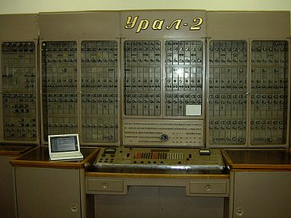
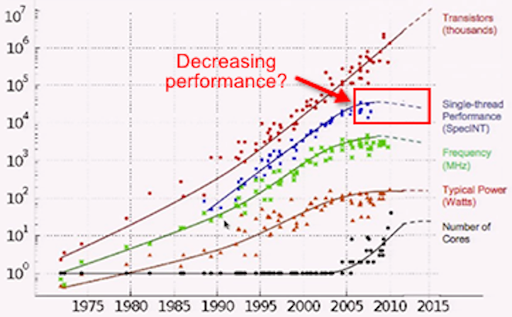
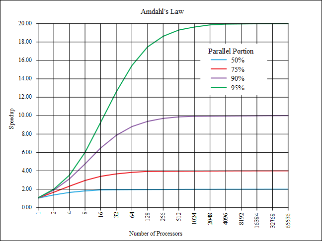
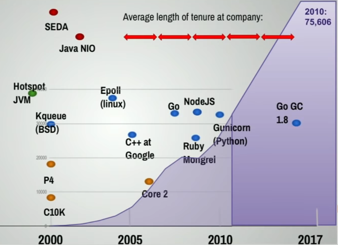
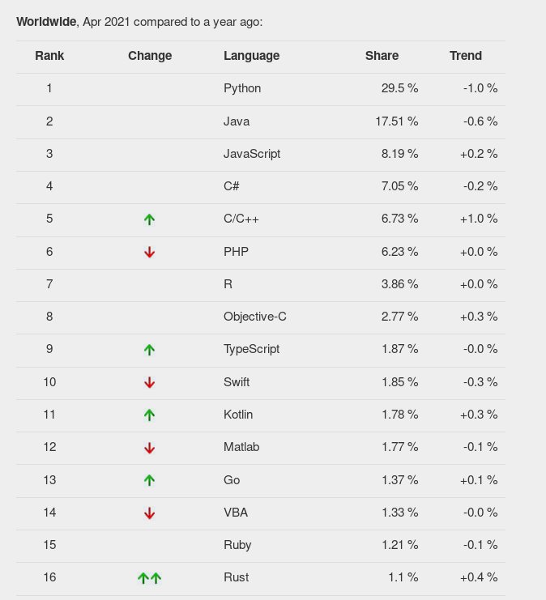

## Is Go language actually worth learning?
### Pavel Tišnovský <ptisnovs@redhat.com>
10 May 2023

---

## Introduction

* There are lots of interesting programming languages that you can learn.
* The question is, should you perfect them all? The answer is no, of course.
* So what about the Go language - is it worth try?
* In this presentation we are going to talk about Go's pros (goroutines,
channels, GC, type systems) and cons (a language with attributes taken from the
previous century :)


---

## Gophers

<!--
// #The Go gopher was designed by Renee French. (http://reneefrench.blogspot.com/)
// #Source https://golang.org/doc/gopher/fiveyears.jpg
// #The design and this image is licensed under the Creative Commons 3.0 Attributions license.
-->


---

## Introduction
- Launched in November 2009 by Google
- Rob Pike, Ken Thompson, Robert Griesemer
- More readable replacement for C/C++/Java/...
- Better suits corporations needs
- „Less is more“

---


## Introduction
- (statically) compiled
- statically typed
- allows cross-compilation
- garbage collected
- built-in concurrency
- strict formatting rules
- type inference

---


## Usage
- server-side web (PHP, Node.js, Python, Ruby, Java)
- client-side web (compilation to WebAssembly)
- cloud technologies (Docker, Podman, Kubernetes, Kubernetes Operators, MinIO, ...)
- available for all interesting systems
- and most architectures (x86-64, ARMv6, ARMv8, even s390x and PowerPC64 LE)
- custom back end + cgo

---

## More readable compared to C/C++

- Evolved from C
- Declarations in postfix
- Much faster for parser to parse sources
- Exported symbols begin with Capital letter
- [https://blog.golang.org/gos-declaration-syntax]

---

## C vs Go

```c
int a;
int *p;
int *(*f)(int *);
```

```go
a int
p *int
f func(*int) *int
```

---

## Cloud technologies
- [Docker](https://www.docker.com/)
- [Podman](https://podman.io/)
- [Kubernetes](https://kubernetes.io/)
- [Kubernetes Operators](https://coreos.com/operators/)
- [MinIO](https://min.io/)
- [NSQ](https://nsq.io/)
- [NATS](https://nats.io/)
- [OpenShift](https://www.redhat.com/en/technologies/cloud-computing/openshift)
- [Go Ethereum](https://geth.ethereum.org/)

---


## Goals
- simplicity
- unambiguity
- performance
- pragmatic
- safer applications (compared to C/C++)
- microservices
- ease to install ("DLL hell" can't happen)
- for DevOps from DevOps
- fast (actually super fast) builds (CI tools like it ;-)

---


## Attention
- Go is a blend of modern approaches combined with quite old ideas
- explicit error handling
- no generics till version 1.18
- no class-based OOP
- no `try`/`catch`/`finally`
- `goto` keyword
- `nil` identifier

---

## Interfaces


---

## Interfaces are automatically implemented

- "satisfied" in Go lingo
- no need to say explicitly `implements` ...


---


## Go vs C(++)
- stronger type system
- no text substitution macros
- no header files
- package system + checks
- safer memory operations + GC
- standardized framework for tests
- stricter rules (`++`/`--`, pointers, ...)
- no exception handling control structures (yet?)
- no generic data types till Go 1.18


---

## But... we are in 21th century!



---


## But... we are in 21th century!

- Multi-core CPUs
- Distributed systems
- Memory locality
- Readability


---

## Multi-core CPUs




---

## Multi-core CPUs




---

## Bit of history

- 60's: insufficient program flow control
- "GOTO considered harmful"
- solved by introducing structured programming
- -> new syntax

---

## Bit of history

- 70's: insufficient state control
- solved by introducing OOP
- -> new syntax

---

## Bit of history
- 2000: insufficient concurrency control
- not solved for a long time
- Go's goroutines + channels
- Python's + JavaScript's async
- -> new syntax

---

## Support for concurrency

- Communicating sequential processes (a formal language etc. etc.)
- "Don't communicate by sharing memory; share memory by communicating"
- So called _goroutines_
- Channels


---


## Concurrency and/or parallelism

- Serial: runs tasks in an order with one CPU core
- Concurrent: runs many tasks simultaneously with a less number of CPU cores (or even 1)
- Parallel: runs n tasks simultaneously with n CPU cores

---

## Concurrency

- when multiple tasks can run in overlapping periods
- needs only one CPU core
- main problem: interruptions

---

## Parallelism

- needs more than one CPU core
- main problem: isolation
- second problem: coordination

---

## Solutions for concurrency and parallelism

- processes
- threads
- coroutines

---


## Solutions for concurrency and parallelism

- processes
- threads
- *goroutines*
- coroutines

---


## Goroutines + channels is a way to ... Go

- Deadlocks are not such a big problem then

---


---


## Memory locality

- True structures
- True value types
- No object headers
- Java: no value types, no structures, object headers

---


## Memory locality

- RAM is no longer "Random Access Memory"

---

## Memory locality


---


## Memory locality and access times

- We humans are bad comparing very small time periods
- Dtto for other units (length, money etc.)

---


## Memory locality and access times


---


## Go and KISS principle

---

## Dynamic devel teams



---


## Dynamic devel teams

- stability
- on source code level: if it compiles in version X, it will compile in version X+1 too
- OTOH: https://pythonclock.org/
- readability


---


## go-fmt

- Gofmt’s style is no one’s favorite, yet gofmt is everyone’s favorite. — Rob Pike
- standard tool


---


## Wanna be mainstream?
- [http://pypl.github.io/PYPL.html]
- [https://hackernoon.com/10-best-programming-languages-to-learn-in-2019-e5b05af4a972]
- [https://insights.dice.com/2018/12/17/5-programming-languages-consider-learning-2019/]
- [https://www.rankred.com/new-programming-languages-to-learn/]


---


## Popularity

- [https://insights.stackoverflow.com/survey/2020#technology-most-loved-dreaded-and-wanted-languages-loved]
- [https://insights.stackoverflow.com/survey/2020#technology-most-loved-dreaded-and-wanted-languages-dreaded]
- [https://insights.stackoverflow.com/survey/2020#technology-most-loved-dreaded-and-wanted-languages-wanted]


---

## Popularity chart




---


## So...is it worth to spend time learning Go?

- networking - YES
- (micro)services - YES
- scalable systems - YES
- you like strict formatting rules - YES
- you like strong type systems - YES
- you like minimalism - YES
- pretty fast compilation - YES
- the simplest deployment - YES
- guaranteed source code compatibility - YES


---


## So...is it worth to spend time learning Go?

- you like classic (broken) class-bases OOP - NO
- you like baroque languages - NO, enjoy C++
- you like inconsistent languages - NO, enjoy Perl
- you like homoiconic languages - NO, LISP/Scheme/Clojure are better then
- you want to manage memory ourself - NO
- you like to have buffer overflows - NO, there are "better" choices
- you like really very strong type system & fast language - Rust


---


<!--
// last slide
## More Gophers
// The Go gopher was designed by Renee French. (http://reneefrench.blogspot.com/)
// Source https://golang.org/doc/gopher/bumper.png
// The design and this image is licensed under the Creative Commons 3.0 Attributions license.

-->


---

# finito
