## Go performance tricks: How I Learned to Stop Worrying and Love Go in production

---

## Developers background

```
Python     35
C          30
Java       26
Bash       19
JavaScript 16
C++        13
Ruby        8
Perl        4
Delphi      3
TypeScript  3
C#          2
```

---

## Simple but useful performance improvements in Go

* Go compiler is pretty straightfoward (= dumb)
* It needs some help from developers

---

## Some interesting areas backed by experience

1. Pass structures by reference, not by value
1. Pass receivers by reference, not by value
1. Maps pre-allocation

* Most things ^ are not idiomatic!

---

## Pass structures by reference, not by value

* All data types are passed by value into functions and methods
    - that's good from "state-space" perspective
    - not so good from performance point of view
* And no nice solution like `const` and `mut` exists in Go

---

## Problem definition

* Large structures passed by value everywhere in the code
    - even within inner loops
* It causes overhead that is super easy to avoid
    - but at cost: wrong semantic is used

---

## Real example

```toml
[logging]
debug = true
log_level = "info"

[kafka_broker]
enabled = true
address = "kafka:29092" #provide in deployment env or as secret
security_protocol = "PLAINTEXT"
cert_path = "not-set"
sasl_mechanism = "PLAIN"
sasl_username = "not-used"
sasl_password = "not-used"
topic = "platform.notifications.ingress" #provide in deployment env or as secret
timeout = "60s"
likelihood_threshold = 0
impact_threshold = 0
severity_threshold = 0
total_risk_threshold = 3
event_filter = "totalRisk >= totalRiskThreshold"

[service_log]
client_id = "a-service-id"
client_secret = "a-secret"
token_url = ""
enabled = false
url = "https://api.openshift.com/api/service_logs/v1/cluster_logs/"
timeout = "15s"
likelihood_threshold = 0
impact_threshold = 0
severity_threshold = 0
total_risk_threshold = 0
event_filter = "totalRisk >= totalRiskThreshold"
rule_details_uri = "https://console.redhat.com/openshift/insights/advisor/recommendations/{module}|{error_key}"

[storage]
db_driver = "postgres"
pg_username = "postgres" #provide in deployment env or as secret
pg_password = "postgres" #provide in deployment env or as secret
pg_host = "localhost" #provide in deployment env or as secret
pg_port = 5432 #provide in deployment env or as secret
pg_db_name = "notification" #provide in deployment env or as secret
pg_params = "sslmode=disable"
log_sql_queries = true

[dependencies]
content_server = "localhost:8082" #provide in deployment env or as secret
content_endpoint = "/api/v1/content" #provide in deployment env or as secret
template_renderer_server = "localhost:8083" #provide in deployment env or as secret
template_renderer_endpoint = "/v1/rendered_reports" #provide in deployment env or as secret

[notifications]
insights_advisor_url = "https://console.redhat.com/openshift/insights/advisor/clusters/{cluster_id}"
cluster_details_uri = "https://console.redhat.com/openshift/details/{cluster_id}#insights"
rule_details_uri = "https://console.redhat.com/openshift/details/{cluster_id}/insights/{module}/{error_key}"
# valid units are SQL epoch time units: months days hours minutes seconds"
cooldown = "24 hours"

[metrics]
job_name = "ccx_notification_service"
# The metrics in Prometheus will be $namespace_$subsystem_$name
namespace = "ccx_notification_service"
subsystem = "to_notification_backend"
gateway_url = "localhost:9091"
gateway_auth_token = ""
retries = 3
# Valid time units are "ns", "us" (or "µs"), "ms", "s", "m", "h".
retry_after = "60s"

[cleaner]
# valid units are SQL epoch time units: months days hours minutes seconds"
max_age = "90 days"

[processing]
filter_allowed_clusters = false
allowed_clusters = []
filter_blocked_clusters = false
blocked_clusters = []
```

---

## Representation of such structure in Go

```go
type ConfigStruct struct {
        Logging       LoggingConfiguration       `mapstructure:"logging" toml:"logging"`
        Storage       StorageConfiguration       `mapstructure:"storage" toml:"storage"`
        Kafka         KafkaConfiguration         `mapstructure:"kafka_broker" toml:"kafka_broker"`
        ServiceLog    ServiceLogConfiguration    `mapstructure:"service_log" toml:"service_log"`
        Dependencies  DependenciesConfiguration  `mapstructure:"dependencies" toml:"dependencies"`
        Notifications NotificationsConfiguration `mapstructure:"notifications" toml:"notifications"`
        Metrics       MetricsConfiguration       `mapstructure:"metrics" toml:"metrics"`
        Cleaner       CleanerConfiguration       `mapstructure:"cleaner" toml:"cleaner"`
        Processing    ProcessingConfiguration    `mapstructure:"processing" toml:"processing"`
}

type LoggingConfiguration struct {
        // Debug enables pretty colored logging
        Debug bool `mapstructure:"debug" toml:"debug"`
        LogLevel string `mapstructure:"log_level" toml:"log_level"`
}

type StorageConfiguration struct {
        Driver        string `mapstructure:"db_driver"       toml:"db_driver"`
        PGUsername    string `mapstructure:"pg_username"     toml:"pg_username"`
        PGPassword    string `mapstructure:"pg_password"     toml:"pg_password"`
        PGHost        string `mapstructure:"pg_host"         toml:"pg_host"`
        PGPort        int    `mapstructure:"pg_port"         toml:"pg_port"`
        PGDBName      string `mapstructure:"pg_db_name"      toml:"pg_db_name"`
        PGParams      string `mapstructure:"pg_params"       toml:"pg_params"`
        LogSQLQueries bool   `mapstructure:"log_sql_queries" toml:"log_sql_queries"`
}
```

---

### 'getter' used in the code

```go
func GetStorageConfigurationByValue(configuration ConfigStruct) StorageConfiguration {
        return configuration.Storage
}
```

* Pros
    - pretty idiomatic
    - basically say the struct is immutable on 1st level
* Cons
    - structure is passed by value
    - structure size is about 700 bytes!

---

### Dirty solution

* the only solution possible in Go
    - different semantic:
        - passing by reference -> struct can be changed within
* unfortunately we can't distinguish between `const` and `mut`
    - mutation (or no mutation) has to be checked by unit tests

```go
func GetStorageConfigurationByReference(configuration *ConfigStruct) StorageConfiguration {
        return configuration.Storage
}
```

---

### Is it worth to do it?

```go
package conf_test

// Benchmark for config module

import (
        "os"
        "testing"

        "config-struct/conf"
)

const (
        configFileEnvVariableName = "CCX_NOTIFICATION_SERVICE_CONFIG_FILE"
        defaultConfigFileName     = "./config"
)

// loadConfiguration function loads configuration prepared to be used by
// benchmarks
func loadConfiguration() (conf.ConfigStruct, error) {
        os.Clearenv()

        err := os.Setenv(configFileEnvVariableName, defaultConfigFileName)
        if err != nil {
                return conf.ConfigStruct{}, err
        }

        config, err := conf.LoadConfiguration(configFileEnvVariableName, defaultConfigFileName)
        if err != nil {
                return conf.ConfigStruct{}, err
        }

        return config, nil
}

func mustLoadBenchmarkConfiguration(b *testing.B) conf.ConfigStruct {
        configuration, err := loadConfiguration()
        if err != nil {
                b.Fatal(err)
        }
        return configuration
}

func BenchmarkGetStorageConfigurationFunctionByValue(b *testing.B) {
        b.StopTimer()
        configuration := mustLoadBenchmarkConfiguration(b)
        b.StartTimer()

        for i := 0; i < b.N; i++ {
                // call benchmarked function
                conf.GetStorageConfigurationByValue(configuration)
        }

}

func BenchmarkGetStorageConfigurationFunctionByReference(b *testing.B) {
        b.StopTimer()
        configuration := mustLoadBenchmarkConfiguration(b)
        b.StartTimer()

        for i := 0; i < b.N; i++ {
                // call benchmarked function
                conf.GetStorageConfigurationByReference(&configuration)
        }

}

```

---

### Benchmark results

```
$ go test -bench=. -benchtime=1000000000x -cpuprofile profile.out -v config-struct/conf

goos: linux
goarch: amd64
pkg: config-struct/conf
cpu: Intel(R) Core(TM) i7-8665U CPU @ 1.90GHz
BenchmarkGetStorageConfigurationFunctionByValue
BenchmarkGetStorageConfigurationFunctionByValue-8       1000000000  13.20 ns/op
BenchmarkGetStorageConfigurationFunctionByReference
BenchmarkGetStorageConfigurationFunctionByReference-8   1000000000   0.2405 ns/op
PASS
ok      config-struct/conf      27.166s
```

---

### Benchmark results

* 13.20 ns/op vs 0.2405 ns/op
* That is 5488% speed increase :)
    - memcpy operation elimination

---

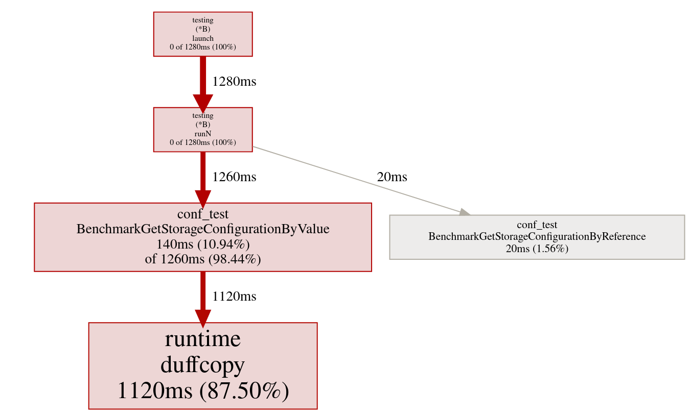

---

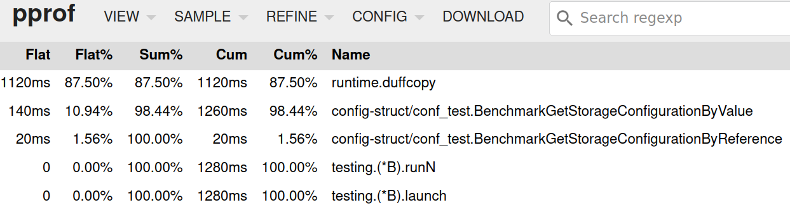

---

### Is it still relevant?

* 0.2405 ns vs. 13.20 ns from CPU point of view vs. human point of view

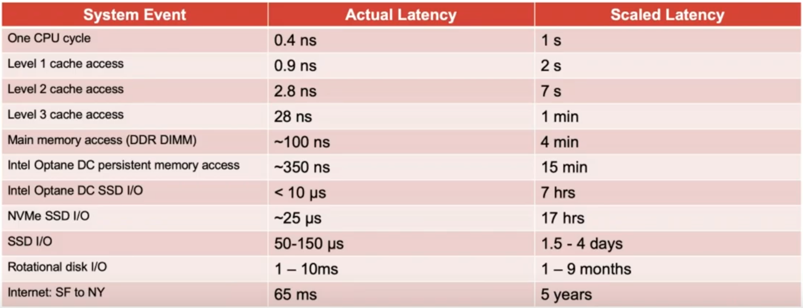

---

### Memory is getting "slower"

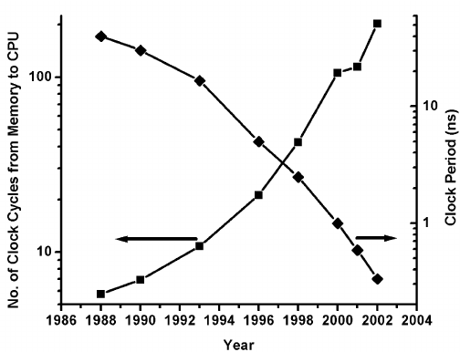

---

### What about methods?

* The same issue + simple fix

```go
func (configuration ConfigStruct) GetStorageConfigurationByValue() StorageConfiguration {
        return configuration.Storage
}

func (configuration *ConfigStruct) GetStorageConfigurationByReference() StorageConfiguration {
        return configuration.Storage
}
```

---

### Benchmark for methods

```go
func BenchmarkGetStorageConfigurationMethodByValue(b *testing.B) {
        b.StopTimer()
        configuration := mustLoadBenchmarkConfiguration(b)
        b.StartTimer()

        for i := 0; i < b.N; i++ {
                // call benchmarked function
                configuration.GetStorageConfigurationByValue()
        }

}

func BenchmarkGetStorageConfigurationMethodByReference(b *testing.B) {
        b.StopTimer()
        configuration := mustLoadBenchmarkConfiguration(b)
        b.StartTimer()

        for i := 0; i < b.N; i++ {
                // call benchmarked function
                configuration.GetStorageConfigurationByReference()
        }

}
```

---

### Run the benchmark

```
$ go test -bench=. -benchtime=1000000000x -cpuprofile profile.out -v config-struct/conf

goos: linux
goarch: amd64
pkg: config-struct/conf
cpu: Intel(R) Core(TM) i7-8665U CPU @ 1.90GHz
BenchmarkGetStorageConfigurationFunctionByValue
BenchmarkGetStorageConfigurationFunctionByValue-8      1000000000   13.20 ns/op
BenchmarkGetStorageConfigurationFunctionByReference
BenchmarkGetStorageConfigurationFunctionByReference-8  1000000000    0.2405 ns/op
BenchmarkGetStorageConfigurationMethodByValue
BenchmarkGetStorageConfigurationMethodByValue-8        1000000000   13.24 ns/op
BenchmarkGetStorageConfigurationMethodByReference
BenchmarkGetStorageConfigurationMethodByReference-8    1000000000    0.3596 ns/op
PASS
ok      config-struct/conf      27.166s
```

---

## Maps pre-alllocation

* In Go it is possible to specify number of map items during map allocation

```go
m1 := make(map[UUID]time.Time)
m2 := make(map[UUID]time.Time, b.N)
```

* Not strictly needed, so developers took "Python approach"
* Does it make sense to try to estimate number of items?
* Who knows? Probably just the benchark...

---

### Benchmark

```go
type UUID string

func BenchmarkInsertIntoPreallocatedMapUUIDKey(b *testing.B) {
        m := make(map[UUID]time.Time, b.N)
        t := time.Now()

        for i := 0; i < b.N; i++ {
                b.StopTimer()
                id := UUID(uuid.New().String())
                b.StartTimer()
                m[id] = t
        }
}

func BenchmarkInsertIntoEmptyMapUUIDKey(b *testing.B) {
        m := map[UUID]time.Time{}
        t := time.Now()

        for i := 0; i < b.N; i++ {
                b.StopTimer()
                id := UUID(uuid.New().String())
                b.StartTimer()
                m[id] = t
        }
}
```

---

### Benchmark results

```
goos: linux
goarch: amd64
pkg: map-bench
cpu: Intel(R) Core(TM) i7-8665U CPU @ 1.90GHz
BenchmarkInsertIntoEmptyMapUUIDKey-8            1000000   354.7 ns/op
BenchmarkInsertIntoPreallocatedMapUUIDKey-8     1000000   163.9 ns/op
PASS
```

---

### Benchmark results

* For different input N

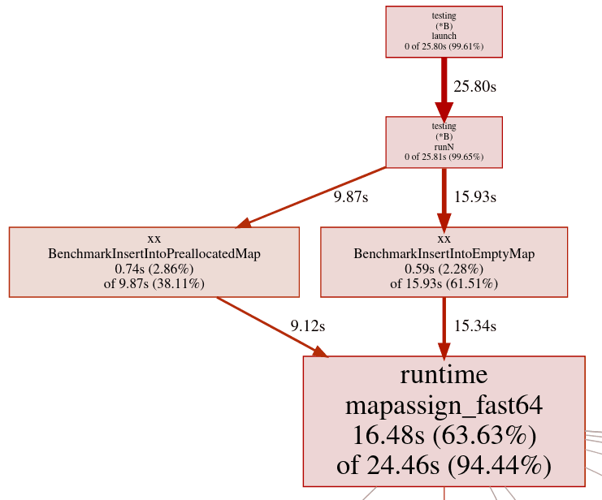

---

### Maps with large keys

* Keys can be of any type in Go
* So keys might be pretty large (imagine structs)

```go
type key struct {
        ID      int
        payload [100]byte
}

m1 := make(map[key]value)
m2 := make(map[key]value, capacity)
```

---

### Benchmark

```go
type key struct {
        ID      int
        payload [100]byte
}

type value struct{}

func BenchmarkInsertIntoPreallocatedMapCompoundKey(b *testing.B) {
        m := make(map[key]value, b.N)

        for i := 0; i < b.N; i++ {
                k := key{
                        ID: i,
                }
                m[k] = value{}
        }
}

func BenchmarkInsertIntoEmptyMapCompoundKey(b *testing.B) {
        m := map[key]value{}

        for i := 0; i < b.N; i++ {
                k := key{
                        ID: i,
                }
                m[k] = value{}
        }
}
```

---

### Benchmark results for maps with large keys

```
goos: linux
goarch: amd64
pkg: map-bench
cpu: Intel(R) Core(TM) i7-8665U CPU @ 1.90GHz
BenchmarkInsertIntoEmptyMapCompoundKey-8          1000000    332.2 ns/op
BenchmarkInsertIntoPreallocatedMapCompoundKey-8   1000000    177.7 ns/op
PASS
```

---

### Memory requirements

* For us much more relevant
    - as pods will be killed due to OOM

---

### Go profiler to the rescue

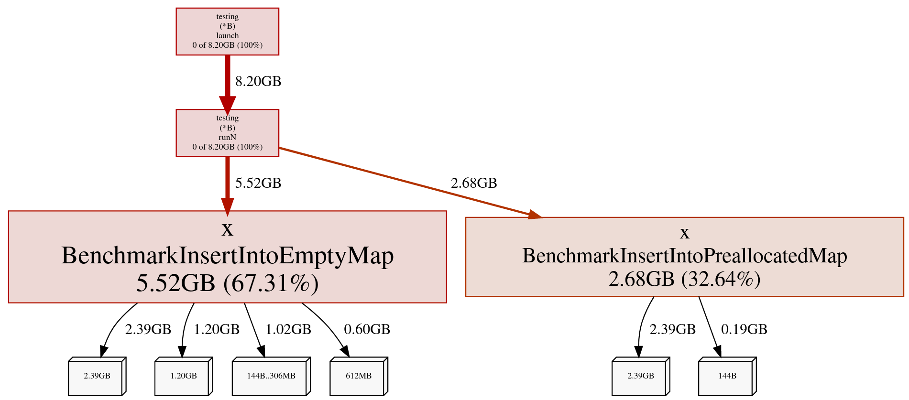

---

### Go profiler to the rescue

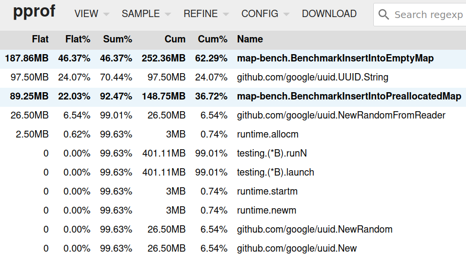

---

## Set implementations

* Implementation
    - first devel instinct: "map" of course
    - but we tried linear data structure too!

---

## Set implementations

```go
type ID int
 
func genID(i int) ID {
        return ID(3*i + 1)
}
 
func fillInMap(b *testing.B, items int) map[ID]struct{} {
        b.StopTimer()
 
        m := make(map[ID]struct{}, items)
 
        for i := 0; i < items; i++ {
                id := genID(i)
                m[id] = struct{}{}
        }
 
        b.StartTimer()
        return m
}
 
func fillInSlice(b *testing.B, items int) []ID {
        b.StopTimer()
 
        s := make([]ID, items)
 
        for i := 0; i < items; i++ {
                id := genID(i)
                s[i] = id
        }
 
        b.StartTimer()
        return s
}
```

---

### Benchmark for read/in-set operation

```go
func performBenchmarkFindInMap(b *testing.B, m map[ID]struct{}) {
        items := len(m)
        for i := 0; i < b.N; i++ {
                _, found := m[genID(i%items)]
                if !found {
                        b.Fatal("not found")
                }
        }
}
 
func performBenchmarkFindInSlice(b *testing.B, s []ID) {
        items := len(s)
        for i := 0; i < b.N; i++ {
                found := false
                id := genID(i % items)
                for _, p := range s {
                        if p == id {
                                found = true
                                break
                        }
                }
                if !found {
                        b.Fatal("not found")
                }
        }
}
```

---


### Benchmark results

```
BenchmarkFindInMap1-8       100000000   12.01 ns/op
BenchmarkFindInSlice1-8     100000000    7.208 ns/op
BenchmarkFindInMap5-8       100000000   12.61 ns/op
BenchmarkFindInSlice5-8     100000000    8.346 ns/op
BenchmarkFindInMap10-8      100000000   14.57 ns/op
BenchmarkFindInSlice10-8    100000000    9.498 ns/op
BenchmarkFindInMap20-8      100000000   14.28 ns/op
BenchmarkFindInSlice20-8    100000000   11.61 ns/op
BenchmarkFindInMap100-8     100000000   14.63 ns/op
BenchmarkFindInSlice100-8   100000000   35.57 ns/op
BenchmarkFindInMap1000-8    100000000   22.53 ns/op
BenchmarkFindInSlice1000-8  100000000  281.4 ns/op
```

---


### Graphical interpretation

---

* Low number of items

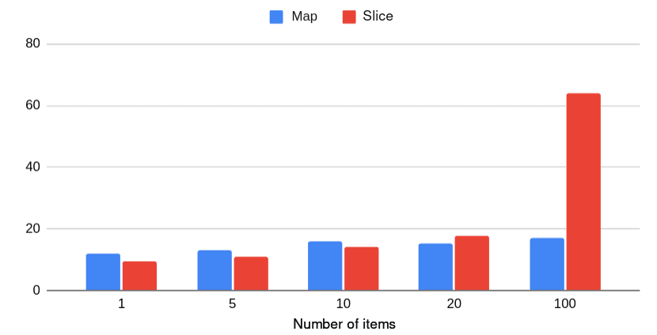

---

* Higher number of items

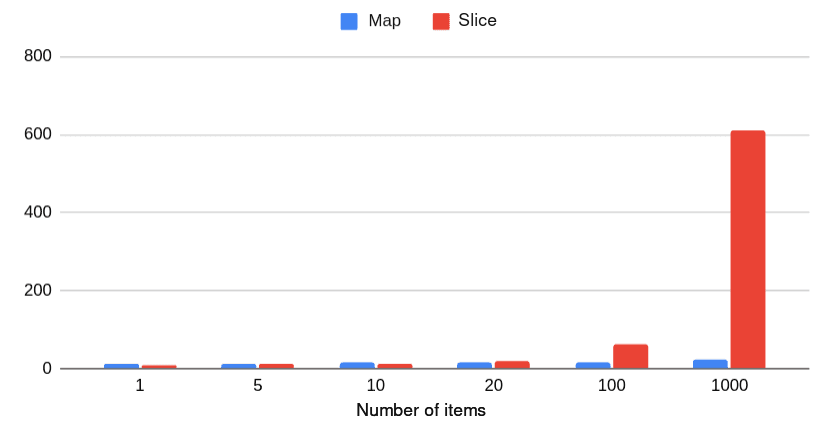

---

* Map vs slice for set implementation

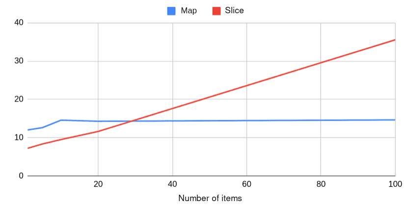

---

### Use slices instead of arrays (if possible)

* C-proselytes and Java-proselytes seems to use arrays a lot
* But in fact arrays are not used much in idiomatic Go code

* Array in Go
    - passed by value (COPY!)
    - not the case in Java
    - semantic is totally different

---

### Slices in Go

* Struct/record with three items
   - pointer to data (array)
   - length
   - capacity
* Passed by value
   - but it is not deep clone

---

### Benchmark

```go
func changeMe1(values []int) {
	values[0] = FIRST_VALUE
	values[MAX_VALS-1] = LAST_VALUE
}

func changeMe2(values [MAX_VALS]int) {
	values[0] = FIRST_VALUE
	values[MAX_VALS-1] = LAST_VALUE
}

func changeMe3(values *[MAX_VALS]int) {
	values[0] = FIRST_VALUE
	values[MAX_VALS-1] = LAST_VALUE
}

func BenchmarkPassSlice(b *testing.B) {
	var values []int = make([]int, MAX_VALS)

	for i := 0; i < b.N; i++ {
		changeMe1(values)
	}
	if values[0] != FIRST_VALUE {
		b.Fatal()
	}
	if values[MAX_VALS-1] != LAST_VALUE {
		b.Fatal()
	}
}

func BenchmarkPassArrayByValue(b *testing.B) {
	var values [MAX_VALS]int = [MAX_VALS]int{DEFAULT_VALUE}

	for i := 0; i < b.N; i++ {
		changeMe2(values)
	}
	if values[0] != DEFAULT_VALUE {
		b.Fatal()
	}
	if values[MAX_VALS-1] != DEFAULT_VALUE {
		b.Fatal()
	}
}

func BenchmarkPassArrayByReference(b *testing.B) {
	var values [MAX_VALS]int = [MAX_VALS]int{DEFAULT_VALUE}

	for i := 0; i < b.N; i++ {
		changeMe3(&values)
	}
	if values[0] != FIRST_VALUE {
		b.Fatal()
	}
	if values[MAX_VALS-1] != LAST_VALUE {
		b.Fatal()
	}
}
```

---

## Benchmark results

```
BenchmarkPassSlice-8              100000000    0.4799 ns/op
BenchmarkPassArrayByValue-8       100000000    0.2371 ns/op
BenchmarkPassArrayByReference-8   100000000    0.4740 ns/op
```

* What?
    - compiler detected that local changes are not visible outside function
    - and the whole function was dropped

---

## Is it really the case?

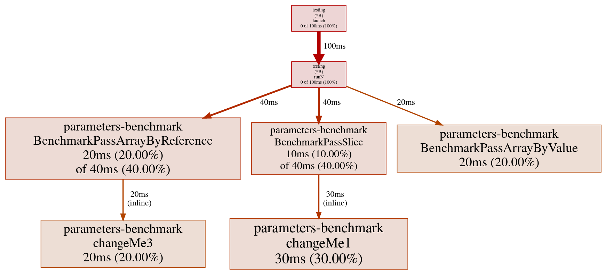

---

## Now with side effect

---

###

---

###

---

### SIMD instructions

* Sets of special instructions
    - operate on short fixed-length arrays
    - specialized data-processing operations
    - (not available outside SIMD world)
    - min, max, abs, saturated arithmetic
* Very important feature of today CPUs
    - sometimes more important than multicore(s)

---

### SIMD extensions on x86-64 CPUs

* MMX
* 3Dnow!
* SSE
    - SSE 2, SSE 3, SSE 4.1, SSE 4.2
* AVX
    - splitted into multiple sets
    - F16C etc.

---

### How are these used?

* Auto-vectorization
    - performed by compiler
* Intrinsic
    - available made by compiler/headers/packages
* Assembler
    - built-in (if available)
    - external one

---

### Typical vectors used in SIMD

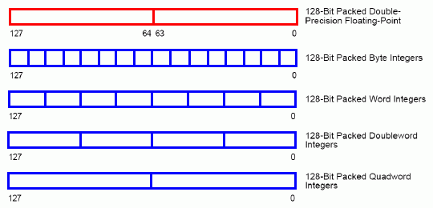

---

### Operations with vectors (GCC)

```c
typedef signed int v16si __attribute__((vector_size(16)));
 
void add16ui(v16si x, v16si y, v16si * z)
{
    *z = x + y;
}

v16si x = { 0, 1, 2, 3 };
v16si y = { 0xffffffff, 0xffffffff, 0xffffffff, 0xffffffff };
v16si z;

add16ui(x, y,  z);

int i;

puts("vector of signed ints");

for (i = 0; i < sizeof(v16si) / sizeof(signed int); i++) {
    printf("%d %d\n", i, z[i]);
}
```

---

### Intrinsic

```
Technology  Header file
--------------------------
MMX         mmintrin.h
SSE1        xmmintrin.h
SSE2        emmintrin.h
SSE4.1      smmintrin.h
AVX2        avx2intrin.h
```

---

### Intrinsic usage

```c
#include <xmmintrin.h>
 
int main(void)
{
    __v4sf x = { 1.0, 2.0, 3.0, 4.0 };
    __v4sf y = { 0.1, 0.1, 0.1, 0.1 };
    __v4sf z;
    int i;
 
    z = __builtin_ia32_addps(x, y);
 
    for (i = 0; i < sizeof(x) / sizeof(float); i++) {
        printf("%2d %f %f %f\n", i, x[i], y[i], z[i]);
    }
}
```

### Generated machine code

```asm
   z = __builtin_ia32_addps(x, y);
  31:   0f 28 45 d0             movaps xmm0,XMMWORD PTR [rbp-0x30]
  35:   0f 28 4d c0             movaps xmm1,XMMWORD PTR [rbp-0x40]
  39:   0f 58 c1                addps  xmm0,xmm1
  3c:   0f 29 45 e0             movaps XMMWORD PTR [rbp-0x20],xmm0
```

---

### SIMD support in Go

* Auto-vectorization
    - not provided by Google's compiler
    - gccgo can use it
* Intrinsic
    - not available in Go
    - and very probably never will!
* Assembler
    - built-in N/A in Go
    - external one is cumbersome to use
    - gccgo + GNU assembler (gasm)

---

### SIMD support in Go

* Not ideal situation today
    - we don't invest into this approach
    - anyway most processing is performed against UTF-8 chars

---

# Thank you!

---

# Questions?

---
