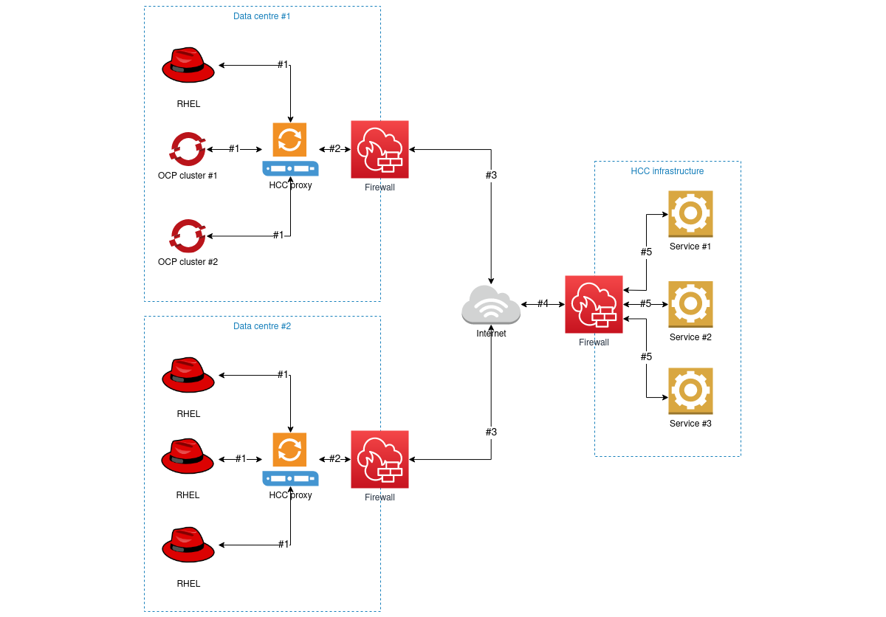
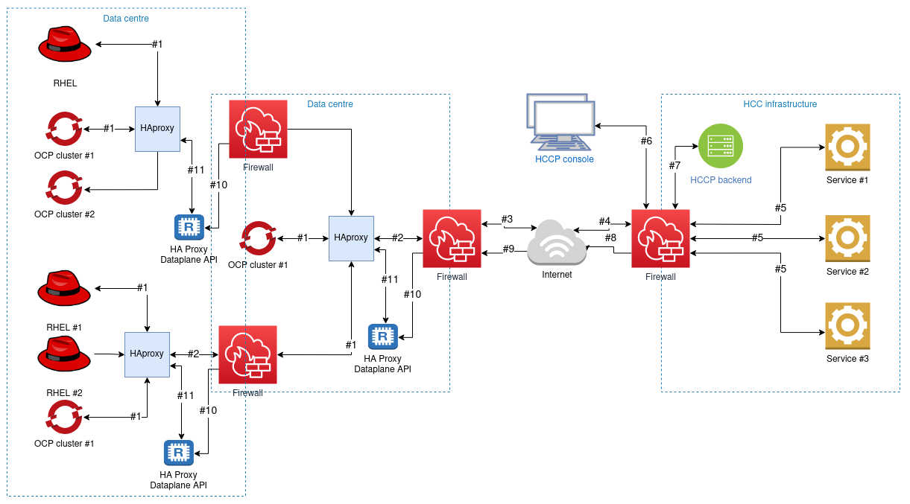
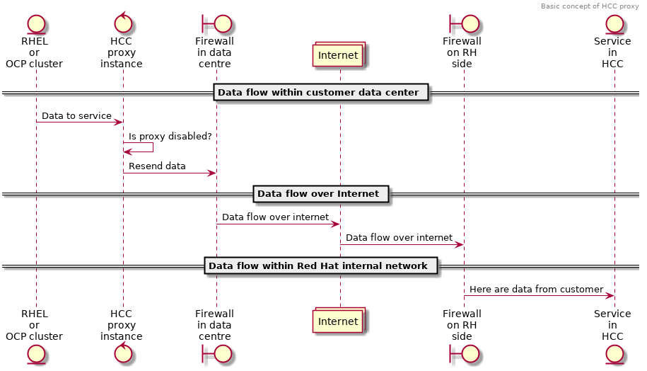
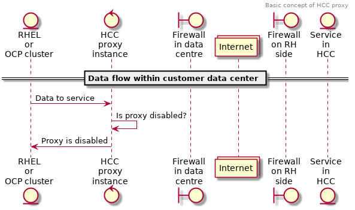
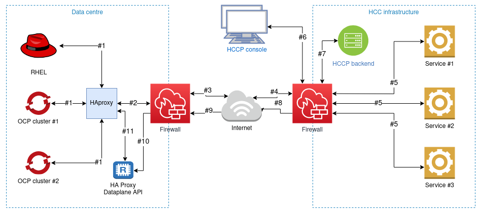
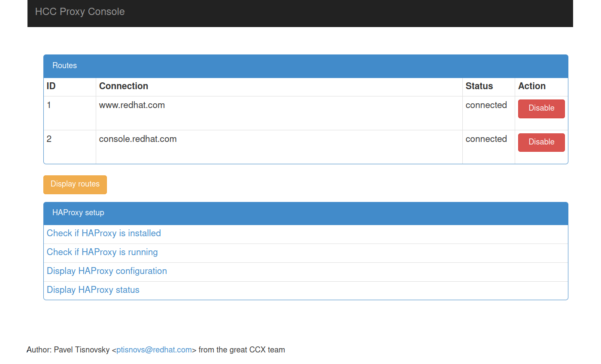

# HCC Proxy: a Proof of Concept

---

## Architecture of HCC Proxy usage

---

## Fine-grained configuration

---

## HCC Proxy as on/off switch

---

## HCC Proxy as on/off switch

---

## Controlling HCC Proxy through console

---

## Console implementation (PoC)

---

## Live demo

Settings:

* Redirection flow to HCC Proxy
* HCC Proxy started
* HCC Console started
* Accessing www.redhat.com periodically
* HCC Console used as on/off switch

---

