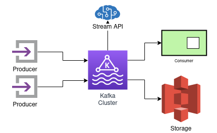
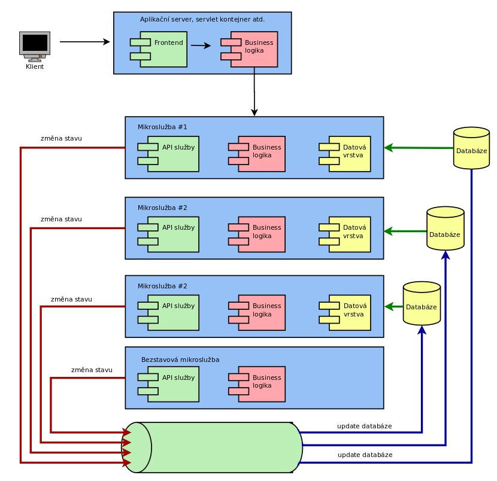
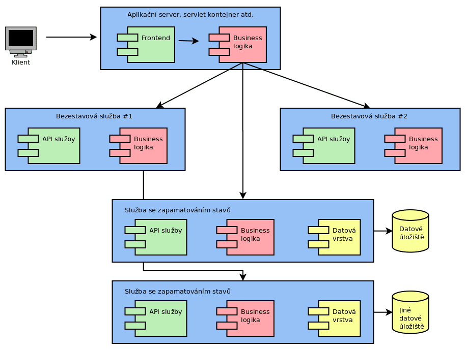
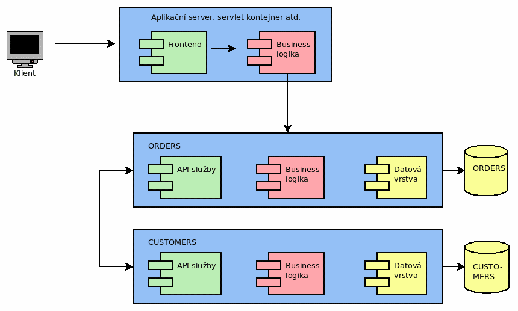
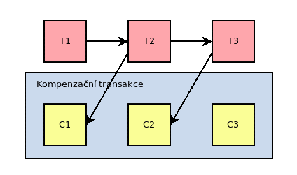
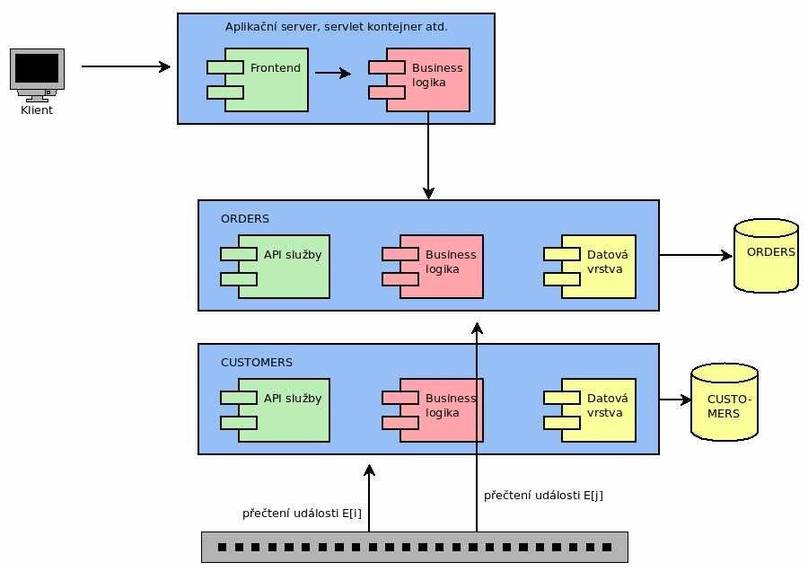
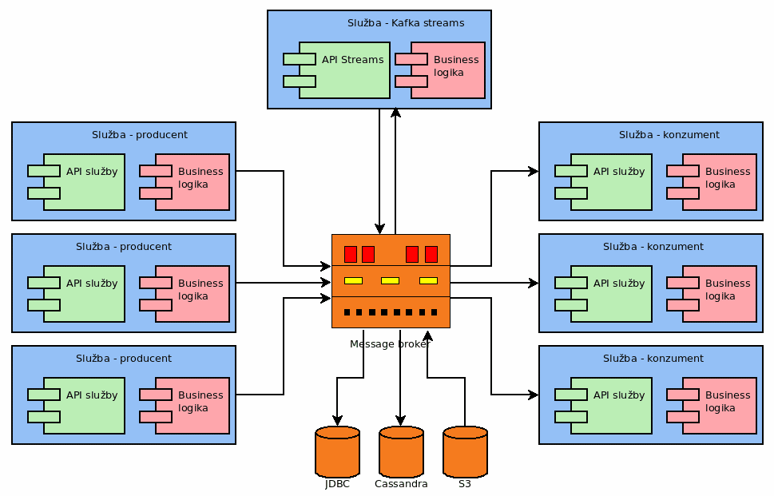

# Apache Kafka


---

## Multifaceted Apache Kafka

* scalable real-time messaging platform
    - able to process millions of messages per second
* event streaming platform for massive volumes of big data analytics
* distributed storage
    - with support for replayability of events
    - and with guaranteed ordering
* data integration framework for streaming ETL
* data processing framework
    - continuous stateless or stateful stream processing

---

## Kafka in not:

* proxy for millions of clients
    - like mobile apps
* API Management platform
* database for complex queries and batch analytics workloads
    - simple aggregations possible thanks to ksqlDB
* IoT platform with features such as device management
* technology for hard real-time applications
    - safety-critical systems
    - deterministic systems

---

## Typical usage of Kafka

* Message broker on steroids
* Central part of Lambda architecture
* Central part of Kappa architecture
* Logging platform

---

### Kafka streams



---

### Source of truth

[full image](images/kafka_kappa.png)


---

### Message brokers: communication strategies

* Enterprise integration patterns (EIP)

---

## Microservices

* Apache Kafka is sometimes used as a key component in microservice-based architectures
* "Design the organisation you want, the architecture will follow (kicking and screaming)"

---

### Classic architecture

* Front-end
* Back-end
    - business logic
    - data layer
* Storage


---

### Stateless and stateful microservices

* Services w/o state
    - super easy to test
    - usually very easy to scale up
    - restarts are usually not a big deal
* Stateful service
    - the opposite is true

---

[Full image](images/microservices2.png)


---

### Communication between stateful microservices

* Not as easy as it might seem
    - "compound" transactions
    - should one service synchronously wait for second one?

---



---

### Compensation transactions

* One possible solution



---

### Apache Kafka as source of events

[Full image](images/microservices5.png)



---

### Apache Kafka as message broker



---

### Kappa architecture

[Full image](images/microservices7.png)


---

### Messaging

* Command–query separation (CQS)
* Command-query responsibility segregation (CQRS)
* How to communicate between components
    - COMMAND message
    - EVENT message
    - QUERY message
* Sometimes different buses are used
    - CommandBus
    - EventBus
    - QueryBus

---

## Basic concepts

* Topic
    -  a named log of events
* Producer
    - sends messages/events into selected topic
* Consumer
    - retrieves messages/events from selected topic

---

## Append-only log

* new mesage/event is always written on the end of topic
* messages/events are immutable
* can be read by
    - seeking and arbitrary offset
    - sequential scanning

---

## Three basic operations

* Producer
    - produce (send) message to given topic
* Consumer
    - rewind (seek) to message X
    - consume message + update offset

---

## Topic is NOT a queue

* Topic is basically stateless
    - consumers have to maintain their state
    - by storing their offsets "somewhere"
* Message is not deleted after consumption
    - just messages past the retention period are deleted
* FIFO model is not followed

---

## Kafka technology is much more difficult though

* Partitions
* Multiple replicas per partition
* Sharding

---

## Key features

* Scalability
* Reliability
* Log compaction

---

## Scalability

* Topic can be partitioned
    - across different servers

---

## Reliability

* Replication
* Changing leadership role

---

## Log compaction

* Keeps the latest known value for each record key
* Preserves the most recent version of a record during deletion

---

## CLI

---

### CLI producers and consumers

---

### Other standard CLI tools

---

## Kafkacat (kcat)

* List topics

```
kafkacat -L -b localhost:9092
```

* Producer mode

```
```

* Consumer mode

```
```

---

## Clients for Apache Kafka

* [Supported languages/ecosystems](https://cwiki.apache.org/confluence/display/KAFKA/Clients)
    - C/C++
    - Python
    - Go (AKA golang)
    - Erlang
    - PowerShell
    - .NET
    - Ruby
    - Node.js
    - Proxy (HTTP REST, etc)
    - Perl
    - stdin/stdout
    - PHP
    - Rust
    - Alternative Java
    - Storm
    - Scala DSL 
    - Clojure
    - Swift

---

## Client examples

* Examples for Python
* Examples for Go
* Examples for Java
* Examples for Clojure

---

### Examples for Python

---

#### Messages producer

```
#!/usr/bin/env python3

from kafka import KafkaProducer
from time import sleep
from json import dumps

server = "localhost:9092"
topic = "upload"

print("Connecting to Kafka")
producer = KafkaProducer(
    bootstrap_servers=[server], value_serializer=lambda x: dumps(x).encode("utf-8")
)
print("Connected to Kafka")

for i in range(1000):
    data = {"counter": i}
    producer.send(topic, value=data)
    sleep(5)
```

---

#### Messages consumer

```
#!/usr/bin/env python3

import sys
from kafka import KafkaConsumer

server = "localhost:9092"
topic = "upload"
group_id = "group1"

print("Connecting to Kafka")
consumer = KafkaConsumer(
    topic, group_id=group_id, bootstrap_servers=[server], auto_offset_reset="earliest"
)
print("Connected to Kafka")

try:
    for message in consumer:
        print(
            "%s:%d:%d: key=%s value=%s"
            % (
                message.topic,
                message.partition,
                message.offset,
                message.key,
                message.value,
            )
        )
except KeyboardInterrupt:
    sys.exit()
```

---

### Examples for Go

---

#### Messages producer

```go
package main

import (
        "log"

        "github.com/Shopify/sarama"
)

const (
        // KafkaConnectionString obsahuje jméno počítače a port, na kterém běží Kafka broker
        KafkaConnectionString = "localhost:9092"

        // KafkaTopic obsahuje jméno tématu
        KafkaTopic = "test-topic"
)

func main() {
        // konstrukce konzumenta
        producer, err := sarama.NewSyncProducer([]string{KafkaConnectionString}, nil)

        // kontrola chyby při připojování ke Kafce
        if err != nil {
                log.Fatal(err)
        }

        log.Printf("Connected to %s", KafkaConnectionString)

        // zajištění uzavření připojení ke Kafce
        defer func() {
                if err := producer.Close(); err != nil {
                        log.Fatal(err)
                }
        }()

        // poslání (produkce) zprávy
        msg := &sarama.ProducerMessage{Topic: KafkaTopic, Value: sarama.StringEncoder("testing 123")}
        partition, offset, err := producer.SendMessage(msg)
        if err != nil {
                log.Printf("FAILED to send message: %s\n", err)
        } else {
                log.Printf("&gt; message sent to partition %d at offset %d\n", partition, offset)
        }

        log.Print("Done")
}
```

---

#### Messages consumer

```go
package main

import (
        "log"

        "github.com/Shopify/sarama"
)

const (
        // KafkaConnectionString obsahuje jméno počítače a port, na kterém běží Kafka broker
        KafkaConnectionString = "localhost:9092"

        // KafkaTopic obsahuje jméno tématu
        KafkaTopic = "test-topic"
)

func main() {
        // konstrukce konzumenta
        consumer, err := sarama.NewConsumer([]string{KafkaConnectionString}, nil)

        // kontrola chyby při připojování ke Kafce
        if err != nil {
                log.Fatal(err)
        }

        log.Printf("Connected to %s", KafkaConnectionString)

        // zajištění uzavření připojení ke Kafce
        defer func() {
                if err := consumer.Close(); err != nil {
                        log.Fatal(err)
                }
        }()

        // přihlášení ke zvolenému tématu
        partitionConsumer, err := consumer.ConsumePartition(KafkaTopic, 0, sarama.OffsetNewest)
        if err != nil {
                log.Fatal(err)
        }

        // zajištění ukončení přihlášení ke zvolenému tématu
        defer func() {
                if err := partitionConsumer.Close(); err != nil {
                        log.Fatal(err)
                }
        }()

        // postupné čtení zpráv, které byly do zvoleného tématu publikovány
        consumed := 0
        for {
                msg := &lt;-partitionConsumer.Messages()
                // vypíšeme pouze offset zprávy, její klíč a tělo (value, payload)
                log.Printf("Consumed message offset %d: %s:%s", msg.Offset, msg.Key, msg.Value)
                consumed++
        }

        // výpis počtu zpracovaných zpráv (ovšem sem se stejně nedostaneme :-)
        log.Printf("Consumed: %d", consumed)
        log.Print("Done")
}

```
---

### Examples for Java

---

#### Messages producer

```java
import java.util.Properties;

import org.apache.kafka.clients.producer.KafkaProducer;
import org.apache.kafka.clients.producer.ProducerConfig;
import org.apache.kafka.clients.producer.ProducerRecord;
import org.apache.kafka.common.serialization.StringSerializer;

public class SimpleProducer {
    public static void main(String args[])
    {
        String bootstrapServers="127.0.0.1:9092";
        Properties properties=new Properties();
        properties.setProperty(ProducerConfig.BOOTSTRAP_SERVERS_CONFIG, bootstrapServers);
        properties.setProperty(ProducerConfig.KEY_SERIALIZER_CLASS_CONFIG, StringSerializer.class.getName());
        properties.setProperty(ProducerConfig.VALUE_SERIALIZER_CLASS_CONFIG, StringSerializer.class.getName());

        KafkaProducer<String,String> producer = new KafkaProducer<String, String>(properties);

        ProducerRecord<String, String> record = new ProducerRecord<String, String>("topic", "Hello");
        producer.send(record);
        producer.flush();
        producer.close();
    }
}
```

---

#### Messages consumer

```java
```

---

### Examples for Clojure

---

#### Messages producer

```
```

---

#### Messages consumer

```
```
---

## Kafka connect


* "Distributed scalable framework"
* Automatic consuming or producing data
    - with data persistence in-between
* Part of Apache Kafka
* Just configuration files
* And connectors

---

## Kafka Connect components

* Sources
* Kafka Cluster
* Sinks

---

## Kafka Connect use cases

---

### Moving data from one DB to another one


---

### Connection between MQTT and AWS SQS


---

### From one source to various sinks

* Amazon S3
* Logs
* Storage (database)


---

#### Custom consumers are possible

* Amazon S3
* Logs
* Storage (database)
* And bunch of custom consumers


---

## Kafka Connect from developers PoV

* Is separate process
* It requires no programming
    - failures handling
    - logging
    - monitoring
    - scaling
    - migrating
    - sec. handling etc.
* Lightweight data transformations
* Sometimes defined by one simple property file

---

### Simple file sink

* Connector that read all messages from selected topic
* Such messages are written into selected text file
    - line by line

---

### Configuration file

```property
name=local-file-sink
connector.class=FileStreamSink
tasks.max=1
file=test.sink.txt
topics=connect-test-1
key.converter=org.apache.kafka.connect.storage.StringConverter
value.converter=org.apache.kafka.connect.storage.StringConverter
key.converter.schemas.enable=false
value.converter.schemas.enable=false
```

---

### Use the connector

* Starting

```bash
cd kafka/kafka_2.12-3.3.2/
bin/connect-standalone.sh config/connect-standalone.properties config/connect-file-sink.properties
```

* Producing messages

```bash
bin/kafka-console-producer.sh --broker-list localhost:9092 --topic connect-test-1
```

* Key+value

```bash
bin/kafka-console-producer.sh --broker-list localhost:9092 --topic conect-test-1 -property parse.key=true --property key.separator=:
```

---

### Messages in JSON format

* Common requirement

```property
name=local-file-sink
connector.class=FileStreamSink
tasks.max=1
file=test.sink.txt
topics=connect-test-1
key.converter=org.apache.kafka.connect.storage.StringConverter
value.converter=org.apache.kafka.connect.storage.StringConverter
key.converter.schemas.enable=false
value.converter.schemas.enable=false
```

---

### Handling messages with improper format

* Stop the connector
* Ignore incorrect message
* Send incorrect message into DLQ
    - dead letter queue
    - pretty common approach in message brokers world

---

### Stop the connector

* We already know how to do it

---

### Ignore incorrect message

* property named `errors.tolerance`

```property
name=local-file-sink-json
connector.class=FileStreamSink
tasks.max=1
file=test.sink3.jsons
topics=connect-test-json
key.converter=org.apache.kafka.connect.json.JsonConverter
value.converter=org.apache.kafka.connect.json.JsonConverter
key.converter.schemas.enable=false
value.converter.schemas.enable=false
errors.tolerance=all
```

---

### Send incorrect message into DLQ

```property
name=local-file-sink-json
connector.class=FileStreamSink
tasks.max=1
file=test.sink4.jsons
topics=connect-test-json
key.converter=org.apache.kafka.connect.json.JsonConverter
value.converter=org.apache.kafka.connect.json.JsonConverter
key.converter.schemas.enable=false
value.converter.schemas.enable=false
errors.tolerance=all
errors.deadletterqueue.topic.name=dlq_bad_jsons
errors.deadletterqueue.topic.replication.factor=1
```

---

### Retrieve incorrect messages

* Using standard tools

```
bin/kafka-console-consumer.sh  --bootstrap-server localhost:9092 --topic dlq_bad_jsons --partition 0 --offset earliest
```

* Using *Kafkacat*

```
kafkacat -b localhost:9092 -t dlq_bad_jsons -C
```

---

### JDBC-based sink

```property
name=db-sink
connector.class=io.confluent.connect.jdbc.JdbcSinkConnector
tasks.max=1
topics=connect-test-3
key.converter=org.apache.kafka.connect.json.JsonConverter
value.converter=org.apache.kafka.connect.json.JsonConverter
key.converter.schemas.enable=false
value.converter.schemas.enable=false
connection.url=jdbc:postgresql://localhost:5432/kafka_sink?user=postgres&password=postgres
auto.create=true
delete.enabled=false
```

---

## Monitoring

* JMX
* Prometheus metrics

---

### JMX

* Java Management Extensions
* Standard in Java world for a long time
* Ability to monitor **any** JVM-based application
* Metrics etc. available through *MBeans*
* Standard tool named **jconsole**

(example of **jconsole** usage)

---

### Simple example of custom MBeans

#### MBean definition via interface named `xxxMBean`:

```java
public interface StatusMBean {
    Integer getAnswer();
    String getProgramName();
    Boolean getSwitchStatus();
}
```

---

#### Interface implementation:

```java
public class Status implements StatusMBean {
   private Integer answer;
   private String programName;
   private Boolean switchStatus;

   public Status(String programName) {
       this.answer = 42;
       this.programName = programName;
       this.switchStatus = false;
   }
```

---

#### Interface implementation (cont.):

* getters
* setters

```java
   @Override
   public Integer getAnswer() {
       return this.answer;
   }

   @Override
   public String getProgramName() {
       return this.programName;
   }

   @Override
   public Boolean getSwitchStatus() {
       return switchStatus;
   }
}
```

---

#### MBean export

```java
import java.util.Scanner;

import javax.management.*;
import java.lang.management.ManagementFactory;

public class Main {
   public static void main(String[] args) {
       try {
           String programName = (args.length == 0) ? "foobar" : args[0];

           StatusMBean systemStatus = new Status(programName);

           MBeanServer platformMBeanServer = ManagementFactory.getPlatformMBeanServer();
           ObjectName objectName = new ObjectName("cz.amend.app:name=StatusExample");
           platformMBeanServer.registerMBean(systemStatus, objectName);

       } catch (Exception e) {
           e.printStackTrace();
       }

       new Scanner(System.in).nextLine();
   }
}
```

---

#### Example of **jconsole** usage

(live)

---

#### JMX can be used to *control* applications as well

* MBean definition via interface named `xxxMBean`:

```java
public interface StatusMBean {
    Integer getAnswer();
    Long    getCounter();
    String  getProgramName();
    Boolean getSwitchStatus();
    void    setSwitchStatus(Boolean newStatus);
    void    flipSwitchStatus();
}
```

---

#### Interface implementation

```java
public class Status implements StatusMBean {
   private Integer answer;
   private String programName;
   private Boolean switchStatus;
   private Long counter;

   public Status(String programName) {
       this.answer = 42;
       this.programName = programName;
       this.switchStatus = false;
       this.counter = 0L;
   }
   
   @Override
   public Integer getAnswer() {
       return this.answer;
   }

   @Override
   public Long getCounter() {
       this.counter++;
       return this.counter;
   }

   @Override
   public String getProgramName() {
       return this.programName;
   }

   @Override
   public Boolean getSwitchStatus() {
       return switchStatus;
   }

   @Override
   public void setSwitchStatus(Boolean newStatus) {
       this.switchStatus = newStatus;
   }

   @Override
   public void flipSwitchStatus() {
       System.out.println("Flip switch status called!");
       this.switchStatus = !this.switchStatus;
   }
}
```

---

#### MBean export

```java
import java.util.Scanner;

import javax.management.*;
import java.lang.management.ManagementFactory;

public class Main {
   public static void main(String[] args) {
       try {
           String programName = (args.length == 0) ? "foobar" : args[0];

           StatusMBean systemStatus = new Status(programName);

           MBeanServer platformMBeanServer = ManagementFactory.getPlatformMBeanServer();
           ObjectName objectName = new ObjectName("cz.amend.app:name=StatusExample");
           platformMBeanServer.registerMBean(systemStatus, objectName);

       } catch (Exception e) {
           e.printStackTrace();
       }

       new Scanner(System.in).nextLine();
   }
}
```

---

(example of **jconsole** usage)

---

### JMX Exporter

* Tool to provide metrics via Prometheus-like HTTP responses
* Used as `agent` for JVM

---

### JMX exporter setup and usage

* Setup

```bash
wget https://repo1.maven.org/maven2/io/prometheus/jmx/jmx_prometheus_javaagent/0.15.0/jmx_prometheus_javaagent-0.15.0.jar
touch config.yaml
```
* Usage

```bash
java -javaagent:./jmx_prometheus_javaagent-0.15.0.jar=8080:config.yaml Main
```

* Getting metrics

```bash
curl localhost:8080/metrics
```

---

### JMX Exporter setup for Kafka broker

```bash
if [ $# -lt 1 ];
then
    echo "USAGE: $0 [-daemon] server.properties [--override property=value]*"
    exit 1
fi
base_dir=$(dirname $0)
 
if [ "x$KAFKA_LOG4J_OPTS" = "x" ]; then
    export KAFKA_LOG4J_OPTS="-Dlog4j.configuration=file:$base_dir/../config/log4j.properties"
fi
 
if [ "x$KAFKA_HEAP_OPTS" = "x" ]; then
    export KAFKA_HEAP_OPTS="-Xmx1G -Xms1G"
fi
 
EXTRA_ARGS=${EXTRA_ARGS-'-name kafkaServer -loggc'}
 
COMMAND=$1
case $COMMAND in
  -daemon)
    EXTRA_ARGS="-daemon "$EXTRA_ARGS
    shift
    ;;
  *)
    ;;
esac
 
export KAFKA_OPTS=' -javaagent:jmx_prometheus_javaagent-0.15.0.jar=9999:./config/kafka-2_0_0.yml'
 
exec $base_dir/kafka-run-class.sh $EXTRA_ARGS kafka.Kafka "$@"
```

---

### Kafka metrics

- Kafka server (broker) metrics
- Producer metrics
- Consumer metrics
- ZooKeeper metrics
- JVM-related metrics

---

#### Kafka server (broker) metrics

```
UnderReplicatedPartitions         kafka.server:type=ReplicaManager,name=UnderReplicatedPartitions
IsrShrinksPerSec/IsrExpandsPerSec kafka.server:type=ReplicaManager,name=IsrShrinksPerSec
ActiveControllerCount             kafka.controller:type=KafkaController,name=ActiveControllerCount
OfflinePartitionsCount            kafka.controller:type=KafkaController,name=OfflinePartitionsCount
LeaderElectionRateAndTimeMs       kafka.controller:type=ControllerStats,name=LeaderElectionRateAndTimeMs
UncleanLeaderElectionsPerSec      kafka.controller:type=ControllerStats,name=UncleanLeaderElectionsPerSec
TotalTimeMs                       kafka.network:type=RequestMetrics,name=TotalTimeMs
PurgatorySize                     kafka.server:type=DelayedOperationPurgatory,name=PurgatorySize
BytesInPerSec/BytesOutPerSec      kafka.server:type=BrokerTopicMetrics,name={BytesInPerSec|BytesOutPerSec}
RequestsPerSecond                 kafka.network:type=RequestMetrics,name=RequestsPerSec
```

---

### Producer metrics

```
compression-rate-avg    kafka.producer:type=producer-metrics,client-id=([-.w]+)
response-rate           kafka.producer:type=producer-metrics,client-id=([-.w]+)
request-rate            kafka.producer:type=producer-metrics,client-id=([-.w]+)
request-latency-avg     kafka.producer:type=producer-metrics,client-id=([-.w]+)
outgoing-byte-rate      kafka.producer:type=producer-metrics,client-id=([-.w]+)
io-wait-time-ns-avg     kafka.producer:type=producer-metrics,client-id=([-.w]+)
batch-size-avg          kafka.producer:type=producer-metrics,client-id=([-.w]+)
```

---

### Consumer metrics

```
records-lag             kafka.consumer:type=consumer-fetch-manager-metrics,client-id=([-.w]+),topic=([-.w]+),partition=([-.w]+)
records-lag-max         kafka.consumer:type=consumer-fetch-manager-metrics,client-id=([-.w]+),topic=([-.w]+),partition=([-.w]+)
                        kafka.consumer:type=consumer-fetch-manager-metrics,client-id=([-.w]+)
bytes-consumed-rate     kafka.consumer:type=consumer-fetch-manager-metrics,client-id=([-.w]+),topic=([-.w]+)
                        kafka.consumer:type=consumer-fetch-manager-metrics,client-id=([-.w]+)
records-consumed-rate   kafka.consumer:type=consumer-fetch-manager-metrics,client-id=([-.w]+),topic=([-.w]+)
                        kafka.consumer:type=consumer-fetch-manager-metrics,client-id=([-.w]+)
fetch-rate              kafka.consumer:type=consumer-fetch-manager-metrics,client_id=([-.w]+)
```

---

### ZooKeeper metrics

```
outstanding_requests        Number of requests queued
avg_latency                 Amount of time it takes to respond to a client
num_alive_connections       Number of clients connected to ZooKeeper
followers                   Number of active followers
pending_syncs               Number of pending syncs from followers
open_file_descriptor_count  Number of file descriptors in use
```

---

### JVM-related metrics

```
CollectionCount             java.lang:type=GarbageCollector,name=G1 (Young|Old) Generation
CollectionTime              java.lang:type=GarbageCollector,name=G1 (Young|Old) Generation
```

---

## Useful links

1. [Getter and Setter in Java](https://www.geeksforgeeks.org/getter-and-setter-in-java/)
1. [Enterprise Integration Patterns](https://www.enterpriseintegrationpatterns.com/)
1. [Apache Kafka vs. Middleware (MQ, ETL, ESB) – Slides + Video](https://www.kai-waehner.de/blog/2019/03/07/apache-kafka-middleware-mq-etl-esb-comparison/)
1. [Discover Kafka® connectors and more](https://www.confluent.io/hub/?_ga=2.197519912.642206306.1675149141-1201563621.1675149140)
1. [JDBC Connector (Source and Sink)](https://www.confluent.io/hub/confluentinc/kafka-connect-jdbc)
1. [From Zero to Hero with Kafka Connect by Robin Moffatt](https://www.youtube.com/watch?v=Jkcp28ki82k)
1. [Apache Kafka Queue 101: Messaging Made Easy](https://hevodata.com/learn/kafka-queue/)
1. [What is Apache Kafka?](https://aws.amazon.com/msk/what-is-kafka/)
1. [Kafka Is Not A Queue](https://abhyrama.com/2019/06/25/kafka-is-not-a-queue/)
1. [Sharding Kafka for Increased Scale and Reliability](https://www.crowdstrike.com/blog/how-we-improved-scale-and-reliability-by-sharding-kafka/)
1. [Kafka clients](https://cwiki.apache.org/confluence/display/KAFKA/Clients)
