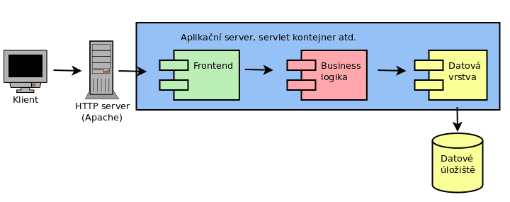

# Apache Kafka


---


## Usage of Kafka

* Message broker on steroids
* Lambda architecture
* Kappa architecture
* Logging platform


---

## Microservices

* Apache Kafka is sometimes key component in microservice-based architectures


### Classic architecture

* Front-end
* Back-end
    - business logic
    - data layer
* Storage


---


### Stateless and stateful microservices

* Services w/o state
    - super easy to test
    - usually very easy to scale up
    - restarts are usually not a big deal
* Stateful service
    - the opposite is true


---


### Communication between stateful microservices

* Not as easy as it might seem
    - "compound" transactions
    - should one service synchronously wait for second one?


---


### Compensation transactions

* One possible solution


---


### Apache Kafka as source of events


---


### Apache Kafka as message broker


---


### Kappa architecture


---

## Monitoring

### JMX

* Java Management Extensions
* Standard in Java world for a long time
* Ability to monitor **any** JVM-based application
* Metrics etc. available through *MBeans*
* Standard tool named **jconsole**

(example of **jconsole** usage)


---

### Simple example of custom MBeans

#### MBean definition via interface named `xxxMBean`:

```java
public interface StatusMBean {
    Integer getAnswer();
    String getProgramName();
    Boolean getSwitchStatus();
}
```

#### Interface implementation:

```java
public class Status implements StatusMBean {
   private Integer answer;
   private String programName;
   private Boolean switchStatus;

   public Status(String programName) {
       this.answer = 42;
       this.programName = programName;
       this.switchStatus = false;
   }
   
   @Override
   public Integer getAnswer() {
       return this.answer;
   }

   @Override
   public String getProgramName() {
       return this.programName;
   }

   @Override
   public Boolean getSwitchStatus() {
       return switchStatus;
   }
}
```

