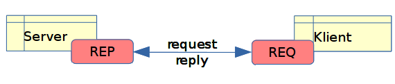
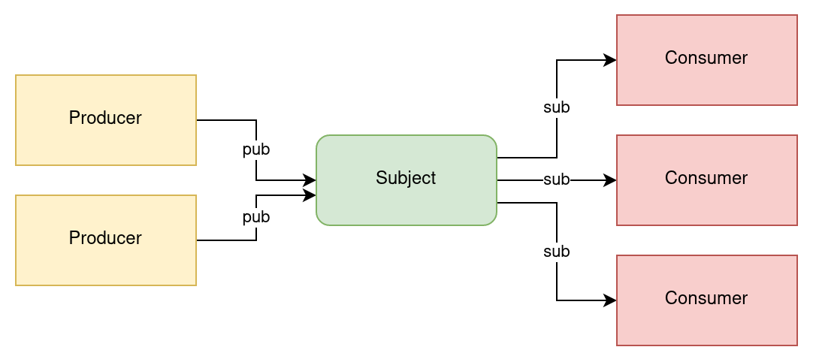
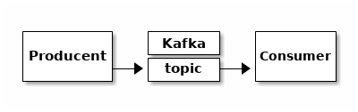
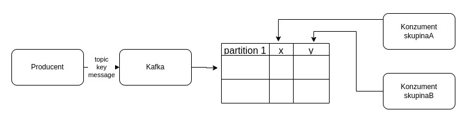
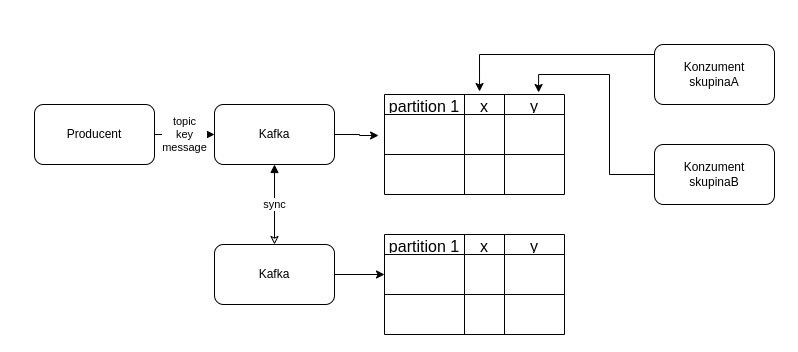

# Apache Kafka


Pavel Tišnovský,
apache_kafka@centrum.cz

---

"Every enterprise is powered by data"

---

## Multifaceted Apache Kafka

* scalable real-time messaging platform
    - able to process millions of messages per second
* event streaming platform for massive volumes of big data analytics
* distributed storage
    - with support for replayability of events
    - and with guaranteed ordering
* data integration framework for streaming ETL
* data processing framework
    - continuous stateless or stateful stream processing

---

## Kafka in not:

* proxy for millions of clients
    - like mobile apps
* API Management platform
* database for complex queries and batch analytics workloads
    - simple aggregations possible thanks to ksqlDB
* IoT platform with features such as device management
* technology for hard real-time applications
    - safety-critical systems
    - deterministic systems

---

## Typical usage of Kafka

* Message broker on steroids
* Central part of Lambda architecture
* Central part of Kappa architecture
* Logging platform
* ETL with capability to "replay" data

---


---

### Kafka streams


---

### Source of truth

[full image](images/kafka_kappa.png)


---

### Kafka: Message broker on steroids

---

### Message brokers

* Classic ones
   - ActiveMQ (Artemis)
   - RabbitMQ
   - IBM MQ
   - etc.

---

### Why message brokers?


---

### Why message brokers?


---

### Message brokers: communication strategies

* Enterprise integration patterns (EIP)

---

### Request reply



---

### Surveyor


---

### Pub-sub



---

### Push-pull


---

### Push-pull with messages redistribution


---

### Push-pull with reply to producer


---

### Other strategies (NATS etc.)


---

## Microservices

* Apache Kafka is sometimes used as a key component in microservice-based architectures
* "Design the organisation you want, the architecture will follow (kicking and screaming)"

---

### Classic architecture

* Front-end
* Back-end
    - business logic
    - data layer
* Storage


---

### Stateless and stateful microservices

* Services w/o state
    - super easy to test
    - usually very easy to scale up
    - restarts are usually not a big deal
* Stateful service
    - the opposite is true

---

[Full image](images/microservices2.png)


---

### Communication between stateful microservices

* Not as easy as it might seem
    - "compound" transactions
    - should one service synchronously wait for second one?

---


---

### Compensation transactions

* One possible solution


---

### Apache Kafka as source of events

[Full image](images/microservices5.png)


---

### Apache Kafka as message broker


---

### Kappa architecture

[Full image](images/microservices7.png)


---

### Messaging

* Command–query separation (CQS)
* Command-query responsibility segregation (CQRS)
* How to communicate between components
    - COMMAND message
    - EVENT message
    - QUERY message
* Sometimes different buses are used
    - CommandBus
    - EventBus
    - QueryBus

---

## Basic concepts

* Message
    - also called event
* Topic
    - a named log of events
* Producer
    - sends messages/events into selected topic
* Consumer
    - retrieves messages/events from selected topic

---

### Producer and consumer



---

### More producers and consumers


---

### Messages in Kafka

* Array of bytes
    - no prior knowledge about format
* Optional key
* Batch(es)
    - multiple messages for the same topic+partition
    - written as one block
    - efficiency

---

### Topics and partitions

* Messages are categorized into topics
* Topic is splitted into partitions

---

## Append-only log

* new mesage/event is always written on the end of one partition
* messages/events are immutable
* can be read by
    - seeking and arbitrary offset
    - sequential scanning

---

## Three basic operations

* Producer
    - produce (send) message to given topic
* Consumer
    - rewind (seek) to message X
    - consume message + update offset

---

## Topic is NOT a queue

* Topic is basically stateless
    - consumers have to maintain their state
    - by storing their offsets "somewhere"
* Message is not deleted after consumption
    - just messages past the retention period are deleted
* FIFO model is not followed

---

## Topic with one partition only

```
+---+---+---+---+---+---+---+---+---+
| 0 | 1 | 2 | 3 | 4 | 5 | 6 | 7 | 8 | ...
+---+---+---+---+---+---+---+---+---+
                ^                        ^
                |                        |
              read                     write
```

---

## Kafka technology is much more difficult though

* Partitions
* Multiple replicas per partition
* Sharding

---

## Multiple partitions for one topic

```
              +---+---+---+---+---+---+
partition #0  | 0 | 1 | 2 | 3 | 4 | 5 | ...
              +---+---+---+---+---+---+
partition #1  | 0 | 1 | 2 | ...
              +---+---+---+
partition #2  | ...
              +---+---+---+---+---+---+---+---+---+
partition #3  | 0 | 1 | 2 | 3 | 4 | 5 | 6 | 7 | 8 | ...
              +---+---+---+---+---+---+---+---+---+
```

---

## Key features

* Scalability
* Reliability
* Log compaction

---

## Scalability

* Topic can be partitioned
    - across different servers

---

## Reliability

* Replication
* Changing leadership role

---

### Multiple replicas per partition

```
                                     write
                                       |
+---+---+---+---+---+---+---+---+---+  v
| 0 | 1 | 2 | 3 | 4 | 5 | 6 | 7 | 8 | ...    (leader)
+---+---+---+---+---+---+---+---+---+
                  ^               ^
                read              |
                                 sync
                                  |
                                  v
+---+---+---+---+---+---+---+---+---+
| 0 | 1 | 2 | 3 | 4 | 5 | 6 | 7 | 8 |        (follower)
+---+---+---+---+---+---+---+---+---+
                                  ^
                                  |
                                 sync
                                  |
                                  v
+---+---+---+---+---+---+---+---+---+
| 0 | 1 | 2 | 3 | 4 | 5 | 6 | 7 | 8 |        (follower)
+---+---+---+---+---+---+---+---+---+
```

---

### Multiple replicas for partitioned topic

```
              +---+---+---+---+---+---+
partition #0  | 0 | 1 | 2 | 3 | 4 | 5 | ...
              +---+---+---+---+---+---+
partition #1  | 0 | 1 | 2 | ...
              +---+---+---+                               (leader)
partition #2  | ...
              +---+---+---+---+---+---+---+---+---+
partition #3  | 0 | 1 | 2 | 3 | 4 | 5 | 6 | 7 | 8 | ...
              +---+---+---+---+---+---+---+---+---+
                                      ^
                                      |
                                     sync
                                      |
                                      v
              +---+---+---+---+---+---+
partition #0  | 0 | 1 | 2 | 3 | 4 | 5 | ...
              +---+---+---+---+---+---+
partition #1  | 0 | 1 | 2 | ...
              +---+---+---+
partition #2  | ...                                       (follower)
              +---+---+---+---+---+---+---+---+---+
partition #3  | 0 | 1 | 2 | 3 | 4 | 5 | 6 | 7 | 8 | ...
              +---+---+---+---+---+---+---+---+---+
                                      ^
                                      |
                                     sync
                                      |
                                      v
              +---+---+---+---+---+---+
partition #0  | 0 | 1 | 2 | 3 | 4 | 5 | ...
              +---+---+---+---+---+---+
partition #1  | 0 | 1 | 2 | ...
              +---+---+---+
partition #2  | ...                                       (follower)
              +---+---+---+---+---+---+---+---+---+
partition #3  | 0 | 1 | 2 | 3 | 4 | 5 | 6 | 7 | 8 | ...
              +---+---+---+---+---+---+---+---+---+
```


---

## Log compaction

* Keeps the latest known value for each record key
* Preserves the most recent version of a record during deletion

---

## Consumer groups, clusters, multiple brokers

* Consumer groups
    - at most one consumer per partition
    - scalability
* Clusters
    - one broker is controller
    - elected automatically
    - assigning partitions
    - monitoring broker failures

---

## Multiple consumers in one group


---

## Consumers from different groups



---

## Multiple brokers



---

## Consumer groups, clusters, multiple brokers

* Partition can be assigned to more brokers
    - replication
    - redundancy
    - can survive broker(s) failure

---

### Retention

* Retention policy
    - setup globally
    - and possible to setup for topic
    - retention limits are minimum guarantees
    - just one criterium might be met

```
log.retention.hours
log.retention.bytes
log.segment.bytes
log.retention.check.interval.ms
log.roll.hours
```

---

### Retention

* The messages on a topic are not immediately removed after they are consumed/expired
* Once either of the limit is breached, the messages are marked deleted

---

## CLI

* Apache Kafka with batteries included

---

## Starting Zookeeper and broker(s)

---

### Zookeeper configuration

* Stored in `config/zookeeper.properties` file

```properties
dataDir=/tmp/zookeeper
clientPort=2181
maxClientCnxns=0
```

---

### Starting Zookeeper

```bash
bin/zookeeper-server-start.sh config/zookeeper.properties
```

```bash
bin\windows\zookeeper-server-start.bat config/zookeeper.properties
```

---

### Checking Zookeeper by telnet

```bash
$ telnet localhost 2181
```

```
Trying ::1...
Connected to localhost.
Escape character is '^]'.
srvr
Zookeeper version: 3.6.3--6401e4ad2087061bc6b9f80dec2d69f2e3c8660a, built on 04/08/2021 16:35 GMT
Latency min/avg/max: 0/0.0/0
Received: 1
Sent: 0
Connections: 1
Outstanding: 0
Zxid: 0x16e
Mode: standalone
Node count: 174
Connection closed by foreign host.
```

---

### Broker(s) configuration

* Stored in `config/server.properties`
* Better to use IDs greater that #replicas

---

### Broker(s) configuration

```properties
broker.id=100
listeners=PLAINTEXT://:9092
num.network.threads=3
num.io.threads=8
 
socket.send.buffer.bytes=102400
socket.receive.buffer.bytes=102400
socket.request.max.bytes=104857600
 
log.dirs=/tmp/kafka-logs
num.partitions=1
num.recovery.threads.per.data.dir=1
log.retention.hours=168
log.segment.bytes=1073741824
 
zookeeper.connect=localhost:2181
zookeeper.connection.timeout.ms=6000
```

---

### Starting server

```
bin/kafka-server-start.sh config/server.properties
```

```
bin\windows\kafka-server-start.bat config/server.properties
```

---

## Number of zookeepers

* Zookeeper cluster:
    - called ensemble
* Quorum
    - so odd number of Zookepers are preferred
    - better to keep <=7 Zookepers
* Writes to Zookeeper
    - changes membership of consumer groups
    - changes in Kafka cluster itself
    - pretty low frequency of changes (usually)
    - (+ commit offsets if configured)

---

## How Zookeepers know about each other

* Common configuration
    - ID (small number)
    - peer port
    - leader port

---

### Config

```
tickTime=2000
dataDir=/var/lib/zookeeper
clientPort=2181
initLimit=20
syncLimit=5
server.1=zoo1.example.com:2888:3888
server.2=zoo2.example.com:2888:3888
server.3=zoo3.example.com:2888:3888
```

* Each server `myid` file in `dataDir`
    - specifies unique ID

---

### More brokers

* Configuration files
    - `config/server0.properties`
    - `config/server1.properties` etc.
* Rules
    - `broker.id` must be unique
    - `listeners` must have unique port numbers
    - `log.dirs` better to be different

---

### Starting more brokers

* On one machine:

```bash
$ nohup bin/kafka-server-start.sh config/server1.properties &
$ nohup bin/kafka-server-start.sh config/server2.properties &
$ nohup bin/kafka-server-start.sh config/server3.properties &
```

```bash
bin\windows\kafka-server-start.bat config/server1.properties
bin\windows\kafka-server-start.bat config/server2.properties
bin\windows\kafka-server-start.bat config/server3.properties
```

---

### CLI producers and consumers

* Stored in `bin` subdirectory
* Two scripts
    - `bin/kafka-console-producer.sh`
    - `bin/kafka-console-consumer.sh`

---

### Other standard CLI tools

```
connect-distributed.sh
connect-mirror-maker.sh
connect-standalone.sh
kafka-acls.sh
kafka-broker-api-versions.sh
kafka-cluster.sh
kafka-configs.sh
kafka-consumer-groups.sh
kafka-consumer-perf-test.sh
kafka-delegation-tokens.sh
kafka-delete-records.sh
kafka-dump-log.sh
kafka-features.sh
kafka-get-offsets.sh
kafka-leader-election.sh
kafka-log-dirs.sh
kafka-metadata-quorum.sh
kafka-metadata-shell.sh
kafka-mirror-maker.sh
kafka-producer-perf-test.sh
kafka-reassign-partitions.sh
kafka-replica-verification.sh
kafka-run-class.sh
kafka-server-start.sh
kafka-server-stop.sh
kafka-storage.sh
kafka-streams-application-reset.sh
kafka-topics.sh
kafka-transactions.sh
kafka-verifiable-consumer.sh
kafka-verifiable-producer.sh
trogdor.sh
zookeeper-security-migration.sh
zookeeper-server-start.sh
zookeeper-server-stop.sh
zookeeper-shell.sh
```

---

### Create topic with #partitions

```bash
bin/kafka-topics.sh --bootstrap-server localhost:9092 --create --topic topic3 --partitions 4
```

```bash
bin\windows\kafka-topics.bat --bootstrap-server localhost:9092 --create --topic topic3 --partitions 4
```

---

### List all topics

```bash
bin/kafka-topics.sh --bootstrap-server localhost:9092 --list
```

```bash
bin\windows\kafka-topics.bat --bootstrap-server localhost:9092 --list
```

---

### List all consumer groups

```bash
bin/kafka-consumer-groups.sh --bootstrap-server localhost:9092 --list
```

```bash
bin\windows\kafka-consumer-groups.bat --bootstrap-server localhost:9092 --list
```

---

### Info about one group

```bash
bin/kafka-consumer-groups.sh --bootstrap-server localhost:9092 --group test-group --describe
```

```bash
bin\windows\kafka-consumer-groups.bat --bootstrap-server localhost:9092 --group test-group --describe
```

---

### Reset offsets

```bash
bin/kafka-consumer-groups.sh --reset-offsets --to-earliest --topic topic3 --execute --group test-group-4 --bootstrap-server localhost:9092
```

```bash
bin\windows\kafka-consumer-groups.bat --reset-offsets --to-earliest --topic topic3 --execute --group test-group-4 --bootstrap-server localhost:9092
```


---

### Multiple consumers example #1

```
bin/kafka-topics.sh --bootstrap-server localhost:9092 --create --topic T3 --partitions 3
```

```
bin\windows\kafka-topics.bat --bootstrap-server localhost:9092 --create --topic T3 --partitions 3
```

---

### Multiple consumers example #2

```
bin/kafka-console-consumer.sh --bootstrap-server localhost:9092 --topic T3 --group G3
bin/kafka-console-consumer.sh --bootstrap-server localhost:9092 --topic T3 --group G3
bin/kafka-console-consumer.sh --bootstrap-server localhost:9092 --topic T3 --group G3
```

```
bin\windows\kafka-console-consumer.bat --bootstrap-server localhost:9092 --topic T3 --group G3
bin\windows\kafka-console-consumer.bat --bootstrap-server localhost:9092 --topic T3 --group G3
bin\windows\kafka-console-consumer.bat --bootstrap-server localhost:9092 --topic T3 --group G3
```

---

### Multiple consumers example #3

```
bin/kafka-console-producer.sh --broker-list localhost:9092 --topic T3 --property parse.key=true --property key.separator=":"
```

```
bin\windows\kafka-console-producer.bat --broker-list localhost:9092 --topic T3 --property parse.key=true --property key.separator=":"
```

---

### Multiple consumers example #4

```bash
bin/kafka-consumer-groups.sh --bootstrap-server localhost:9092 --group G3 --describe
```

```bash
bin\windows\kafka-consumer-groups.bat --bootstrap-server localhost:9092 --group G3 --describe
```

---

### Partition replications

* Examples below expects 3 brokers to run
    - with different IDs
    - with different port
    - and with different log.dirs

---

### Partition replications

* Topic with one partition that is replicated 3 times

```
bin/kafka-topics.sh --bootstrap-server localhost:9092 --create --topic test_topic_2 --replication-factor 3

bin/kafka-topics.sh --bootstrap-server localhost:9092 --describe --topic test_topic_2
```

* Topic with three partitions that are replicated

```
bin/kafka-topics.sh --bootstrap-server localhost:9092 --create --topic test_topic_3 --replication-factor 3 --partitions 3

bin/kafka-topics.sh --bootstrap-server localhost:9092 --describe --topic test_topic_3
```

---

### Partition replications

* Specify replica assignments

```
bin/kafka-topics.sh --bootstrap-server localhost:9092 --create --topic test_topic_4 --replica-assignment 101:102,100:101

bin/kafka-topics.sh --bootstrap-server localhost:9092 --create --topic test_topic_5 --replica-assignment 102:100:101
```

---

## kcli

* Topic, partitions and messages browser
* Works in console
* Windows + Linux

* https://github.com/cswank/kcli

---

## Kafkacat (kcat)

* List topics

```
kafkacat -L -b localhost:9092
```

---

## Kafkacat as producer

* Messages on standard input

```
kafkacat -P -b localhost:9092 -t "upload"
```

* Messages from files

```
kafkacat -P -b localhost:9092 -t filedrop -p 0 file1.bin file2.txt /etc/motd dalsi_soubor.tgz
```

---

## Kafkacat as consumer

* Standard consumer for topic

```
kafkacat -C -b localhost:9092 -t "upload"
```

* Consumer mode
    - 1000 messages from topic topic1
    - does not wait for new messages

```
kafkacat -C -b localhost:9092 -t topic1 -p 0 -o -1000 -e
```

---

## Kafkacat as consumer (2)

* Consumer mode for with consumer group spec.

```
kafkacat -b localhost:9092 -G skupina_konzumentů topic1
```

* Consumer for multiple topics

```
kafkacat -b localhost:9092 -G skupina_konzumentů téma1 téma2
```

---

## Clients for Apache Kafka

* [Supported languages/ecosystems](https://cwiki.apache.org/confluence/display/KAFKA/Clients)
    - C/C++
    - Python
    - Go (AKA golang)
    - Erlang
    - PowerShell
    - .NET
    - Ruby
    - Node.js
    - Proxy (HTTP REST, etc)
    - Perl
    - stdin/stdout
    - PHP
    - Rust
    - Alternative Java
    - Storm
    - Scala DSL 
    - Clojure
    - Swift

---

## Client examples

* Examples for Python
* Examples for Go
* Examples for Java
* Examples for Clojure

---

### Examples for Python

* Libraries used
    - kafka-python
    - confluent-kafka

```bash
pip3 install --user kafka-python
```

---

#### Messages producer

```
#!/usr/bin/env python3

from kafka import KafkaProducer
from time import sleep
from json import dumps

server = "localhost:9092"
topic = "upload"

print("Connecting to Kafka")
producer = KafkaProducer(
    bootstrap_servers=[server],
    value_serializer=lambda x: dumps(x).encode("utf-8")
)
print("Connected to Kafka")

for i in range(1000):
    data = {"counter": i}
    producer.send(topic, value=data)
    sleep(5)
```

---

#### Messages consumer

```
#!/usr/bin/env python3

import sys
from kafka import KafkaConsumer

server = "localhost:9092"
topic = "upload"
group_id = "group1"

print("Connecting to Kafka")
consumer = KafkaConsumer(
    topic, group_id=group_id,
    bootstrap_servers=[server],
    auto_offset_reset="earliest"
)
print("Connected to Kafka")

try:
    for message in consumer:
        print(
            "%s:%d:%d: key=%s value=%s"
            % (
                message.topic,
                message.partition,
                message.offset,
                message.key,
                message.value,
            )
        )
except KeyboardInterrupt:
    sys.exit()
```

---

### Consumer with "replay" ability

```python
#!/usr/bin/env python3

import sys
from kafka import KafkaConsumer, TopicPartition

server = 'localhost:9092'
topic = 'upload'
group_id = 'group1'

print('Connecting to Kafka')
consumer = KafkaConsumer(group_id=group_id,
                         bootstrap_servers=[server])
print('Connected to Kafka')

tp = TopicPartition(topic=topic, partition=0)
consumer.assign([tp])
consumer.seek(tp, 0)

try:
    for message in consumer:
        print("%s:%d:%d: key=%s value=%s" % (message.topic, message.partition, message.offset, message.key, message.value))
except KeyboardInterrupt:
    sys.exit()
```

---

### Examples for Go

* Two libraries can be used
    - Sarama
    - Confluent-kafka-go

---

#### Messages producer

```go
package main

import (
        "log"

        "github.com/Shopify/sarama"
)

const (
        // KafkaConnectionString obsahuje jméno počítače a port, na kterém běží Kafka broker
        KafkaConnectionString = "localhost:9092"

        // KafkaTopic obsahuje jméno tématu
        KafkaTopic = "test-topic"
)

func main() {
        // konstrukce konzumenta
        producer, err := sarama.NewSyncProducer([]string{KafkaConnectionString}, nil)

        // kontrola chyby při připojování ke Kafce
        if err != nil {
                log.Fatal(err)
        }

        log.Printf("Connected to %s", KafkaConnectionString)

        // zajištění uzavření připojení ke Kafce
        defer func() {
                if err := producer.Close(); err != nil {
                        log.Fatal(err)
                }
        }()

        // poslání (produkce) zprávy
        msg := &sarama.ProducerMessage{Topic: KafkaTopic, Value: sarama.StringEncoder("testing 123")}
        partition, offset, err := producer.SendMessage(msg)
        if err != nil {
                log.Printf("FAILED to send message: %s\n", err)
        } else {
                log.Printf("> message sent to partition %d at offset %d\n", partition, offset)
        }

        log.Print("Done")
}
```

---

#### Messages consumer

```go
package main

import (
        "log"

        "github.com/Shopify/sarama"
)

const (
        // KafkaConnectionString obsahuje jméno počítače a port, na kterém běží Kafka broker
        KafkaConnectionString = "localhost:9092"

        // KafkaTopic obsahuje jméno tématu
        KafkaTopic = "test-topic"
)

func main() {
        // konstrukce konzumenta
        consumer, err := sarama.NewConsumer([]string{KafkaConnectionString}, nil)

        // kontrola chyby při připojování ke Kafce
        if err != nil {
                log.Fatal(err)
        }

        log.Printf("Connected to %s", KafkaConnectionString)

        // zajištění uzavření připojení ke Kafce
        defer func() {
                if err := consumer.Close(); err != nil {
                        log.Fatal(err)
                }
        }()

        // přihlášení ke zvolenému tématu
        partitionConsumer, err := consumer.ConsumePartition(KafkaTopic, 0, sarama.OffsetNewest)
        if err != nil {
                log.Fatal(err)
        }

        // zajištění ukončení přihlášení ke zvolenému tématu
        defer func() {
                if err := partitionConsumer.Close(); err != nil {
                        log.Fatal(err)
                }
        }()

        // postupné čtení zpráv, které byly do zvoleného tématu publikovány
        consumed := 0
        for {
                msg := <-partitionConsumer.Messages()
                // vypíšeme pouze offset zprávy, její klíč a tělo (value, payload)
                log.Printf("Consumed message offset %d: %s:%s", msg.Offset, msg.Key, msg.Value)
                consumed++
        }

        // výpis počtu zpracovaných zpráv (ovšem sem se stejně nedostaneme :-)
        log.Printf("Consumed: %d", consumed)
        log.Print("Done")
}

```
---

### Message producer (confluent-kafka)

```go
package main

import (
        "fmt"
        "gopkg.in/confluentinc/confluent-kafka-go.v1/kafka"
)

const (
        server   = "localhost:9092"
        topic    = "upload"
        group_id = "group1"
)

func main() {
        consumer, err := kafka.NewConsumer(&kafka.ConfigMap{
                "bootstrap.servers": server,
                "group.id":          group_id,
                "auto.offset.reset": "earliest",
        })
        defer consumer.Close()

        if err != nil {
                panic(err)
        }

        consumer.SubscribeTopics([]string{topic}, nil)

        for {
                message, err := consumer.ReadMessage(-1)
                if err == nil {
                        fmt.Printf("Message on %s: %s %s\n", message.TopicPartition, string(message.Key), string(message.Value))
                } else {
                        fmt.Printf("Consumer error: %v (%v)\n", err, message)
                }
        }
}
```

---

### Message consumer (confluent-kafka)

```go
package main

import (
        "fmt"
        "gopkg.in/confluentinc/confluent-kafka-go.v1/kafka"
)

const (
        server   = "localhost:9092"
        topic    = "upload"
        group_id = "group1"
)

func main() {
        consumer, err := kafka.NewConsumer(&kafka.ConfigMap{
                "bootstrap.servers": server,
                "group.id":          group_id,
                "auto.offset.reset": "earliest",
        })
        defer consumer.Close()

        if err != nil {
                panic(err)
        }

        consumer.SubscribeTopics([]string{topic}, nil)

        for {
                message, err := consumer.ReadMessage(-1)
                if err == nil {
                        fmt.Printf("Message on %s: %s %s\n", message.TopicPartition, string(message.Key), string(message.Value))
                } else {
                        fmt.Printf("Consumer error: %v (%v)\n", err, message)
                }
        }
}
```

---

### Examples for Java

---

#### Messages producer

```java
import java.util.Properties;

import org.apache.kafka.clients.producer.KafkaProducer;
import org.apache.kafka.clients.producer.ProducerConfig;
import org.apache.kafka.clients.producer.ProducerRecord;
import org.apache.kafka.common.serialization.StringSerializer;

public class SimpleProducer {
    public static void main(String args[])
    {
        String bootstrapServers="127.0.0.1:9092";
        Properties properties=new Properties();
        properties.setProperty(ProducerConfig.BOOTSTRAP_SERVERS_CONFIG, bootstrapServers);
        properties.setProperty(ProducerConfig.KEY_SERIALIZER_CLASS_CONFIG, StringSerializer.class.getName());
        properties.setProperty(ProducerConfig.VALUE_SERIALIZER_CLASS_CONFIG, StringSerializer.class.getName());

        KafkaProducer<String,String> producer = new KafkaProducer<String, String>(properties);

        ProducerRecord<String, String> record = new ProducerRecord<String, String>("topic", "Hello");
        producer.send(record);
        producer.flush();
        producer.close();
    }
}
```

---

#### Compilation and running

```bash
javac -cp kafka_2.12-3.3.2/libs/kafka-clients-3.3.2.jar SimpleProducer.java
```

```bash
java -cp .:kafka_2.12-3.3.2/libs/kafka-clients-3.3.2.jar:kafka_2.12-3.3.2/libs/slf4j-api-1.7.36.jar SimpleProducer
```

---

#### Messages consumer

```java
import java.util.Arrays;
import java.time.Duration;
import java.util.Properties;

import org.apache.kafka.clients.consumer.KafkaConsumer;
import org.apache.kafka.clients.consumer.ConsumerConfig;
import org.apache.kafka.clients.consumer.ConsumerRecord;
import org.apache.kafka.clients.consumer.ConsumerRecords;
import org.apache.kafka.common.serialization.StringDeserializer;

public class SimpleConsumer {
    public static void main(String args[])
    {
        String bootstrapServers="127.0.0.1:9092";
        String group_id="my_consumer_group";
        String topic="topic";

        Properties properties=new Properties();
        properties.setProperty(ConsumerConfig.BOOTSTRAP_SERVERS_CONFIG, bootstrapServers);
        properties.setProperty(ConsumerConfig.GROUP_ID_CONFIG, group_id);
        properties.setProperty(ConsumerConfig.KEY_DESERIALIZER_CLASS_CONFIG, StringDeserializer.class.getName());
        properties.setProperty(ConsumerConfig.VALUE_DESERIALIZER_CLASS_CONFIG, StringDeserializer.class.getName());
        properties.setProperty(ConsumerConfig.AUTO_OFFSET_RESET_CONFIG, "earliest");

        KafkaConsumer<String,String> consumer= new KafkaConsumer<String,String>(properties);
        consumer.subscribe(Arrays.asList(topic));

        while(true) {
            ConsumerRecords<String,String> records=consumer.poll(Duration.ofMillis(100));
            for(ConsumerRecord<String,String> record: records){
                System.out.println("Key: "+ record.key() + ", Value:" +record.value());
                System.out.println("Partition:" + record.partition()+",Offset:"+record.offset());
            }
        }
    }
}
```

---

#### Compilation and running

```bash
javac -cp kafka_2.12-3.3.2/libs/kafka-clients-3.3.2.jar SimpleConsumer.java
```

```bash
java -cp .:kafka_2.12-3.3.2/libs/kafka-clients-3.3.2.jar:kafka_2.12-3.3.2/libs/slf4j-api-1.7.36.jar SimpleConsumer
```

```bash
javac -cp kafka_2.12-3.3.2\libs\kafka-clients-3.3.2.jar SimpleConsumer.java
```

```bash
java -cp .;kafka_2.12-3.3.2\libs\kafka-clients-3.3.2.jar;kafka_2.12-3.3.2\libs\slf4j-api-1.7.36.jar SimpleConsumer
```

---

### Examples for Clojure

---

#### Messages producer

```
(ns produce-messages-2.core
  (:require [jackdaw.client :as jc]
            [clojure.pprint :as pp]))

(def producer-config
  {"bootstrap.servers" "localhost:9092"
   "key.serializer" "org.apache.kafka.common.serialization.StringSerializer"
   "value.serializer" "org.apache.kafka.common.serialization.StringSerializer"
   "acks" "all"
   "client.id" "foo"})

(defn -main
  [& args]
  (with-open [producer (jc/producer producer-config)]
    (doseq [i (range 1 101)]
      (let [key (str i)
            value (str "Message #" i)]
        (println "Publishing message with key '" key "' and value '" value "'")
        (let [record-metadata (jc/produce! producer {:topic-name "test2"} key value)]
          (pp/pprint @record-metadata)))
      )))
```

---

#### Messages consumer

```
(ns consume-messages-1.core
  (:require [jackdaw.client :as jc]
            [jackdaw.client.log :as jl]
            [clojure.pprint :as pp]))

(def consumer-config
  {"bootstrap.servers" "localhost:9092"
   "key.deserializer" "org.apache.kafka.common.serialization.StringDeserializer"
   "value.deserializer" "org.apache.kafka.common.serialization.StringDeserializer"
   "group.id"  "group-A"})

(defn -main
  [& args]
  (with-open [consumer (-> (jc/consumer consumer-config)
                           (jc/subscribe [{:topic-name "test1"}]))]
    (doseq [{:keys [key value partition timestamp offset]} (jl/log consumer 10)]
      (println "key: " key)
      (println "value: " value)
      (println "partition: " partition)
      (println "timestamp: " timestamp)
      (println "offset: " offset))))
```
---

## Kafka connect


* "Distributed scalable framework"
* Automatic consuming or producing data
    - with data persistence in-between
* Part of Apache Kafka
* Just configuration files
* And connectors

---

## Kafka Connect components

* Sources
* Kafka Cluster
* Sinks

---

## Kafka Connect use cases

---

### Moving data from one DB to another one


---

### Connection between MQTT and AWS SQS


---

### From one source to various sinks

* Amazon S3
* Logs
* Storage (database)


---

#### Custom consumers are possible

* Amazon S3
* Logs
* Storage (database)
* And bunch of custom consumers


---

## Kafka Connect from developers PoV

* Is separate process
* It requires no programming
    - failures handling
    - logging
    - monitoring
    - scaling
    - migrating
    - sec. handling etc.

---

## Kafka Connect from developers PoV (cont.)

* Lightweight data transformations
* Sometimes defined by one simple property file

---

### Simple file sink

* Connector that read all messages from selected topic
* Such messages are written into selected text file
    - line by line

---

### Configuration file

```properties
name=local-file-sink
connector.class=FileStreamSink
tasks.max=1
file=test.sink.txt
topics=connect-test-1
key.converter=org.apache.kafka.connect.storage.StringConverter
value.converter=org.apache.kafka.connect.storage.StringConverter
key.converter.schemas.enable=false
value.converter.schemas.enable=false
```

---

### Use the connector

* Starting

```bash
cd kafka/kafka_2.12-3.3.2/
bin/connect-standalone.sh config/connect-standalone.properties config/connect-file-sink.properties
```

```bash
cd kafka\kafka_2.12-3.3.2\
bin\windows\connect-standalone.bat config\connect-standalone.properties config\connect-file-sink.properties
```

---

### Use the connector (Linux)

* Producing messages

```bash
bin/kafka-console-producer.sh --broker-list localhost:9092 --topic connect-test-1
```

* Key+value

```bash
bin/kafka-console-producer.sh --broker-list localhost:9092 --topic connect-test-1 -property parse.key=true --property key.separator=:
```

---

### Use the connector (Windows)

* Producing messages

```bash
bin\windows\kafka-console-producer.bat --broker-list localhost:9092 --topic connect-test-1
```

* Key+value

```bash
bin\windows\kafka-console-producer.bat --broker-list localhost:9092 --topic connect-test-1 -property parse.key=true --property key.separator=:
```

---

### Messages in JSON format

* Common requirement

```properties
name=local-file-sink
connector.class=FileStreamSink
tasks.max=1
file=test.sink.txt
topics=connect-test-1
key.converter=org.apache.kafka.connect.json.JsonConverter
value.converter=org.apache.kafka.connect.json.JsonConverter
key.converter.schemas.enable=false
value.converter.schemas.enable=false
```

---

### Handling messages with improper format

* Stop the connector
* Ignore incorrect message
* Send incorrect message into DLQ
    - dead letter queue
    - pretty common approach in message brokers world

---

### Stop the connector

* We already know how to do it

---

### Ignore incorrect message

* property named `errors.tolerance`

```properties
name=local-file-sink-json
connector.class=FileStreamSink
tasks.max=1
file=test.sink3.jsons
topics=connect-test-json
key.converter=org.apache.kafka.connect.json.JsonConverter
value.converter=org.apache.kafka.connect.json.JsonConverter
key.converter.schemas.enable=false
value.converter.schemas.enable=false
errors.tolerance=all
```

---

### Send incorrect message into DLQ

```properties
name=local-file-sink-json
connector.class=FileStreamSink
tasks.max=1
file=test.sink4.jsons
topics=connect-test-json
key.converter=org.apache.kafka.connect.json.JsonConverter
value.converter=org.apache.kafka.connect.json.JsonConverter
key.converter.schemas.enable=false
value.converter.schemas.enable=false
errors.tolerance=all
errors.deadletterqueue.topic.name=dlq_bad_jsons
errors.deadletterqueue.topic.replication.factor=1
```

---

### Retrieve incorrect messages

* Using standard tools

```bash
bin/kafka-console-consumer.sh  --bootstrap-server localhost:9092 --topic dlq_bad_jsons --partition 0 --offset earliest
```

```bash
bin\windows\kafka-console-consumer.bat  --bootstrap-server localhost:9092 --topic dlq_bad_jsons --partition 0 --offset earliest
```

* Using *Kafkacat*

```bash
kafkacat -b localhost:9092 -t dlq_bad_jsons -C
```

---

### JDBC-based sink

```properties
name=db-sink
connector.class=io.confluent.connect.jdbc.JdbcSinkConnector
tasks.max=1
topics=connect-test-3
key.converter=org.apache.kafka.connect.json.JsonConverter
value.converter=org.apache.kafka.connect.json.JsonConverter
key.converter.schemas.enable=true
value.converter.schemas.enable=true
connection.url=jdbc:postgresql://localhost:5432/kafka_sink?user=postgres&password=postgres
auto.create=true
delete.enabled=false
```

---

### JDBC-based sink

* It will work
* But it will use table named `connect-test-3`
    - a bit problematic

---

### JDBC-based sink

```properties
name=db-sink
connector.class=io.confluent.connect.jdbc.JdbcSinkConnector
tasks.max=1
topics=test_table
key.converter=org.apache.kafka.connect.json.JsonConverter
value.converter=org.apache.kafka.connect.json.JsonConverter
key.converter.schemas.enable=true
value.converter.schemas.enable=true
connection.url=jdbc:postgresql://localhost:5432/kafka_sink?user=postgres&password=postgres
auto.create=true
delete.enabled=false
```

---

## Monitoring

* JMX
* Prometheus metrics

---

### JMX

* Java Management Extensions
* Standard in Java world for a long time
* Ability to monitor **any** JVM-based application
* Metrics etc. available through *MBeans*
* Standard tool named **jconsole**

(example of **jconsole** usage)

---

### Simple example of custom MBeans

#### MBean definition via interface named `xxxMBean`:

```java
public interface StatusMBean {
    Integer getAnswer();
    String getProgramName();
    Boolean getSwitchStatus();
}
```

---

#### Interface implementation:

```java
public class Status implements StatusMBean {
   private Integer answer;
   private String programName;
   private Boolean switchStatus;

   public Status(String programName) {
       this.answer = 42;
       this.programName = programName;
       this.switchStatus = false;
   }
```

---

#### Interface implementation (cont.):

* getters
* setters

```java
   @Override
   public Integer getAnswer() {
       return this.answer;
   }

   @Override
   public String getProgramName() {
       return this.programName;
   }

   @Override
   public Boolean getSwitchStatus() {
       return switchStatus;
   }
}
```

---

#### MBean export

```java
import java.util.Scanner;

import javax.management.*;
import java.lang.management.ManagementFactory;

public class Main {
   public static void main(String[] args) {
       try {
           String programName = (args.length == 0) ? "foobar" : args[0];

           StatusMBean systemStatus = new Status(programName);

           MBeanServer platformMBeanServer = ManagementFactory.getPlatformMBeanServer();
           ObjectName objectName = new ObjectName("cz.amend.app:name=StatusExample");
           platformMBeanServer.registerMBean(systemStatus, objectName);

       } catch (Exception e) {
           e.printStackTrace();
       }

       new Scanner(System.in).nextLine();
   }
}
```

---

#### Example of **jconsole** usage

(live)

---

#### JMX can be used to *control* applications as well

* MBean definition via interface named `xxxMBean`:

```java
public interface StatusMBean {
    Integer getAnswer();
    Long    getCounter();
    String  getProgramName();
    Boolean getSwitchStatus();
    void    setSwitchStatus(Boolean newStatus);
    void    flipSwitchStatus();
}
```

---

#### Interface implementation

```java
public class Status implements StatusMBean {
   private Integer answer;
   private String programName;
   private Boolean switchStatus;
   private Long counter;

   public Status(String programName) {
       this.answer = 42;
       this.programName = programName;
       this.switchStatus = false;
       this.counter = 0L;
   }
   
   @Override
   public Integer getAnswer() {
       return this.answer;
   }

   @Override
   public Long getCounter() {
       this.counter++;
       return this.counter;
   }

   @Override
   public String getProgramName() {
       return this.programName;
   }

   @Override
   public Boolean getSwitchStatus() {
       return switchStatus;
   }

   @Override
   public void setSwitchStatus(Boolean newStatus) {
       this.switchStatus = newStatus;
   }

   @Override
   public void flipSwitchStatus() {
       System.out.println("Flip switch status called!");
       this.switchStatus = !this.switchStatus;
   }
}
```

---

#### MBean export

```java
import java.util.Scanner;

import javax.management.*;
import java.lang.management.ManagementFactory;

public class Main {
   public static void main(String[] args) {
       try {
           String programName = (args.length == 0) ? "foobar" : args[0];

           StatusMBean systemStatus = new Status(programName);

           MBeanServer platformMBeanServer = ManagementFactory.getPlatformMBeanServer();
           ObjectName objectName = new ObjectName("cz.amend.app:name=StatusExample");
           platformMBeanServer.registerMBean(systemStatus, objectName);

       } catch (Exception e) {
           e.printStackTrace();
       }

       new Scanner(System.in).nextLine();
   }
}
```

---

(example of **jconsole** usage)

---

### JMX Exporter

* Tool to provide metrics via Prometheus-like HTTP responses
* Used as `agent` for JVM

---

### JMX exporter setup and usage

* Setup

```bash
wget https://repo1.maven.org/maven2/io/prometheus/jmx/jmx_prometheus_javaagent/0.15.0/jmx_prometheus_javaagent-0.15.0.jar
touch config.yaml
```
* Usage

```bash
java -javaagent:./jmx_prometheus_javaagent-0.15.0.jar=8080:config.yaml Main
```

* Getting metrics

```bash
curl localhost:8080/metrics
```

---

### JMX Exporter setup for Kafka broker

```bash
if [ $# -lt 1 ];
then
    echo "USAGE: $0 [-daemon] server.properties [--override property=value]*"
    exit 1
fi
base_dir=$(dirname $0)
 
if [ "x$KAFKA_LOG4J_OPTS" = "x" ]; then
    export KAFKA_LOG4J_OPTS="-Dlog4j.configuration=file:$base_dir/../config/log4j.properties"
fi
 
if [ "x$KAFKA_HEAP_OPTS" = "x" ]; then
    export KAFKA_HEAP_OPTS="-Xmx1G -Xms1G"
fi
 
EXTRA_ARGS=${EXTRA_ARGS-'-name kafkaServer -loggc'}
 
COMMAND=$1
case $COMMAND in
  -daemon)
    EXTRA_ARGS="-daemon "$EXTRA_ARGS
    shift
    ;;
  *)
    ;;
esac
 
export KAFKA_OPTS=' -javaagent:jmx_prometheus_javaagent-0.15.0.jar=9999:./config/kafka-2_0_0.yml'
 
exec $base_dir/kafka-run-class.sh $EXTRA_ARGS kafka.Kafka "$@"
```

---

### Kafka metrics

- Kafka server (broker) metrics
- Producer metrics
- Consumer metrics
- ZooKeeper metrics
- JVM-related metrics

---

#### Kafka server (broker) metrics

```
UnderReplicatedPartitions         kafka.server:type=ReplicaManager,name=UnderReplicatedPartitions
IsrShrinksPerSec/IsrExpandsPerSec kafka.server:type=ReplicaManager,name=IsrShrinksPerSec
ActiveControllerCount             kafka.controller:type=KafkaController,name=ActiveControllerCount
OfflinePartitionsCount            kafka.controller:type=KafkaController,name=OfflinePartitionsCount
LeaderElectionRateAndTimeMs       kafka.controller:type=ControllerStats,name=LeaderElectionRateAndTimeMs
UncleanLeaderElectionsPerSec      kafka.controller:type=ControllerStats,name=UncleanLeaderElectionsPerSec
TotalTimeMs                       kafka.network:type=RequestMetrics,name=TotalTimeMs
PurgatorySize                     kafka.server:type=DelayedOperationPurgatory,name=PurgatorySize
BytesInPerSec/BytesOutPerSec      kafka.server:type=BrokerTopicMetrics,name={BytesInPerSec|BytesOutPerSec}
RequestsPerSecond                 kafka.network:type=RequestMetrics,name=RequestsPerSec
```

---

### Producer metrics

```
compression-rate-avg    kafka.producer:type=producer-metrics,client-id=([-.w]+)
response-rate           kafka.producer:type=producer-metrics,client-id=([-.w]+)
request-rate            kafka.producer:type=producer-metrics,client-id=([-.w]+)
request-latency-avg     kafka.producer:type=producer-metrics,client-id=([-.w]+)
outgoing-byte-rate      kafka.producer:type=producer-metrics,client-id=([-.w]+)
io-wait-time-ns-avg     kafka.producer:type=producer-metrics,client-id=([-.w]+)
batch-size-avg          kafka.producer:type=producer-metrics,client-id=([-.w]+)
```

---

### Consumer metrics

```
records-lag             kafka.consumer:type=consumer-fetch-manager-metrics,client-id=([-.w]+),topic=([-.w]+),partition=([-.w]+)
records-lag-max         kafka.consumer:type=consumer-fetch-manager-metrics,client-id=([-.w]+),topic=([-.w]+),partition=([-.w]+)
                        kafka.consumer:type=consumer-fetch-manager-metrics,client-id=([-.w]+)
bytes-consumed-rate     kafka.consumer:type=consumer-fetch-manager-metrics,client-id=([-.w]+),topic=([-.w]+)
                        kafka.consumer:type=consumer-fetch-manager-metrics,client-id=([-.w]+)
records-consumed-rate   kafka.consumer:type=consumer-fetch-manager-metrics,client-id=([-.w]+),topic=([-.w]+)
                        kafka.consumer:type=consumer-fetch-manager-metrics,client-id=([-.w]+)
fetch-rate              kafka.consumer:type=consumer-fetch-manager-metrics,client_id=([-.w]+)
```

---

### ZooKeeper metrics

```
outstanding_requests        Number of requests queued
avg_latency                 Amount of time it takes to respond to a client
num_alive_connections       Number of clients connected to ZooKeeper
followers                   Number of active followers
pending_syncs               Number of pending syncs from followers
open_file_descriptor_count  Number of file descriptors in use
```

---

### JVM-related metrics

```
CollectionCount             java.lang:type=GarbageCollector,name=G1 (Young|Old) Generation
CollectionTime              java.lang:type=GarbageCollector,name=G1 (Young|Old) Generation
```

---

## Useful links 1/2

1. [Getter and Setter in Java](https://www.geeksforgeeks.org/getter-and-setter-in-java/)
1. [Enterprise Integration Patterns](https://www.enterpriseintegrationpatterns.com/)
1. [Apache Kafka vs. Middleware (MQ, ETL, ESB) – Slides + Video](https://www.kai-waehner.de/blog/2019/03/07/apache-kafka-middleware-mq-etl-esb-comparison/)
1. [Discover Kafka® connectors and more](https://www.confluent.io/hub/?_ga=2.197519912.642206306.1675149141-1201563621.1675149140)
1. [JDBC Connector (Source and Sink)](https://www.confluent.io/hub/confluentinc/kafka-connect-jdbc)
1. [From Zero to Hero with Kafka Connect by Robin Moffatt](https://www.youtube.com/watch?v=Jkcp28ki82k)
1. [Apache Kafka Queue 101: Messaging Made Easy](https://hevodata.com/learn/kafka-queue/)
1. [What is Apache Kafka?](https://aws.amazon.com/msk/what-is-kafka/)

---

## Useful links 2/2

1. [Kafka Is Not A Queue](https://abhyrama.com/2019/06/25/kafka-is-not-a-queue/)
1. [Sharding Kafka for Increased Scale and Reliability](https://www.crowdstrike.com/blog/how-we-improved-scale-and-reliability-by-sharding-kafka/)
1. [Kafka clients](https://cwiki.apache.org/confluence/display/KAFKA/Clients)
