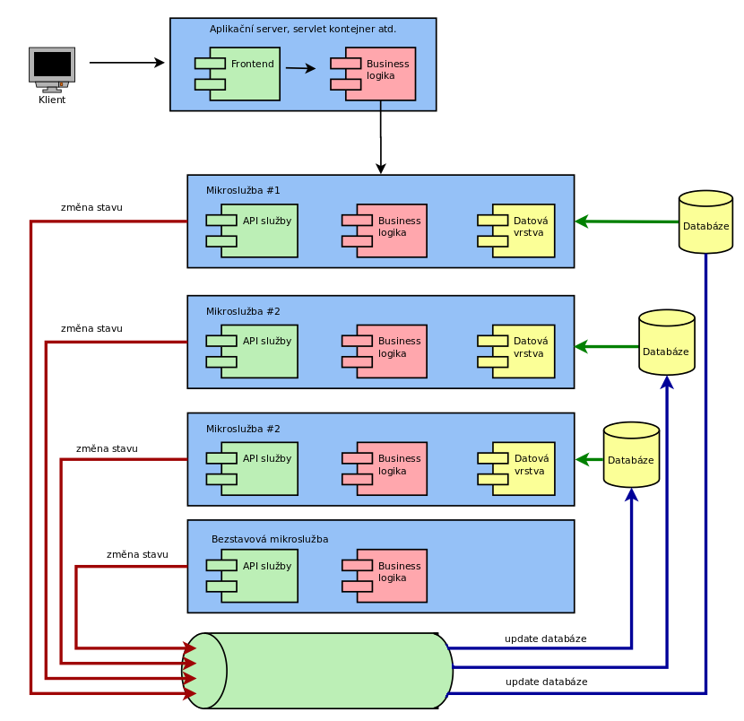
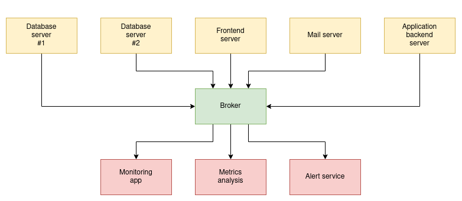
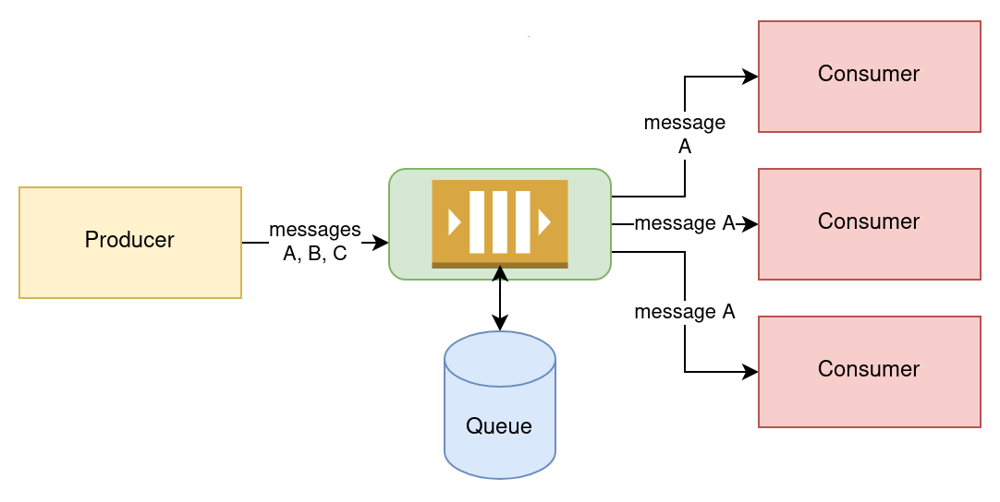
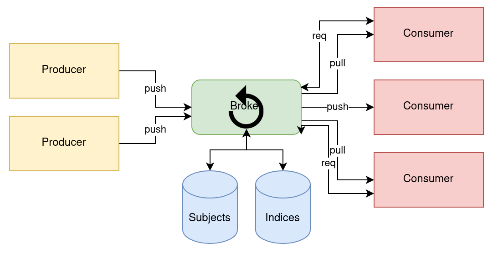

# Apache Kafka


---

"Every enterprise is powered by data"

---

## Multifaceted Apache Kafka

* scalable real-time messaging platform
    - able to process millions of messages per second
* event streaming platform for massive volumes of big data analytics
* distributed storage
    - with support for replayability of events
    - and with guaranteed ordering
* data integration framework for streaming ETL
* data processing framework
    - continuous stateless or stateful stream processing

---

## Kafka in not:

* proxy for millions of clients
    - like mobile apps
* API Management platform
* database for complex queries and batch analytics workloads
    - simple aggregations possible thanks to ksqlDB
* IoT platform with features such as device management
* technology for hard real-time applications
    - safety-critical systems
    - deterministic systems

---

## Typical usage of Kafka

* Message broker on steroids
* Central part of Lambda architecture
* Central part of Kappa architecture
* Logging platform
* ETL with capability to "replay" data

---

### Kafka streams


---

### Source of truth

[full image](images/kafka_kappa.png)


---

### Kafka: Message broker on steroids

---

### Message brokers

* Classic ones
   - ActiveMQ (Artemis)
   - RabbitMQ
   - IBM MQ
   - etc.

---

### Why message brokers?


---

### Why message brokers?



---

### Message brokers: communication strategies

* Enterprise integration patterns (EIP)

---

### Request reply


---

### Surveyor


---

### Pub-sub


---

### Push-pull


---

### Push-pull with messages redistribution



---

### Push-pull with reply to producer


---

### Other strategies (NATS etc.)



---

## Microservices

* Apache Kafka is sometimes used as a key component in microservice-based architectures
* "Design the organisation you want, the architecture will follow (kicking and screaming)"

---

### Classic architecture

* Front-end
* Back-end
    - business logic
    - data layer
* Storage


---

### Stateless and stateful microservices

* Services w/o state
    - super easy to test
    - usually very easy to scale up
    - restarts are usually not a big deal
* Stateful service
    - the opposite is true

---

[Full image](images/microservices2.png)


---

## Basic concepts

* Message
    - also called event
* Topic
    - a named log of events
* Producer
    - sends messages/events into selected topic
* Consumer
    - retrieves messages/events from selected topic

---

### Messages in Kafka

* Array of bytes
    - no prior knowledge about format
* Optional key
* Batch(es)
    - multiple messages for the same topic+partition
    - written as one block
    - efficiency

---

### Topics and partitions

* Messages are categorized into topics
* Topic is splitted into partitions

---

## Append-only log

* new mesage/event is always written on the end of topic
* messages/events are immutable
* can be read by
    - seeking and arbitrary offset
    - sequential scanning

---

## Three basic operations

* Producer
    - produce (send) message to given topic
* Consumer
    - rewind (seek) to message X
    - consume message + update offset

---

## Topic is NOT a queue

* Topic is basically stateless
    - consumers have to maintain their state
    - by storing their offsets "somewhere"
* Message is not deleted after consumption
    - just messages past the retention period are deleted
* FIFO model is not followed

---

## Topic with one partition only

```
+---+---+---+---+---+---+---+---+---+
| 0 | 1 | 2 | 3 | 4 | 5 | 6 | 7 | 8 | ...
+---+---+---+---+---+---+---+---+---+
                ^                        ^
                |                        |
              read                     write
```

---

## Kafka technology is much more difficult though

* Partitions
* Multiple replicas per partition
* Sharding

---

### Multiple partitions for one topic

```
              +---+---+---+---+---+---+
partition #0  | 0 | 1 | 2 | 3 | 4 | 5 | ...
              +---+---+---+---+---+---+
partition #1  | 0 | 1 | 2 | ...
              +---+---+---+
partition #2  | ...
              +---+---+---+---+---+---+---+---+---+
partition #3  | 0 | 1 | 2 | 3 | 4 | 5 | 6 | 7 | 8 | ...
              +---+---+---+---+---+---+---+---+---+
```

---

### Multiple replicas per partition

```
```

---

### Multiple replicas for partitioned topic

```
```

---

## Key features

* Scalability
* Reliability
* Log compaction

---

## Scalability

* Topic can be partitioned
    - across different servers
    - consumers can consume messages paralelly

```
```

---

## Reliability

* Replication
* Changing leadership role

```
```

---

## Log compaction

* Keeps the latest known value for each record key
* Preserves the most recent version of a record during deletion

---

## Consumer groups, clusters, multiple brokers

* Consumer groups
    - at most one consumer per partition
    - scalability
* Clusters
    - one broker is controller
    - elected automatically
    - assigning partitions
    - monitoring broker failures

---

## Consumer groups, clusters, multiple brokers

* Partition can be assigned to more brokers
    - replication
    - redundancy
    - can survive broker(s) failure

---

### Retention

* Retention policy
    - setup globally
    - and possible to setup for topic
    - retention limits are minimum guarantees

```
log.retention.hours
log.retention.bytes
log.segment.bytes
log.retention.check.interval.ms
log.roll.hours
```

