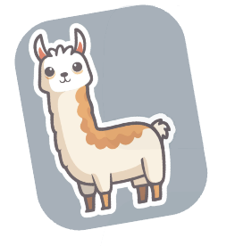
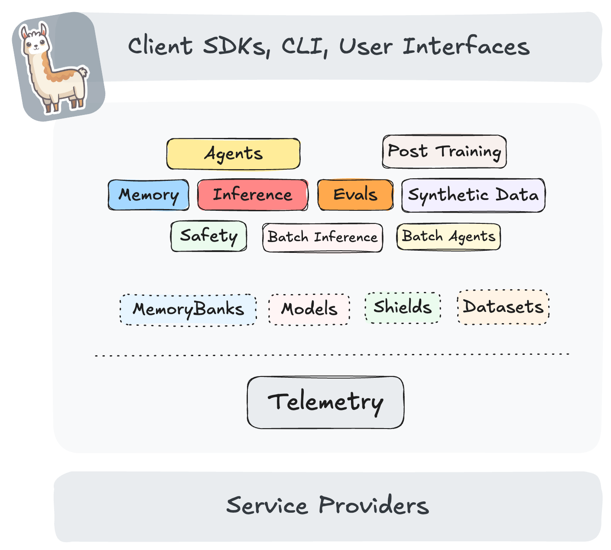

# Llama Stack



Pavel Tišnovský,
tisnik@centrum.cz

---

## Co je to Llama Stack?

* Framework pro tvorbu aplikací s AI
    - chat boti
    - obecně generativní AI (GenAI)
    - trénink, evaluace
* Skutečný framework nezávislý na programovacím jazyku
    - systém providerů
    - RAG, správa kvóty, guardrails, metriky atd.

---



---

### Nejjednodušší využití Llama Stacku

* Volání LLM
* Zpracování odpovědi od LLM
* "chatbot v.0.0.1"

---

### Skutečné požadavky jsou však širší

* Podpora RAG
* Historie konverzace
* Rozvětvení konverzace
* Zapamatování fakt o uživateli
* Volání MCP
* Kvóty
* Kontrola dotazů a odpovědí
* Volání více LLM, evaluace odpovědí atd.

---

### API a poskytovatelé

* Plně konfigurovatelné
* Lze získat seznam dostupných API
* Taktéž lze získat seznam dostupných poskytovatelů
* Pozor: závislosti vyžadované jednotlivými poskytovateli

---

### Poskytovatelé (providers)

<table>
<tr><th>Označení</th><th>Stručný popis</th></tr>
<tr><td>Agents</td><td>interakce se systémem agentů (samotní agenti mohou provádět různé operace)</td></tr>
<tr><td>Inference</td><td>rozhraní k&nbsp;LLM modelům i k&nbsp;embedding modelům</td></tr>
<tr><td>VectorIO</td><td>původně rozhraní k&nbsp;vektorovým databázím (hledání podobných vektorů), nyní i fulltext hledání</td></tr>
</table>

---

### Poskytovatelé (providers)

<table>
<tr><td>Safety</td><td>detekce dotazů s&nbsp;nevhodným či nepovoleným obsahem apod.</td></tr>
<tr><td>Telemetry</td><td>telemetrie (OpenTelemetry ale i další)</td></tr>
<tr><td>Eval</td><td>vyhodnocování odpovědí modelů atd.</td></tr>
<tr><td>DatasetIO</td><td>čtení a zápisy datových sad z/do zvoleného systému (může být i lokální souborový systém)</td></tr>
</table>

---


---

### Komunikace s Llama Stackem

* CLI
* REST API
* Jako běžná knihovna (Python atd.)
* Llama Stack klient
    - podporuje REST API
    - podporuje i běh formou knihovny (async)

---

### Llama Stack klient

* Python
* Swift
* Kotlin
* Node.js

---

### Llama Stack jako knihovna


---

### Llama Stack jako samostatná služba


---

### Běh v kontejneru


---

### Příklad služby postavené na Llama Stacku

* REST API postavené nad API Llama Stacku
* Obě možnosti spuštění Llama Stacku
* Implementace formou asynchronního kódu (Python)

---


---

### Instalace Llama Stacku

Ukázka pro ekosystém Pythonu

```
pdm init
pdm add llama-stack fastapi opentelemetry-sdk \
opentelemetry-exporter-otlp opentelemetry-instrumentation \
aiosqlite litellm uvicorn blobfile
```

---

### Výsledný projektový soubor

```toml
[project]
name = "llama-stack-demo"
version = "0.1.0"
description = "Default template for PDM package"
authors = []
dependencies = [
    "llama-stack==0.2.20",
    "llama-stack-client==0.2.20",
    "opentelemetry-sdk>=1.34.0",
    "opentelemetry-exporter-otlp>=1.34.0",
    "opentelemetry-instrumentation>=0.55b0",
    ...
    ...
    ...
]
requires-python = "==3.12.*"
readme = "README.md"
license = {text = "MIT"}


[tool.pdm]
distribution = false
```

---

### Spuštění Llama Stacku

```bash
uv run llama stack
```

---

### Seznam API Llama Stacku

Lze získat z příkazové řádky:

```bash
uv run llama stack list-apis
```

---

```text
┏━━━━━━━━━━━━━━━━━━━┓
┃ API               ┃
┡━━━━━━━━━━━━━━━━━━━┩
│ providers         │
├───────────────────┤
│ inference         │
├───────────────────┤
│ safety            │
├───────────────────┤
│ agents            │
├───────────────────┤
│ batches           │
├───────────────────┤
│ vector_io         │
├───────────────────┤
│ datasetio         │
├───────────────────┤
│ scoring           │
├───────────────────┤
│ eval              │
├───────────────────┤
│ post_training     │
├───────────────────┤
│ tool_runtime      │
├───────────────────┤
│ telemetry         │
├───────────────────┤
│ models            │
├───────────────────┤
│ shields           │
├───────────────────┤
│ vector_dbs        │
├───────────────────┤
│ datasets          │
├───────────────────┤
│ scoring_functions │
├───────────────────┤
│ benchmarks        │
├───────────────────┤
│ tool_groups       │
├───────────────────┤
│ files             │
├───────────────────┤
│ inspect           │
└───────────────────┘
```

---

### Seznam poskytovatelů

Lze opět získat z příkazové řádky:

```bash
uv run llama stack list-providers
```

---

```text
┏━━━━━━━━━━━━━━━┳━━━━━━━━━━━━━━━━━━━━━━━━━━━━━━━━┳━━━━━━━━━━━━━━━━━━━━━━━━━━━━━━━━━━━━━━━━━━━━━━━━━━━━━━━━━━━━━━━━━━━━━━━━━━━━━━━━━━━━━━━━━━━━━━━━━━━━━━━━━━━━┓
┃ API Type      ┃ Provider Type                  ┃ PIP Package Dependencies                                                                                   ┃
┡━━━━━━━━━━━━━━━╇━━━━━━━━━━━━━━━━━━━━━━━━━━━━━━━━╇━━━━━━━━━━━━━━━━━━━━━━━━━━━━━━━━━━━━━━━━━━━━━━━━━━━━━━━━━━━━━━━━━━━━━━━━━━━━━━━━━━━━━━━━━━━━━━━━━━━━━━━━━━━━┩
│ agents        │ inline::meta-reference         │ matplotlib,pillow,pandas,scikit-learn,mcp>=1.8.1,aiosqlite,psycopg2-binary,redis,pymongo                   │
├───────────────┼────────────────────────────────┼────────────────────────────────────────────────────────────────────────────────────────────────────────────┤
│ batches       │ inline::reference              │ openai                                                                                                     │
├───────────────┼────────────────────────────────┼────────────────────────────────────────────────────────────────────────────────────────────────────────────┤
│ datasetio     │ inline::localfs                │ pandas                                                                                                     │
├───────────────┼────────────────────────────────┼────────────────────────────────────────────────────────────────────────────────────────────────────────────┤
│ datasetio     │ remote::huggingface            │ datasets                                                                                                   │
├───────────────┼────────────────────────────────┼────────────────────────────────────────────────────────────────────────────────────────────────────────────┤
│ datasetio     │ remote::nvidia                 │ datasets                                                                                                   │
├───────────────┼────────────────────────────────┼────────────────────────────────────────────────────────────────────────────────────────────────────────────┤
│ eval          │ inline::meta-reference         │ tree_sitter,pythainlp,langdetect,emoji,nltk                                                                │
├───────────────┼────────────────────────────────┼────────────────────────────────────────────────────────────────────────────────────────────────────────────┤
```

---

### Využití klienta pro Llama Stack

```bash
uv init
uv add llama-stack-client
```

```text
Resolved 37 packages in 689ms
Prepared 1 package in 280ms
░░░░░░░░░░░░░░░░░░░░ [0/35] Installing wheels...                                                                                        warning: Failed to hardlink files; falling back to full copy. This may lead to degraded performance.
         If the cache and target directories are on different filesystems, hardlinking may not be supported.
         If this is intentional, set `export UV_LINK_MODE=copy` or use `--link-mode=copy` to suppress this warning.
Installed 35 packages in 383ms
 + annotated-types==0.7.0
 + anyio==4.11.0
 + certifi==2025.8.3
 + charset-normalizer==3.4.3
 + click==8.3.0
 + distro==1.9.0
 + fire==0.7.1
 ...
 ...
 ...
```

---

### Projektový soubor

```toml
[project]
name = "client"
version = "0.1.0"
description = "Add your description here"
readme = "README.md"
requires-python = ">=3.12"
dependencies = [
    "llama-stack-client>=0.2.22",
]
```

---

```python
from llama_stack_client import LlamaStackClient

client = LlamaStackClient(base_url="http://localhost:8321")

print(f"Using Llama Stack version {client._version}")

models = client.models.list()

for model in models:
    print(model)
```

```python
from llama_stack.distribution.library_client import LlamaStackAsLibraryClient

client = LlamaStackAsLibraryClient("run.yaml")
client.initialize()

print(f"Using Llama Stack version {client._version}")

models = client.models.list()

for model in models:
    print(model)
```

---

### Ukázka výstupu

```
Using Llama Stack version 0.2.22
Model(identifier='openai/gpt-4-turbo', metadata={}, api_model_type='llm', provider_id='openai', type='model', provider_resource_id='gpt-4-turbo', model_type='llm')
Model(identifier='openai/gpt-3.5-turbo-0125', metadata={}, api_model_type='llm', provider_id='openai', type='model', provider_resource_id='gpt-3.5-turbo-0125', model_type='llm')
Model(identifier='openai/gpt-3.5-turbo', metadata={}, api_model_type='llm', provider_id='openai', type='model', provider_resource_id='gpt-3.5-turbo', model_type='llm')
Model(identifier='openai/gpt-3.5-turbo-instruct', metadata={}, api_model_type='llm', provider_id='openai', type='model', provider_resource_id='gpt-3.5-turbo-instruct', model_type='llm')
Model(identifier='openai/gpt-4', metadata={}, api_model_type='llm', provider_id='openai', type='model', provider_resource_id='gpt-4', model_type='llm')
```

---

### Komunikace s LLM

```python
from llama_stack_client import LlamaStackClient

PROMPT = "Say Hello"

client = LlamaStackClient(base_url="http://localhost:8321")

print(f"Using Llama Stack version {client._version}")

response = client.inference.chat_completion(
    messages=[{"role": "user", "content": PROMPT}],
    model_id=client.models.list()[0].identifier,
)

text = response.completion_message.content
print(f"LLM response: {text}")
```

---

### Vývoj Llama Stacku

* Změny v API
* Plány na ukončení podpory starších API
    - deprecation
* Náhrada agent API za OpenAI API
* Stabilizace ve verzi 0.3.0 ???

---

### Využití novějšího API

```python
from llama_stack_client import LlamaStackClient

client = LlamaStackClient(base_url="http://localhost:8321")

print(f"Using Llama Stack version {client._version}")

models = client.models.list()
model_id = models[0].identifier

print(f"Using model {model_id}")

response = client.chat.completions.create(
    model=model_id,
    messages=[{"role": "user", "content": "What is the capital of France?"}]
)

print(response.to_json())
```

---

### Získávání informací z poskytnutých dokumentů

* RAG
* Ovšem i další vstupy
    - sémantické vyhledávání
    - fulltext vyhledávání
    - hybridní vyhledávání

---

### Prvotní zpracování dokumentů

```python
import uuid
from pathlib import Path
from llama_stack_client import LlamaStackClient

client = LlamaStackClient(base_url="http://localhost:8321")
print(f"Using Llama Stack version {client._version}")

vector_store_name= f"vec_{str(uuid.uuid4())[0:8]}"
print(f"Vector store name: {vector_store_name}")

vector_store = client.vector_stores.create(name=vector_store_name)
vector_store_id = vector_store.id

print(f"Vector store ID: {vector_store_id}")
```

---

### Prvotní zpracování dokumentů

```python
path=Path("cesta_k_souboru.md")
print(f"File path: {path}")

file_create_response = client.files.create(file=path, purpose="assistants")
print(f"File create response: {file_create_response}")

file_ingest_response = client.vector_stores.files.create(
    vector_store_id=vector_store_id,
    file_id=file_create_response.id,
)
print(f"File ingest response: {file_ingest_response}")
```

---

### Získání odpovědi z dokumentu

```python
models = client.models.list()
model_id = models[0].identifier

print(f"Using model {model_id}")

MODEL_ID="openai/gpt-4-turbo"

def print_rag_response(response):
    print(f"ID: {response.id}")
    print(f"Status: {response.status}")
    print(f"Model: {response.model}")
    print(f"Created at: {response.created_at}")
    print(f"Output items: {len(response.output)}")

    for i, output_item in enumerate(response.output):
        if len(response.output) > 1:
            print(f"\n--- Output Item {i+1} ---")
        print(f"Output type: {output_item.type}")

        if output_item.type in ("text", "message"):
            print(f"Response content: {output_item.content[0].text}")
        elif output_item.type == "file_search_call":
            print(f"  Tool Call ID: {output_item.id}")
            print(f"  Tool Status: {output_item.status}")
            print(f"  Queries: {', '.join(output_item.queries)}")
            print(f"  Results: {output_item.results if output_item.results else 'None'}")
        else:
            print(f"Response content: {output_item.content}")


response = client.responses.create(
    model=MODEL_ID,
    input="zadaný dotaz",
    tools=[
        {
            "type": "file_search",
            "vector_store_ids": [vector_store_id],
        }
    ]
)

print_rag_response(response)
```

---

### Ukázka 1/2

* Dokument:
    - `README.TXT` ze hry Supaplex
* Relevantní část z dokumentu:

```plaintext
[a round rock] - ZONK
       This is another very common obstacle (and usually a very
       unpleasant one) a Zonk tends to fall down whenever possible
       (i.e. there is a void underneath). Be careful, when a Zonk
       falls on you (Murphy) you will explode (read: die). Murphy can
       push Zonks to the side (not up and down) if nothing is blocking
       the Zonk (i.e. there is a void on the other side). Murphy can
       only push one Zonk at a time, so watch out when dropping Zonks
       next to each other! With some good timing, you can also drop
       Zonks on Electrons (see below) or Snik-snaks (see below) which
       will explode (and not bother you again). Zonks have the nasty
       habit of falling SIDEWAYS off Ram-Chips (see below) and other
       Zonks if possible (i.e. there is a void to the side), on all
       other objects the Zonks will lie steady.
```

---

### Ukázka 1/2
* Dotaz:
```plaintext
What is Zonk?
```
* Odpověď:
```plaintext
"ZONK" refers to an element in the videogame Supaplex. In the
game, a Zonk is depicted as a round rock, and it is a common and typically
unpleasant obstacle. Zonks tend to fall downwards whenever possible, for
instance, if there is a void directly underneath them. Players must be cautious
as a Zonk falling on the character (Murphy) results in an explosion and
game-over for the player. Murphy can push Zonks laterally (but not vertically)
if there is space for them to move, but can only push one Zonk at a time. Good
timing is needed to use Zonks strategically, such as dropping them on top of
enemies (like Snik-snaks) to eliminate them through explosions.
```

---

## Závěr

---

## ✅ Pro

* Relativně dobře promyšlená technologie
    - vše řízeno konfiguračním souborem
* Do značné míry nezávislá na klientských aplikacích
* Potenciál pro vznik dalších poskytovatelů (providers)
    - event-driven přístup(?)

---

## ❌ Proti

* Nestabilita celé platformy (konfigurace, API, poskytovatelé)
* Poměrně strohá dokumentace, příklady použití atd.
* Poměrně značné množství chyb a regresí

---

## Děkuji za pozornost


