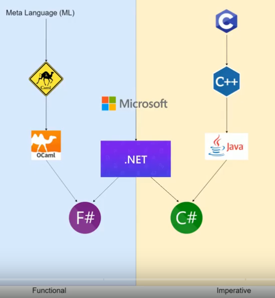

# ML programming lanugage family

---



---

## ML language

* functional
* polymorphic Hindley–Milner type system
    - type inference
    - no runtime type errors (proof)
* pattern matching
* one of the few languages to be
    - completely specified
    - and verified using formal semantics

---

## ML language family

* ML (Meta Language)
* SML (Standard ML)
* CAML (Categorical Abstract Machine Language)
* OCaml (Objective CAML)
* F#

---

## ML functional

* Functions are first-class citizens
* Pure functions (w/o side effects)
* Immutable values are preffered
    - purely functional data structures

---

## Immutable "variables"

```
let x = 42
printf "x=%d" x

x <- x + 1
printf "x=%d" x
```

---

## Mutability is ugly

```
let mutable x = 42
printf "x=%d" x

x <- x + 1
printf "x=%d" x
```

---

## ML type inference

```
let x = 42
```

---

## Strong type checking

* Improper

```
let x = 1 + 2
let x = 1 + 2.5
let x = 1 +. 2.5
let x = 1.0 + 2.5
```

* The only proper

```
let x = 1.0 +. 2.5
```

---

## Functions

* Fully type inference possible

```
let inc x = x + 1
```

```
let inc x:int = x + 1
```

---

## Polymorphic functions

```
let ident x = x;;

Printf.printf "ident=%d\n" (ident 10);;
Printf.printf "ident=%s\n" (ident "foo");;
```

---

## Pattern matching

```
let rec fib = function 
    0 -> 0
  | 1 -> 1
  | n -> fib (n-1) + fib (n-2)


fib 10
```
---

## Pattern matching

```
let rec length([]) = 0
  | length(head::tail) = 1 + length(tail);
```

```
let rec length([]) = 0
  | length(_::tail) = 1 + length(tail);
```

---

## Howto try?

* [Try OCaml](https://try.ocaml.pro/)
* [Try F#](https://try.fsharp.org/)
