# Strojové učení

Pavel Tišnovský
tisnik@centrum.cz

---

## Obsah kurzu (1/4)

* Úvod
    - Umělá inteligence
    - Vývoj umělé inteligence
    - Strojové učení
    - Vztah strojového učení a umělé inteligence
* Základní pojmy
* Techniky strojového učení

---

## Obsah kurzu (2/4)
* Používané nástroje a knihovny
    - NumPy
    - Xarray
    - Pandas
    - Polars
    - Matplotlib
    - Plotnine
    - scikit-learn
    - NLTK

---

## Obsah kurzu (3/4)

* Zpracování dat
* Použití modelů
    - Datové sady pro první seznámení s modely
    - Trénink s učitelem a bez učitele
    - Modely pro klasifikaci
    - Modely pro regresi
    - Lineární regrese a její varianty
    - Křížová validace modelů

---

## Obsah kurzu (4/4)

* Pokročilejší postupy strojového učení
    - Shluková analýza
    - Redukce dimensionality dat
    - Neuronové sítě
    - Konvoluční neuronové sítě
    - Rozpoznávání obrazu

---

# Úvod

* Umělá inteligence
* Vývoj umělé inteligence
* Strojové učení
* Vztah strojového učení a umělé inteligence

---

### Umělá inteligence

* Definice
    - konstrukce strojů, které dokážou provádět činnosti vyžadující inteligenci, pokud by byly prováděny lidmi (Marvin Minsky, 1967)
    - existují i alternativní definice
* Modelování lidské mysli
    - shora dolů (psychologie)
    - zdola nahoru (neurověda)
    - zprostředka (informatika)
* Inteligentní chování může vzniknout ze spojení velkého množství jednoduchých systémů
    - koncept neuronových sítí

---

## Vývoj umělé inteligence

* 1943-1955
    - první myšlenky, že něco podobného může reálně vzniknout
    - booleovský model neuronu
    - A. Turing
        - Computing Machinery and Intelligence

---

## Vývoj umělé inteligence

* 1956
    - McCarthy (LISP)
    - (pravděpodobně) poprvé použil termín AI
    - Newel a Simon: Logic theorist
* velké očekávání pokroku v dalších letech
    - dařilo se částečné řešení různých problémů
    - prakticky každý měsíc nový objev

---

## Vývoj umělé inteligence

* cca 1965
    - vystřízlivění
    - existovala sice spousta vyřešených problémů, ale ty byly triviální
    - nalezeny limity, které se nedařilo překonat
    - první "AI zima"
* sedmdesátá léta
    - systémy založené na znalostech
    - vývoj v mnoha oblastech (hledání ropy atd.)

---

## Vývoj umělé inteligence

* začátek osmdesátých let
    - velké investice do AI
    - očekávání se nenaplnila
    - potom nastává druhá "AI zima"
* druhá polovina osmdesátých let
    - rozvoj neuronových sítí (což nebyla novinka)
* 1995
    - systémy SOAR (State, Operator and Result)

---

## Vývoj umělé inteligence

* 2000
    - big data (v tom pokračujeme i dnes)
    - ale prozatím žádné větší objemy
    - "wow" efekt na úrovni AI
* 2010
    - deep learning
* 2020
    - LLM (prompt engineering, ne fine tuning)
* současnost
    - LLM
    - generativní AI

---

## Strojové učení

* podoblast umělé inteligence
* změna interního stavu systému při tréninku
* několik způsobů realizace strojového učení
* "statistické učení"
* typicky se nejedná o plně automatizovanou činnost
    - vyžaduje chytrá (strategická) rozhodnutí
    - výběr modelu
    - výběr hyperparametrů modelu
    - rozdělení vstupních dat
    - filtrace dat
* nalézají se skryté vzorky a vazby v datech

---

## Vztah strojového učení a umělé inteligence

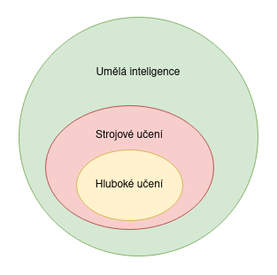

---

## Vztah strojového učení a umělé inteligence

* Umělá inteligence (AI)
    - strojové učení (machine learning, ML)
    - hluboké učení (deep learning, DL)
    - robotika
    - neuronové sítě (NN)
    - zpracování přirozeného jazyka (NLP)
* AI > ML > NN > DL

---

## Vztah strojového učení a umělé inteligence

* Umělá inteligence
    - objevování
    - odvozování
    - odůvodnění
* Strojové učení
    - (sofistikovaná) analýza
    - predikce (!)
    - rozhodování (klasifikace, regrese)

---

### Proč strojové učení?

* Chceme, aby se stroj naučil řešit zadaný problém na základě vzorových řešení:
    - řešení je příliš komplikované
    - problém se často mění, vyvíjí
    - lidská práce je drahá (v porovnání se strojovou)
    - máme k dispozici tolik dat, že je není možné zpracovat "ručně"

---

### Typické aplikace strojového učení

* Rozpoznávání vzorů
    - věci/osoby/výrazy tváře na fotkách
    - mluvená slova
    - spam
    - medicínská diagnóza
* Rozpoznávání anomálií
    - netypické sekvence finančních transakcí
    - netypická data přicházející ze senzorů v atomové elektrárně

---

### Typické aplikace strojového učení

* Předpovídání
    - vývoj ceny akcií na burze / vývoj měnového kurzu
    - jaké filmy bude mít daný člověk rád
    - věk osoby na fotografii
* Shlukování
    - vyhledávání zpráv s podobným obsahem
    - vyhledání skupin zákazníků s podobnými vlastnostmi

---

## Základní pojmy

* Datová sada
    - trénovací data
    - testovací data

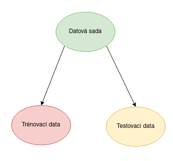

---

### Techniky strojového učení

* Supervised learning
    - také se nazývá "predictive modeling"
    - známe takzvané "kategorie" neboli odpovědi
* Unsupervised learning
    - neznáme odpovědi
    - model musí najít struktury/vzory v datech
    - typicky různé varianty clusteringu

---

### Techniky strojového učení

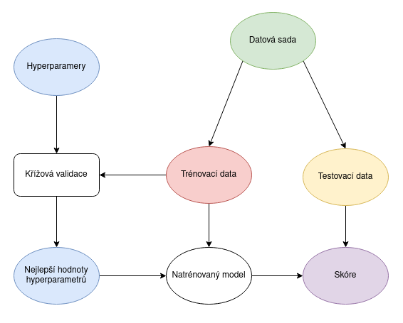

---

### Supervised learning

1. trénink na základě vstupních dat
    - model se naučí vztahy mezi daty a očekávanou odpovědí
2. predikce na základě jiných(!) dat
    - problematika rozdělení dat
3. výsledky
    - klasifikace: koupí si A, B nebo C?
    - regrese: vektor příznaků, numerická hodnota nebo hodnoty

---

### Unsupervised learning

1. trénink modelu na základě vstupních dat
    - ovšem bez znalosti správných odpovědí
2. shluková analýza
3. latentní a faktorová analýza

---

### Další možnosti

1. kombinace obou metod (bez/s učitelem)
2. učení se zpětnou vazbou
    - pasivní
    - aktivní

---

### ML modely

* ANN
* Desicion trees
* Support-vector machine
* Regresní analýza
* Bayesovské sítě
* Genetické algoritmy
* NN

---

### Jak začít?

1. jaké atributy použít z dat?
2. jaký model vybrat
3. jak optimalizovat pro větší výkon
4. jak vytvořit model, který bude vhodný pro pro něj neznámá data?
5. jak odhadnout vhodnost modelu pro neznámá data?


---

### Komprimace dat
* souvislost mezi ML a komprimací dat
* predikce
* tzv. optimální komprese
    - při predikci lze použít aritmetické kódování

---

### Redukce dat

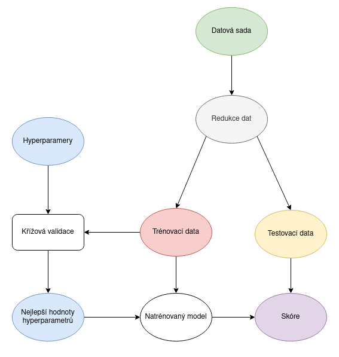

---

### Redukce dat

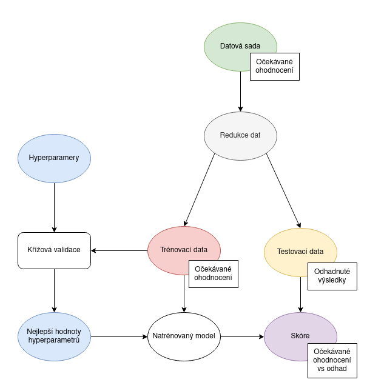

---

### Nedoučení a přeučení

* Nedoučení
    - malá sada dat, na kterých je model trénován
    - příliš složitý model
    - data reprezentují pouze malý vzorek celého spektra hodnot
* Přeučení
    - velká vazba na trénovací data
    - menší flexibilita práce s daty, která model nezná
    - použití polynomu vyššího stupně, když by stačila lineární regrese

---

### Přeučení

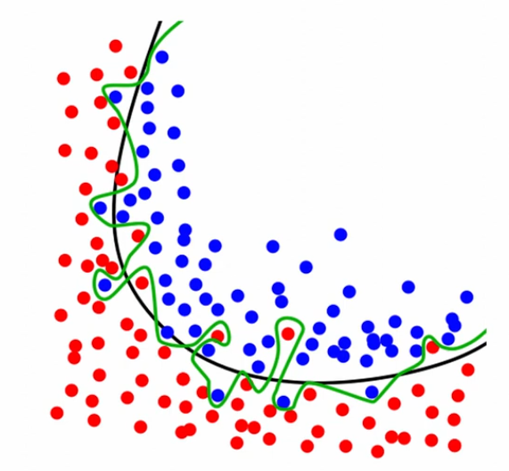

---

### Úspěšnost modelu

* Pro zcela nová (neznámá) data!
    - ne pro trénovací množinu
    - častá chyba

---

### Křížová validace (cross validation)

* rozdělení dat do bloků
    - například na 1/10
    - 9/10 pro trénink
    - 1/10 pro otestování

---

## Zpracování dat

* Nástroje pro datovou analýzu
* Transformace dat na informace
* Jupyter Notebook
* Knihovny používané v této oblasti
    - NumPy, Pandas, Polars, Seaborn, scikit-learn, Dask
* Vizualizace dat
    - Matplotlib
* Zpracování obrazů a přirozeného jazyka v Pythonu
* Navázání na strojové učení

---

## Neuronové sítě

* Propojení takzvaných neuronů
    - Model neuronu
    - Způsob propojení neuronů
    - Vstupy a výstupy

---

### Model neuronu

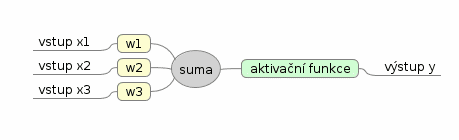

* libovolný počet vstupů
* typicky jeden výstup
* váhy vstupů
* aktivační funkce

y = f(w_1x_1 + w_2x_2 + … + w_nx_n)

---

### Bias

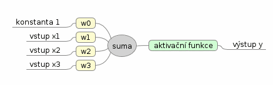

y = f(w_0 + w_1x_1 + w_2x_2 + … + w_nx_n)

---

### Aktivační funkce

* Jediná nelinearita v modelu
* Mnoho typů aktivačních funkcí

---

### Aktivační funkce

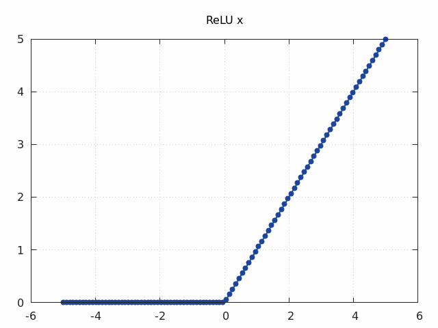

---

### Aktivační funkce

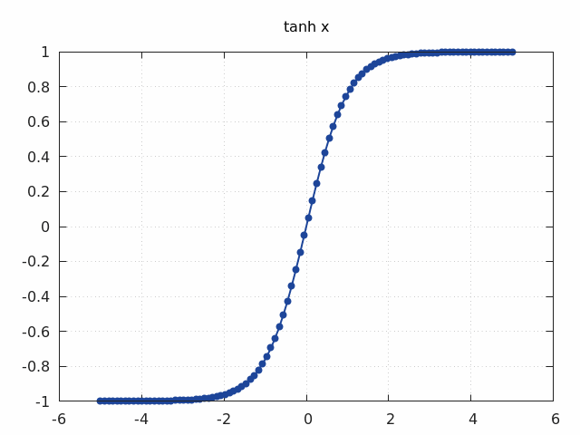

---

### Feed-forward síť

* Vstupní vrstva
* Skryté vrstvy
* Výstupní vrstva

---

### Feed-forward síť

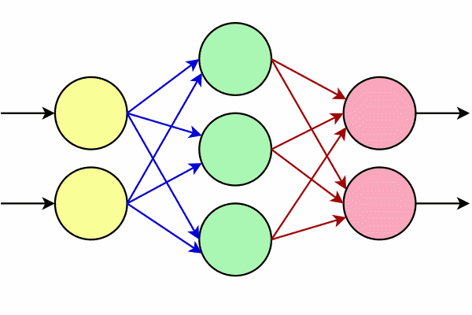

---

### Příliš mnoho vrstev

* Model se přestane učit nebo se učí velmi pomalu
    - vanishing gradient problem
    - "méně je někdy více"

---

### Konvoluční neuronové sítě

* Typicky pro rastrové obrázky
    - mírné posunutí, zkosení atd.
    - lze sice řešit klasickými NN
    - ovšem je to zbytečně složité (RAM, CPU čas)
    - příliš mnoho stejných, ale samostatně uložených vah
    - konvoluční a subsamplingové vrstvy

---

### Konvoluční neuronové sítě

* Typická konfigurace
    - vstupní vrstva
    - konvoluční vrstva #1
    - subsamplingová vrstva #1
    - konvoluční vrstva #2
    - subsamplingová vrstva #2
    - ...
    - ...
    - klasická skrytá vrstva
    - výstupní vrstva

---

### Konvoluční vrstva

* Získání lokálních informací z rastru
* Malé oblasti, například 3x3, 5x5 pixelů
* Každá oblast vstup do jednoho neuronu
    - 9 resp. 25 vstupů
* Jednotlivé oblasti se překrývají
    - pro rastr x*y máme (x-k+1)*(y-k+1) oblastí
    - počet neuronů odpovídá počtu pixelů

---

### Konvoluční vrstva
* Obecně získáváme n rovin
    - zdánlivě obrovská spotřeba RAM
    - (pro rastr x*y máme (x-k+1)*(y-k+1) oblastí)
* Ovšem váhy mezi neurony se sdílí!
    - 26 vah pro oblast 5x5 (včetně biasu)

---

### Subsamplingová vrstva

* Za konvolučními vrstvami
* Nepřekrývající se oblasti
    - dochází ke zmenšování počtu výstupů
    - pro 2x2 oblasti na čtvrtinu

---

### Příklad konvoluční sítě

```
Vrstva          Vstup          Výstup
konvoluční      32 × 32        64 × (32–5+1) × (32–5+1) = 64 × 28 × 28
subsampling     64 × 28 × 28   64 × 28/2 × 28/2 = 64 × 14 × 14
konvoluční      64 × 14 × 14   64 × (14–5+1) × (14–5+1) = 64 × 10 × 10
subsampling     64 × 10 × 10   64 × 10/2 × 10/2 = 64 × 5 × 5 = 1600
```

* následovat může běžná skrytá vrstva s dejme tomu 10 výstupy

---

## Od teorie k praxi


---

### Python

* Dnes jeden z nejpopulárnějších programovacích jazyků
    - viz například TIOBE programming community index
    - <https://www.tiobe.com/tiobe-index/>
    - popř. statistika dostupná na OpenHubu
    - <https://www.openhub.net/languages/compare>
* Dostupnost na většině platforem
    - na některých MCU jako MicroPython

---

### Typické použití Pythonu

* Nástroje a utility ovládané z příkazového řádku
* Aplikace s grafickým uživatelským rozhraním
* Client-server
    - serverová část (Flask, Django, CherryPy, ...)
    - klient (Brython, spíše technologické demo)
* Numerické výpočty, symbolické výpočty
    - NumPy
    - SciPy
    - Matplotlib

---

### Typické použití Pythonu

* Moderní způsoby využití Pythonu
    - AI
    - Machine Learning (Deep Learning)
    - PyTorch
    - Big data
    - aplikace v prohlížeči
* Tzv. „glue“ jazyk
* Vestavitelný interpret Pythonu

---

### Nástroje pro datovou analýzu

* Data mining
* Data procesing a modelování
    - klasifikace
    - predikce
    - výběr modelu
    - redukce počtu dimenzí
    - pre-processing
    - modelování
* Vizualizace

---

### Jupyter Notebook

* Typický centrální prvek, v němž se odehrává vývoj
* Lze sdílet
* Podporuje různá jádra (kernels)
    - mezi jinými i interpret Pythonu
* Podpora vizualizace přímo na ploše notebooku
* Varianta nazvaná JupyterLite

---

### Strojové učení

* scikit-learn
    - stejné rozhraní pro různé ML modely
    - dobře zvolené výchozí parametry modelu
    - možnost doladění parametrů modelu
    - poměrně dobra dokumentace
        - (i když chybí různé howto...)

---

# Praktická část

---

## Jupyter Notebook


* Lokální instalace
* Centrální instalace se vzdáleným přístupem

---

## JupyterLite


* Jupyter Notebook v prohlížeči
* Založeno na technologii WASM
* https://jupyter.org/try-jupyter/lab/

---

## Trénink s učitelem a bez učitele

* S učitelem
    - klasifikace
    - regrese
* Bez učitele
    - clustering

---

## Datové sady pro první seznámení s modely

* Budeme je používat společně s knihovnou scikit-learn

---

### Datová sada Iris

```python
# modul s datovou sadou Iris
from sklearn.datasets import load_iris

# nacteni datove sady
iris = load_iris()

# jakeho typu je vlastne datova sada?
print(type(iris))

print("-" * 100)

# dostupne atributy a metody
print(dir(iris))
```

[Zdrojový kód tohoto příkladu](https://github.com/tisnik/most-popular-python-libs/blob/master/ml_intro/examples//iris_dataset.py)

---

### Datová sada Iris

Výstup

```
<class 'sklearn.utils._bunch.Bunch'>
----------------------------------------------------------------------------------------------------
['DESCR', 'data', 'data_module', 'feature_names', 'filename', 'frame', 'target', 'target_names']
```

---

### Datová sada Iris

```python
# modul s datovou sadou Iris
from sklearn.datasets import load_iris

# nacteni datove sady
iris = load_iris()

print(dir(iris))

print("-" * 100)

# podrobny popis datove sady
print(iris["DESCR"])
```

[Zdrojový kód tohoto příkladu](https://github.com/tisnik/most-popular-python-libs/blob/master/ml_intro/examples//iris_description.py)

---

### Datová sada Iris

```python
# modul s datovou sadou Iris
from sklearn.datasets import load_iris

# nacteni datove sady
iris = load_iris()

# precteni dat z datove sady
# urcenych pro trenink, validaci atd.
data = iris["data"]

print("Feature data:")
print(data)
print("-" * 100)

# typ a "tvar" n-dimenzionalniho pole
print("Data type:")
print(type(data))
print()

print("Data shape:")
print(data.shape)
```

[Zdrojový kód tohoto příkladu](https://github.com/tisnik/most-popular-python-libs/blob/master/ml_intro/examples//iris_data.py)

---

### Datová sada California Housings

```python
import numpy as np

# import funkce pro nacteni datove sady, kterou pouzijeme
from sklearn.datasets import fetch_california_housing

# nacteni datove sady
housings = fetch_california_housing()

# precteni dat z datove sady
data = housings["data"]

# nadpis tabulky
print("Feature              Min         Max           Avg         Std         Var")

# zakladni statisticke informace o jednotlivych atributech
for i in range(len(housings["feature_names"])):
    column = data[:, i]
    feature = housings.feature_names[i]
    print(f"{feature:12}   {column.min():10.3f}   {column.max():10.3f}   {np.mean(column):10.3f}  {np.std(column):10.3f}  {np.var(column):11.3f}")
```

[Zdrojový kód tohoto příkladu](https://github.com/tisnik/most-popular-python-libs/blob/master/ml_intro/examples//california_housings.py)

---

### Umělá data pro clustering

* Blobs atd.
    - nabízí přímo scikit-learn

---

## Modely pro klasifikaci

```python
from sklearn.datasets import load_iris
from sklearn.neighbors import KNeighborsClassifier

# nacteni datove sady
iris = load_iris()

# X je matice (feature matrix)
X = iris.data

# y je vektor (response vector)
y = iris.target

# konstrukce klasifikatoru
# (s hyperparametrem)
classifier = KNeighborsClassifier(n_neighbors=1)

# trening modelu (se vsemi dostupnymi daty)
classifier.fit(X, y)

# parametry jedne rostliny
unknown = [[3, 5, 4, 2]]
print(unknown)

# predikce modelu pro jednu sadu dat
prediction = classifier.predict(unknown)
print(prediction)

# model predikuje hodnoty 0-3, ty si prevedeme na druhy rostlin
print(iris.target_names[prediction])

print()

# parametry vice rostlin
unknown = [[3, 5, 4, 2], [5, 4, 3, 2]]
print(unknown)

# predikce modelu pro vice sad dat
predictions = classifier.predict(unknown)
print(predictions)

# model predikuje hodnoty 0-3, ty si prevedeme na druhy rostlin
print(iris.target_names[predictions])
```

[Zdrojový kód tohoto příkladu](https://github.com/tisnik/most-popular-python-libs/blob/master/ml_intro/examples//iris_basic_classifier.py)

---

```python
from sklearn.datasets import load_iris
from sklearn.linear_model import LogisticRegression

# nacteni datove sady
iris = load_iris()

# X je matice (feature matrix)
X = iris.data

# y je vektor (response vector)
y = iris.target

# konstrukce klasifikatoru
# (s hyperparametrem)
classifier = LogisticRegression(max_iter=1000)
classifier.fit(X, y)

# trening modelu (se vsemi dostupnymi daty)
classifier.fit(X, y)

# parametry jedne rostliny
unknown = [[3, 5, 4, 2]]
print(unknown)

# predikce modelu pro jednu sadu dat
prediction = classifier.predict(unknown)
print(prediction)

# model predikuje hodnoty 0-3, ty si prevedeme na druhy rostlin
print(iris.target_names[prediction])

print()

# parametry vice rostlin
unknown = [[3, 5, 4, 2], [5, 4, 3, 2]]
print(unknown)

# predikce modelu pro vice sad dat
predictions = classifier.predict(unknown)
print(predictions)

# model predikuje hodnoty 0-3, ty si prevedeme na druhy rostlin
print(iris.target_names[predictions])
```

[Zdrojový kód tohoto příkladu](https://github.com/tisnik/most-popular-python-libs/blob/master/ml_intro/examples//iris_different_model.py)

---

```python
import matplotlib.pyplot as plt

import numpy as np
from sklearn.datasets import load_iris
from sklearn.neighbors import KNeighborsClassifier
from sklearn.model_selection import cross_val_score

# nacteni datove sady
iris = load_iris()

# X je matice (feature matrix)
X = iris.data

# y je vektor (response vector)
y = iris.target

feature_names = np.array(iris.feature_names)

print("n", "selectors", "features")

attributes = []
final_scores = []

for i in range(1, 2**len(feature_names)):
    indexes = []
    n = i
    for j in range(len(feature_names)):
        if n % 2 == 1:
            indexes.append(j)
        n //= 2
    selectors = np.array(indexes, dtype=int)
    knn_classifier = KNeighborsClassifier(n_neighbors=5)
    selected_features = X[:, selectors]
    scores = cross_val_score(knn_classifier, selected_features, y, cv=10, scoring='accuracy')
    attributes.append("\n".join(feature_names[selectors]))
    avg_score = scores.mean()
    final_scores.append(avg_score)
    print(i, selectors, feature_names[selectors], avg_score)

fig = plt.figure()
fig.set_figwidth(14)
fig.set_figheight(6)
fig.subplots_adjust(bottom=0.3)

plt.bar(attributes, final_scores)
plt.xticks(rotation=90)
plt.xlabel("Atributy")
plt.ylabel("Přesnost modelu")

# ulozeni grafu do souboru
plt.savefig("111.png")

# vykresleni grafu na obrazovku
plt.show()

```

[Zdrojový kód tohoto příkladu](https://github.com/tisnik/most-popular-python-libs/blob/master/ml_intro/examples//iris_features_selection_graphical.py)

---

## Modely pro regresi

---

## Lineární regrese a její varianty

* Jeden z nejjednodušších a nejužitečnějších modelů
    - interně velmi jednoduchý
    - lze odvodit, co se model naučil
    - typicky nedochází k přeučení
* Typicky metoda nejmenších čtverců
* Lze použít v libovolném počtu rozměrů
* Lineární regrese v oblasti parametrů, nikoli vstupních hodnot
    - polynomická regrese

---

```python
import numpy as np
import matplotlib.pyplot as plt

from sklearn import linear_model

# počet vzorků ve vektorech x i y
VALUES = 50

# x je vektor
x = np.linspace(0, 10, VALUES)

# y je vektor
y = np.linspace(-1, 1, VALUES) + 0.5*np.random.rand(VALUES)

# převod vektoru na 2D matici
X = x.reshape(-1, 1)

# tvar matice X a vektoru y
print("X shape:", X.shape)
print("y shape:", y.shape)

# konstrukce modelu
lr = linear_model.LinearRegression()

# trénink modelu (X musí být maticí)
lr.fit(X, y)

# predikce modelu
y_pred = lr.predict(X)

# výpis vypočtených koeficientů modelu
print("Coefficients: \n", lr.coef_)
print("Intercept: \n", lr.intercept_)

# vykreslení výsledku
plt.scatter(x, y, color="black", s=2)
plt.plot(x, y_pred, color="blue", linewidth=2)

# titulek grafu
plt.title("Linear regression")

# osy
plt.xticks()
plt.yticks()

# ulozeni diagramu do souboru
plt.savefig("112.png")

# zobrazeni diagramu
plt.show()
```

[Zdrojový kód tohoto příkladu](https://github.com/tisnik/most-popular-python-libs/blob/master/ml_intro/examples//linear_regression_gen_data.py)

---

### Použití modelu lineární regrese

* California housings

```python
import matplotlib.pyplot as plt

from sklearn import linear_model
from sklearn.datasets import fetch_california_housing
from sklearn.metrics import mean_squared_error, r2_score
from sklearn.model_selection import train_test_split

# nacteni datove sady
housings = fetch_california_housing()

# precteni dat z datove sady
# urcenych pro trenink, validaci atd.
data = housings["data"]

FIRST_DIM = 2
SECOND_DIM = 3

# rozdělení na trénovací a testovací data
x_train, x_test, y_train, y_test = train_test_split(data[:, FIRST_DIM], data[:, SECOND_DIM], test_size=0.6)

print("Array sizes:")
print(f"x_train: {len(x_train)}")
print(f"y_train: {len(y_train)}")
print(f"x_test:  {len(x_test)}")
print(f"y_test:  {len(y_test)}")

# konstrukce modelu
lr = linear_model.LinearRegression()

# trénink modelu
lr.fit(x_train.reshape(-1, 1), y_train)

# predikce modelu
y_pred = lr.predict(x_test.reshape(-1, 1))

# výpis vypočtených koeficientů modelu
print("Coefficients: \n", lr.coef_)
print("Intercept: \n", lr.intercept_)

# chyba predikce
print("Mean squared error: %.2f" % mean_squared_error(y_test, y_pred))

# 1 = nejlepší predikce modelu
print("Coefficient of determination: %.2f" % r2_score(y_test, y_pred))

# vykreslení výsledku
plt.scatter(x_test, y_test, color="black", s=1)
plt.plot(x_test, y_pred, color="blue", linewidth=3)

# osy
plt.xlabel(housings.feature_names[FIRST_DIM])
plt.ylabel(housings.feature_names[SECOND_DIM])
plt.xticks(())
plt.yticks(())

# ulozeni diagramu do souboru
plt.savefig("82.png")

# zobrazeni diagramu
plt.show()
```

[Zdrojový kód tohoto příkladu](https://github.com/tisnik/most-popular-python-libs/blob/master/ml_intro/examples//housings_linear_regression.py)

---

### Trénink modelu se všemi daty

* Což obecně není vhodné

```python
from sklearn import linear_model
from sklearn.datasets import fetch_california_housing
from sklearn.metrics import mean_squared_error, r2_score

# nacteni datove sady
housings = fetch_california_housing()

# precteni dat z datove sady
# urcenych pro trenink, validaci atd.
data = housings["data"]

# ceny bloku
targets = housings["target"]

# trening bude proveden se VSEMI zaznamy
# testovani taktez (prozatim)
X = data
y = targets

# konstrukce modelu
lr = linear_model.LinearRegression()

# trénink modelu
lr.fit(X, y)

# predikce modelu
y_pred = lr.predict(X)

# výpis vypočtených koeficientů modelu
print("Coefficients: \n", lr.coef_)
print("Intercept: \n", lr.intercept_)

# chyba predikce
print("Mean squared error: %.2f" % mean_squared_error(y, y_pred))

# 1 = nejlepší predikce modelu
print("Coefficient of determination: %.2f" % r2_score(y, y_pred))
```

[Zdrojový kód tohoto příkladu](https://github.com/tisnik/most-popular-python-libs/blob/master/ml_intro/examples//housings_prediction_1.py)

---

### Rozdělení přes train_test_split

```python
from sklearn import linear_model
from sklearn.datasets import fetch_california_housing
from sklearn.metrics import mean_squared_error, r2_score
from sklearn.model_selection import train_test_split

# nacteni datove sady
housings = fetch_california_housing()

# precteni dat z datove sady
# urcenych pro trenink, validaci atd.
data = housings["data"]

# ceny bloku
targets = housings["target"]

# X je matice, y je vektor
X = data
y = targets

# rozdeleni dat na treninkovou a testovaci mnozinu
X_train, X_test, y_train, y_test = train_test_split(X, y, test_size=0.6)

# konstrukce modelu
lr = linear_model.LinearRegression()

# trénink modelu
lr.fit(X_train, y_train)

# predikce modelu
y_pred = lr.predict(X_test)

# výpis vypočtených koeficientů modelu
print("Coefficients: \n", lr.coef_)
print("Intercept: \n", lr.intercept_)

# chyba predikce
print("Mean squared error: %.2f" % mean_squared_error(y_test, y_pred))

# 1 = nejlepší predikce modelu
print("Coefficient of determination: %.2f" % r2_score(y_test, y_pred))
```

[Zdrojový kód tohoto příkladu](https://github.com/tisnik/most-popular-python-libs/blob/master/ml_intro/examples//housings_prediction_2.py)

---

### Konfigurace způsobu rozdělení

```python
import numpy as np

from sklearn import linear_model
from sklearn.datasets import fetch_california_housing
from sklearn.metrics import mean_squared_error, r2_score
from sklearn.model_selection import train_test_split

# nacteni datove sady
housings = fetch_california_housing()

# precteni dat z datove sady
# urcenych pro trenink, validaci atd.
data = housings["data"]

# ceny bloku
targets = housings["target"]

# X je matice, y je vektor
X = np.delete(data, 0, axis=1) # smazat jeden sloupec
y = targets

# rozdeleni dat na treninkovou a testovaci mnozinu
X_train, X_test, y_train, y_test = train_test_split(X, y, test_size=0.6)

# konstrukce modelu
lr = linear_model.LinearRegression()

# trénink modelu
lr.fit(X_train, y_train)

# predikce modelu
y_pred = lr.predict(X_test)

# výpis vypočtených koeficientů modelu
print("Coefficients: \n", lr.coef_)
print("Intercept: \n", lr.intercept_)

# chyba predikce
print("Mean squared error: %.2f" % mean_squared_error(y_test, y_pred))

# 1 = nejlepší predikce modelu
print("Coefficient of determination: %.2f" % r2_score(y_test, y_pred))
```

[Zdrojový kód tohoto příkladu](https://github.com/tisnik/most-popular-python-libs/blob/master/ml_intro/examples//housings_prediction_3.py)

---

### Chyby modelu

```python
import numpy as np
import matplotlib.pyplot as plt

from sklearn import linear_model
from sklearn.datasets import fetch_california_housing
from sklearn.metrics import mean_squared_error, r2_score
from sklearn.model_selection import train_test_split

# nacteni datove sady
housings = fetch_california_housing()

# precteni dat z datove sady
# urcenych pro trenink, validaci atd.
data = housings["data"]

# ceny bloku
targets = housings["target"]

# jmena promennych/atributu
names = housings["feature_names"]

print("Ignored attribute\tMSE\tr2 score")

MEASUREMENTS = 200

for column_to_delete in range(len(names)):
    # X je matice, y je vektor
    X = np.delete(data, column_to_delete, axis=1) # smazat jeden vybrany sloupec
    y = targets

    column = names[column_to_delete]

    mses = []
    r2_scores = []

    for i in range(MEASUREMENTS):
        # rozdeleni dat na treninkovou a testovaci mnozinu
        X_train, X_test, y_train, y_test = train_test_split(X, y, test_size=0.6)

        # konstrukce modelu
        lr = linear_model.LinearRegression()

        # trénink modelu
        lr.fit(X_train, y_train)

        # predikce modelu
        y_pred = lr.predict(X_test)

        # výpis vypočtených koeficientů modelu
        #print("Coefficients: \n", lr.coef_)
        #print("Intercept: \n", lr.intercept_)

        mse = mean_squared_error(y_test, y_pred)
        r2 = r2_score(y_test, y_pred)
        mses.append(mse)
        r2_scores.append(r2)

        print(f"{column:16}\t{mse:0.3f}\t{r2:0.3f}")

    plt.plot(range(MEASUREMENTS), mses, range(MEASUREMENTS), r2_scores)

    # titulek grafu
    plt.title(f"Mode prediction without column {column}")
    plt.legend(["MSE", "R2 score"])

    # osy
    plt.xticks()
    plt.yticks()

    # ulozeni diagramu do souboru
    plt.savefig(f"94_{column}.png")

    # zobrazeni diagramu
    plt.show()

```

[Zdrojový kód tohoto příkladu](https://github.com/tisnik/most-popular-python-libs/blob/master/ml_intro/examples//housings_prediction_errors_2.py)

---

### Výběr (filtrace) atributů

```python
import matplotlib.pyplot as plt

from sklearn.datasets import fetch_california_housing

# nacteni datove sady
housings = fetch_california_housing()

# precteni dat z datove sady
# urcenych pro trenink, validaci atd.
data = housings["data"]

# vykresleni sady histogramu do mrizky
fig, axes = plt.subplots(nrows=4, ncols=2)
fig.set_figheight(15)
fig.set_figwidth(15)

# vykresleni jednotlivych histogramu do mrizky
for i in range(8):
    column = data[:, i]
    feature = housings.feature_names[i]
    ax = axes[i//2][i%2]
    # modifikace zpusobu vypoctu a zobrazeni histogrami
    ax.hist(column, bins=100, histtype="step")
    ax.set(xlabel=feature)


# zbavit se prazdneho mista okolo bunek mrizky
plt.tight_layout()

# ulozeni diagramu do souboru
plt.savefig("95.png")

# zobrazeni diagramu
plt.show()
```

[Zdrojový kód tohoto příkladu](https://github.com/tisnik/most-popular-python-libs/blob/master/ml_intro/examples//housings_histograms.py)

---

## Křížová validace modelů

```python
import numpy as np
from sklearn.datasets import fetch_california_housing
from sklearn import linear_model
from sklearn.model_selection import cross_val_score

# nacteni datove sady
housings = fetch_california_housing()

# X je matice (feature matrix)
X = housings.data

# y je vektor (response vector)
y = housings.target

feature_names = np.array(housings.feature_names)

print("n", "selectors", "features")

for i in range(1, 2**len(feature_names)):
    indexes = []
    n = i
    for j in range(len(feature_names)):
        if n % 2 == 1:
            indexes.append(j)
        n //= 2
    selectors = np.array(indexes, dtype=int)
    # konstrukce modelu
    lr = linear_model.LinearRegression()
    selected_features = X[:, selectors]
    scores = -cross_val_score(lr, selected_features, y, cv=10, scoring='neg_mean_squared_error')
    print(i, selectors, feature_names[selectors], scores.mean())

```

[Zdrojový kód tohoto příkladu](https://github.com/tisnik/most-popular-python-libs/blob/master/ml_intro/examples//housings_features_selection.py)

---

## Shluková analýza

```python
# budeme provádět vykreslování de facto standardní knihovnou Matplotlib
import matplotlib.pyplot as plt

import numpy as np
from sklearn.cluster import KMeans

# testovací data
n_samples = 10000

# počet oblastí, kam se budou data sdružovat
n_components = 6

samples = np.random.rand(n_samples, 2)

samples = samples[:, ::-1]

plt.figure(1)
colors = ["#4444cc", "#44bb44", "#cc4444", "#cccc44", "#44cccc", "#cc44cc"]

# clustering
kmeans = KMeans(n_clusters=6, random_state=0, n_init="auto").fit(samples)

#print(kmeans.labels_)
#print(kmeans.cluster_centers_)

# vykreslení bodů s jejich přiřazením ke clusteru
for i, color in enumerate(colors):
    selector = kmeans.labels_ == i
    plt.scatter(samples[selector, 0], samples[selector, 1], c=color, marker=".", s=1)

plt.scatter(kmeans.cluster_centers_[:, 0], kmeans.cluster_centers_[:, 1], c="red", s=50)
plt.title("K-Means++")

# uložení grafu do souboru
plt.savefig("k_means_5.png")

# vykreslení na obrazovku
plt.show()
```

[Zdrojový kód tohoto příkladu](https://github.com/tisnik/most-popular-python-libs/blob/master/ml_intro/examples//clustering_random_points.py)

---

## Shluková analýza

```python
# Vykreslení bodů v 3D prostoru

import matplotlib.pyplot as plt

from sklearn.cluster import KMeans
from sklearn.datasets import make_blobs

# celkový počet vypočtených bodů
n_samples = 10000

# počet oblastí, kam se budou data sdružovat
n_components = 8

samples, _ = make_blobs(
    n_samples=n_samples, n_features=3, centers=n_components,
    cluster_std=1.80, random_state=0
)

# barvy použité pro obarvení bodů
colors = ["#4444cc", "#44bb44", "#cc4444", "#cccc44", "#44cccc", "#cc44cc", "#cccccc", "#000000"]

# příprava 3D grafu
fig = plt.figure(figsize=(6.4, 6.4))
ax = fig.add_subplot(projection="3d")
ax.set_xlabel("X")
ax.set_ylabel("Y")
ax.set_zlabel("Z")

# clustering
kmeans = KMeans(n_clusters=n_components, random_state=0, n_init="auto").fit(samples)

# vykreslit centra nalezených oblastí
ax.scatter(kmeans.cluster_centers_[:, 0], kmeans.cluster_centers_[:, 1], kmeans.cluster_centers_[:, 2], c="red", s=50)

# vykreslení bodů s jejich přiřazením ke clusteru
for i, color in enumerate(colors):
    selector = kmeans.labels_ == i
    ax.scatter(samples[selector,0], samples[selector,1], samples[selector,2], marker=".", s=1)

# uložení grafu do souboru
plt.savefig("kmeans_spread_blobs_3D.png")

# uložení grafu do souboru
ax.view_init(90, -90, 0)
plt.savefig("kmeans_spread_blobs_view_1.png")

ax.view_init(0, -90, 0)
plt.savefig("kmeans_spread_blobs_view_2.png")

ax.view_init(0, 0, 0)
plt.savefig("kmeans_spread_blobs_view_3.png")
```

[Zdrojový kód tohoto příkladu](https://github.com/tisnik/most-popular-python-libs/blob/master/ml_intro/examples//clustering_kmeans_spread_3d_blobs.py)

---

## Shluková analýza

```python
# budeme provádět vykreslování de facto standardní knihovnou Matplotlib
import matplotlib.pyplot as plt

from sklearn.cluster import SpectralClustering
from sklearn.datasets import make_blobs

# testovací data
n_samples = 10000

# počet oblastí, kam se budou data sdružovat
n_components = 6

samples, labels = make_blobs(
    n_samples=n_samples, centers=n_components, cluster_std=1.50, random_state=0
)

samples = samples[:, ::-1]

plt.figure(1)
colors = ["#4444cc", "#44bb44", "#cc4444", "#cccc44", "#44cccc", "#cc44cc"]

# clustering
spectral = SpectralClustering(n_clusters=n_components, eigen_solver="arpack", affinity="nearest_neighbors", random_state=0).fit(samples)

# vykreslení bodů s jejich přiřazením ke clusteru
for i, color in enumerate(colors):
    selector = spectral.labels_ == i
    plt.scatter(samples[selector, 0], samples[selector, 1], c=color, marker=".", s=1)

plt.title("Spectral clustering")

# uložení grafu do souboru
plt.savefig("blobs_spectral.png")

# vykreslení na obrazovku
plt.show()
```

[Zdrojový kód tohoto příkladu](https://github.com/tisnik/most-popular-python-libs/blob/master/ml_intro/examples//clustering_blobs_spectral_clustering.py)

---

## Neuronové sítě

```python
from sklearn.datasets import load_iris
from sklearn.model_selection import train_test_split

# model zalozeny na neuronove siti
from sklearn.neural_network import MLPClassifier


# nacteni datove sady
iris = load_iris()

# konstrukce klasifikatoru
# (s hyperparametrem)
classifier = MLPClassifier(max_iter=5000)

# X je matice (feature matrix)
X = iris.data

# y je vektor (response vector)
y = iris.target

# rozdělení na trénovací a testovací data
X_train, X_test, y_train, y_test = train_test_split(X, y, test_size=0.2)

# trening modelu
classifier.fit(X_train, y_train)

# očekávané výsledky
expexted_labels = y_test

# výsledky modelu (predikované výsledky)
predicted_labels = classifier.predict(X_test)

# jak je náš model úspěšný?
total = 0
same = 0

# porovnání predikce s očekáváním
for (expected, predicted) in zip(expexted_labels, predicted_labels):
    if expected==predicted:
        same+=1
    total+=1

print(f"total:    {total}")
print(f"same:     {same}")
print(f"accuracy: {100.0*same/total:4.1f}%")

print(f"Features: {classifier.n_features_in_}")
print(f"Layers:   {classifier.n_layers_}")
print(f"Outputs:  {classifier.n_outputs_}")
print("Weights:")

for layer, weights in enumerate(classifier.coefs_):
    print("\t", layer, weights.shape)
```

[Zdrojový kód tohoto příkladu](https://github.com/tisnik/most-popular-python-libs/blob/master/ml_intro/examples//mlp_classifier_01.py)

---

```python
from sklearn.datasets import load_iris
from sklearn.model_selection import train_test_split

from sklearn.metrics import accuracy_score

# model zalozeny na neuronove siti
from sklearn.neural_network import MLPClassifier


# nacteni datove sady
iris = load_iris()

# konstrukce klasifikatoru
# (s hyperparametrem)
classifier = MLPClassifier(max_iter=5000)

# X je matice (feature matrix)
X = iris.data

# y je vektor (response vector)
y = iris.target

# rozdělení na trénovací a testovací data
X_train, X_test, y_train, y_test = train_test_split(X, y, test_size=0.2)

# trening modelu
classifier.fit(X_train, y_train)


# výsledky modelu (predikované výsledky)
y_pred = classifier.predict(X_test)

# vypoctena presnost modelu
print(accuracy_score(y_test, y_pred))

print(f"Features: {classifier.n_features_in_}")
print(f"Layers:   {classifier.n_layers_}")
print(f"Outputs:  {classifier.n_outputs_}")
print("Weights:")

for layer, weights in enumerate(classifier.coefs_):
    print("\t", layer, weights.shape)
```

[Zdrojový kód tohoto příkladu](https://github.com/tisnik/most-popular-python-libs/blob/master/ml_intro/examples//mlp_classifier_02.py)

---

```python
from sklearn.datasets import load_iris
from sklearn.model_selection import train_test_split

from sklearn.metrics import accuracy_score

# model zalozeny na neuronove siti
from sklearn.neural_network import MLPClassifier


# nacteni datove sady
iris = load_iris()

# konstrukce klasifikatoru
# (s hyperparametrem)
classifier = MLPClassifier(max_iter=5000, hidden_layer_sizes = (10, 10, 10))

# X je matice (feature matrix)
X = iris.data

# y je vektor (response vector)
y = iris.target

# rozdělení na trénovací a testovací data
X_train, X_test, y_train, y_test = train_test_split(X, y, test_size=0.2)

# trening modelu
classifier.fit(X_train, y_train)


# výsledky modelu (predikované výsledky)
y_pred = classifier.predict(X_test)

# vypoctena presnost modelu
print(accuracy_score(y_test, y_pred))

print(f"Features: {classifier.n_features_in_}")
print(f"Layers:   {classifier.n_layers_}")
print(f"Outputs:  {classifier.n_outputs_}")
print("Weights:")

for layer, weights in enumerate(classifier.coefs_):
    print("\t", layer, weights.shape)
```

[Zdrojový kód tohoto příkladu](https://github.com/tisnik/most-popular-python-libs/blob/master/ml_intro/examples//mlp_classifier_03.py)

---

```python

import matplotlib.pyplot as plt

from sklearn.datasets import load_iris
from sklearn.model_selection import cross_val_score

# model zalozeny na neuronove siti
from sklearn.neural_network import MLPClassifier


# nacteni datove sady
iris = load_iris()

# X je matice (feature matrix)
X = iris.data

# y je vektor (response vector)
y = iris.target

avg_scores = []

r = range(1, 20)

# hledani optimalniho poctu neuronu ve vrstvach
for neurons in r:
    # konstrukce klasifikatoru
    # (s hyperparametrem)
    classifier = MLPClassifier(max_iter=5000, hidden_layer_sizes = (neurons, neurons, neurons))

    # vypocet skore
    scores = cross_val_score(classifier, X, y, cv=10, scoring='accuracy')

    avg_score = scores.mean()

    # vypsani prumerneho skore do tabulky
    print(neurons, avg_score)

    avg_scores.append(avg_score)

plt.plot(r, avg_scores)
plt.xlabel("Změna počtu neuronů ve třech vrstvách")
plt.ylabel("Přesnost modelu")

# ulozeni grafu do souboru
plt.savefig("139.png")

# vykresleni grafu na obrazovku
plt.show()

```

[Zdrojový kód tohoto příkladu](https://github.com/tisnik/most-popular-python-libs/blob/master/ml_intro/examples//mlp_classifier_04.py)

---

```python

import matplotlib.pyplot as plt

from sklearn.datasets import load_iris
from sklearn.model_selection import cross_val_score

# model zalozeny na neuronove siti
from sklearn.neural_network import MLPClassifier


# nacteni datove sady
iris = load_iris()

# X je matice (feature matrix)
X = iris.data

# y je vektor (response vector)
y = iris.target

avg_scores = []

r = range(1, 20)

# hledani optimalniho poctu neuronu ve vrstvach
for neurons in r:
    # konstrukce klasifikatoru
    # (s hyperparametrem)
    classifier = MLPClassifier(max_iter=5000, hidden_layer_sizes = (neurons, neurons, neurons, neurons, neurons))

    # vypocet skore
    scores = cross_val_score(classifier, X, y, cv=10, scoring='accuracy')

    avg_score = scores.mean()

    # vypsani prumerneho skore do tabulky
    print(neurons, avg_score)

    avg_scores.append(avg_score)

plt.plot(r, avg_scores)
plt.xlabel("Změna počtu neuronů v pěti vrstvách")
plt.ylabel("Přesnost modelu")

# ulozeni grafu do souboru
plt.savefig("140.png")

# vykresleni grafu na obrazovku
plt.show()

```

[Zdrojový kód tohoto příkladu](https://github.com/tisnik/most-popular-python-libs/blob/master/ml_intro/examples//mlp_classifier_05.py)

---

```python

import matplotlib.pyplot as plt

from sklearn.datasets import load_iris
from sklearn.model_selection import cross_val_score

# model zalozeny na neuronove siti
from sklearn.neural_network import MLPClassifier


# nacteni datove sady
iris = load_iris()

# X je matice (feature matrix)
X = iris.data

# y je vektor (response vector)
y = iris.target

avg_scores = []

NEURONS = 5
r = range(1, 40)

# hledani optimalniho poctu neuronu ve vrstvach
for layers in r:
    # konstrukce klasifikatoru
    # (s hyperparametrem)
    layer_sizes = (NEURONS, ) * layers
    classifier = MLPClassifier(max_iter=5000, hidden_layer_sizes = layer_sizes)

    # vypocet skore
    scores = cross_val_score(classifier, X, y, cv=10, scoring='accuracy')

    avg_score = scores.mean()

    # vypsani prumerneho skore do tabulky
    print(layers, avg_score)

    avg_scores.append(avg_score)

plt.plot(r, avg_scores)
plt.xlabel("Změna počtu vrstev")
plt.ylabel("Přesnost modelu")

# ulozeni grafu do souboru
plt.savefig("141.png")

# vykresleni grafu na obrazovku
plt.show()

```

[Zdrojový kód tohoto příkladu](https://github.com/tisnik/most-popular-python-libs/blob/master/ml_intro/examples//mlp_classifier_06.py)

---

```python
# model zalozeny na neuronove siti
from sklearn.neural_network import MLPRegressor

from sklearn.datasets import fetch_california_housing
from sklearn.metrics import mean_squared_error, r2_score
from sklearn.model_selection import train_test_split

# nacteni datove sady
housings = fetch_california_housing()

# precteni dat z datove sady
# urcenych pro trenink, validaci atd.
data = housings["data"]

# ceny bloku
targets = housings["target"]

# X je matice, y je vektor
X = data
y = targets

# rozdeleni dat na treninkovou a testovaci mnozinu
X_train, X_test, y_train, y_test = train_test_split(X, y, test_size=0.5)

# konstrukce modelu
nn = MLPRegressor(max_iter=5000)

# trénink modelu
nn.fit(X_train, y_train)

# predikce modelu
y_pred = nn.predict(X_test)

# chyba predikce
print("Mean squared error: %.2f" % mean_squared_error(y_test, y_pred))

# 1 = nejlepší predikce modelu
print("Coefficient of determination: %.2f" % r2_score(y_test, y_pred))

print(f"Features: {nn.n_features_in_}")
print(f"Layers:   {nn.n_layers_}")
print(f"Outputs:  {nn.n_outputs_}")
print("Weights:")

for layer, weights in enumerate(nn.coefs_):
    print("\t", layer, weights.shape)
```

[Zdrojový kód tohoto příkladu](https://github.com/tisnik/most-popular-python-libs/blob/master/ml_intro/examples//mlp_regression_1.py)

---

```python
# model zalozeny na neuronove siti
from sklearn.neural_network import MLPRegressor

from sklearn.datasets import fetch_california_housing
from sklearn.metrics import mean_squared_error, r2_score
from sklearn.model_selection import train_test_split

# nacteni datove sady
housings = fetch_california_housing()

# precteni dat z datove sady
# urcenych pro trenink, validaci atd.
data = housings["data"]

# ceny bloku
targets = housings["target"]

# X je matice, y je vektor
X = data
y = targets

# rozdeleni dat na treninkovou a testovaci mnozinu
X_train, X_test, y_train, y_test = train_test_split(X, y, test_size=0.5)

neurons = 1000

# konstrukce modelu
nn = MLPRegressor(max_iter=5000, hidden_layer_sizes = (neurons, neurons, ))

# trénink modelu
nn.fit(X_train, y_train)

# predikce modelu
y_pred = nn.predict(X_test)

# chyba predikce
print("Mean squared error: %.2f" % mean_squared_error(y_test, y_pred))

# 1 = nejlepší predikce modelu
print("Coefficient of determination: %.2f" % r2_score(y_test, y_pred))

print(f"Features: {nn.n_features_in_}")
print(f"Layers:   {nn.n_layers_}")
print(f"Outputs:  {nn.n_outputs_}")
print("Weights:")

for layer, weights in enumerate(nn.coefs_):
    print("\t", layer, weights.shape)
```

[Zdrojový kód tohoto příkladu](https://github.com/tisnik/most-popular-python-libs/blob/master/ml_intro/examples//mlp_regression_2.py)

---

```python

import matplotlib.pyplot as plt

# model zalozeny na neuronove siti
from sklearn.neural_network import MLPRegressor

from sklearn.datasets import fetch_california_housing
from sklearn.model_selection import cross_val_score

# nacteni datove sady
housings = fetch_california_housing()

# precteni dat z datove sady
# urcenych pro trenink, validaci atd.
data = housings["data"]

# ceny bloku
targets = housings["target"]

# X je matice, y je vektor
X = data
y = targets

r = range(1, 12)
avg_scores = []

# hledani optimalniho poctu neuronu ve vrstvach
for i in r:
    # konstrukce modelu
    neurons = 2**i
    nn = MLPRegressor(max_iter=5000, hidden_layer_sizes = (neurons, ))

    scores = cross_val_score(nn, X, y, cv=10, scoring='r2')

    # vypsani prumerneho skore do tabulky
    avg_score = scores.mean()
    print(neurons, avg_score)

    avg_scores.append(avg_score)

plt.plot(r, avg_scores)
plt.xlabel("Změna počtu neuronů v jedné vrstvě")
plt.ylabel("R2")

# ulozeni grafu do souboru
plt.savefig("144.png")

# vykresleni grafu na obrazovku
#plt.show()

```

[Zdrojový kód tohoto příkladu](https://github.com/tisnik/most-popular-python-libs/blob/master/ml_intro/examples//mlp_regression_3.py)

---

```python

import matplotlib.pyplot as plt

# model zalozeny na neuronove siti
from sklearn.neural_network import MLPRegressor

from sklearn.datasets import fetch_california_housing
from sklearn.model_selection import cross_val_score

# nacteni datove sady
housings = fetch_california_housing()

# precteni dat z datove sady
# urcenych pro trenink, validaci atd.
data = housings["data"]

# ceny bloku
targets = housings["target"]

# X je matice, y je vektor
X = data
y = targets

r = range(1, 12)
avg_scores = []

# hledani optimalniho poctu neuronu ve vrstvach
for i in r:
    # konstrukce modelu
    neurons = 2**i
    nn = MLPRegressor(max_iter=5000, hidden_layer_sizes = (neurons, neurons, neurons))

    scores = cross_val_score(nn, X, y, cv=10, scoring='r2')

    # vypsani prumerneho skore do tabulky
    avg_score = scores.mean()
    print(neurons, avg_score)

    avg_scores.append(avg_score)

plt.plot(r, avg_scores)
plt.xlabel("Změna počtu neuronů ve třech vrstvách")
plt.ylabel("R2")

# ulozeni grafu do souboru
plt.savefig("145.png")

# vykresleni grafu na obrazovku
#plt.show()

```

[Zdrojový kód tohoto příkladu](https://github.com/tisnik/most-popular-python-libs/blob/master/ml_intro/examples//mlp_regression_4.py)

---

```python

import matplotlib.pyplot as plt

# model zalozeny na neuronove siti
from sklearn.neural_network import MLPRegressor

from sklearn.datasets import fetch_california_housing
from sklearn.model_selection import cross_val_score

# nacteni datove sady
housings = fetch_california_housing()

# precteni dat z datove sady
# urcenych pro trenink, validaci atd.
data = housings["data"]

# ceny bloku
targets = housings["target"]

# X je matice, y je vektor
X = data
y = targets

r = range(1, 12)
avg_scores = []

# hledani optimalniho poctu neuronu ve vrstvach
for i in r:
    # konstrukce modelu
    neurons = 2**i
    nn = MLPRegressor(max_iter=5000, hidden_layer_sizes = (neurons, neurons, neurons, neurons, neurons))

    scores = cross_val_score(nn, X, y, cv=10, scoring='r2')

    # vypsani prumerneho skore do tabulky
    avg_score = scores.mean()
    print(neurons, avg_score)

    avg_scores.append(avg_score)

plt.plot(r, avg_scores)
plt.xlabel("Změna počtu neuronů v pěti vrstvách")
plt.ylabel("R2")

# ulozeni grafu do souboru
plt.savefig("146.png")

# vykresleni grafu na obrazovku
#plt.show()

```

[Zdrojový kód tohoto příkladu](https://github.com/tisnik/most-popular-python-libs/blob/master/ml_intro/examples//mlp_regression_5.py)

