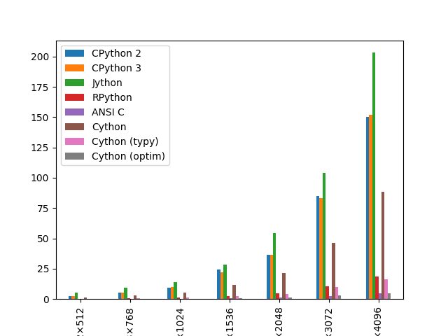
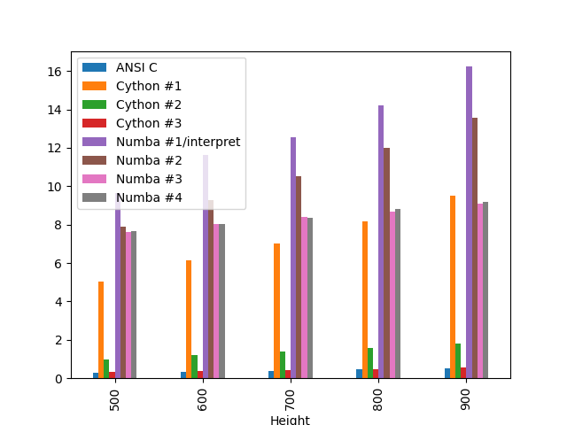

# Evoluce Pythonu

---


---

## Obsah kurzu

* Nové vlastnosti jazyka
* Novinky v ekosystému Pythonu
* Vylepšení výkonnosti Pythonu
* Python a vývoj webových aplikací
* Alternativní projekty a jazyky
* Testování aplikací v Pythonu

---

## Obsah kurzu
### Nové vlastnosti jazyka

* Formátovací řetězce
* Pouze poziční parametry funkcí
* Pattern matching
* "Mroží" operátor
* Podpora pro asynchronní programování
* Skupiny výjimek
* Deklarace datových typů
* Statická typová kontrola

---

## Obsah kurzu
### Novinky v ekosystému Pythonu

* Správa projektů
* Lintery

---

## Obsah kurzu
### Vylepšení výkonnosti Pythonu

* Výkonnější CPython
* Problém související s GILem
* JIT překlad

---

## Obsah kurzu
### Python a vývoj webových aplikací

* Brython
* Transcrypt
* PyScript
* Bokeh

---

## Obsah kurzu
### Alternativní projekty a jazyky

* Coconut
* Mojo

---

## Obsah kurzu
### Testování aplikací v Pythonu

* Jednotkové testy
* Zjištění pokrytí kódu testy
* Testy chování (BDD)
* Nástroj Hypothesis
* Fuzzy testy

---

# Nové vlastnosti jazyka


---

## Nové vlastnosti jazyka

* Formátovací řetězce
* Pouze poziční parametry funkcí
* Pattern matching
* "Mroží" operátor
* Podpora pro asynchronní programování
* Skupiny výjimek
* Deklarace datových typů
* Statická typová kontrola

---

## Postupné rozšiřování možností Pythonu

```
Python 3.6    f-řetězce, async-IO
Python 3.7    klíčová slova async a await
Python 3.8    mroží operátor, poziční parametry
Python 3.9    generické typy
Python 3.10   pattern matching
Python 3.11   skupiny výjimek
Python 3.12   klíčové slovo type + sémantika
```

---

## Formátovací řetězce

* Přidáno do Pythonu 3.6
* Lze využít společně s původním formátováním
* Prefix `f""`
    - proto se nazývají f-strings

---

### Ukázka použití f-řetězců

* "Interpolace" proměnných

```python
a=1
b=2
c=a+b

print(f"{a}+{b}={c}")
```

[Zdrojový kód příkladu](https://github.com/tisnik/most-popular-python-libs/blob/master/modern_python/sources//f-string-1.py)

---

### Výrazy v f-řetězci

* V řetězci lze použít i výrazy

```python
a=1
b=2

print(f"{a}+{b}={a+b}")
```

[Zdrojový kód příkladu](https://github.com/tisnik/most-popular-python-libs/blob/master/modern_python/sources//f-string-2.py)

---

### Podmínka ve výrazu

* Ne vždy plně čitelné, ale pro jednoduché šablony ano

```python
a=1
b=-1

print(f"Kladné: {'ano' if a>0 else 'ne'}")
print(f"Kladné: {'ano' if b>0 else 'ne'}")
```

[Zdrojový kód příkladu](https://github.com/tisnik/most-popular-python-libs/blob/master/modern_python/sources//f-string-3.py)

---

### Volání funkce v f-řetězci

```python
x = "Hello world!"

print(f"Délka '{x}' je {len(x)} znaků")
```

[Zdrojový kód příkladu](https://github.com/tisnik/most-popular-python-libs/blob/master/modern_python/sources//f-string-4.py)

---

### Volání metody v f-řetězci

```python
x = "hello world!"

print(f"Zpráva pro vás: '{x.capitalize()}'")
```

[Zdrojový kód příkladu](https://github.com/tisnik/most-popular-python-libs/blob/master/modern_python/sources//f-string-5.py)

---

### Jednodušší ladění

```python
name = "Guido"
surname = "Rossum"

print(f"{name=} {surname=}")
```

[Zdrojový kód příkladu](https://github.com/tisnik/most-popular-python-libs/blob/master/modern_python/sources//f-string-6.py)

Výsledek:

```
name='Guido' surname='Rossum'
```

---

## Poziční parametry funkcí

* Přidáno do Pythonu 3.8
* Umožňují rozlišit funkce s parametry zapisovanými jen pozičně
* Ostatní parametry buď pozičně nebo je lze pojmenovat

---

### Poziční parametry funkcí

* Běžně deklarovaná funkce

```python
def foo(x, y, z):
    return x+y-z


print(foo(1, 2, 10))
print(foo(x=1, y=2, z=10))
```

[Zdrojový kód příkladu](https://github.com/tisnik/most-popular-python-libs/blob/master/modern_python/sources//positional-params-1.py)

---

### Poziční parametry funkcí

* Parametry lze pojmenovat a předat v jiném pořadí

```python
def foo(x, y, z):
    return x+y-z


print(foo(1, 2, 10))
print(foo(z=1, y=2, x=10))
```

[Zdrojový kód příkladu](https://github.com/tisnik/most-popular-python-libs/blob/master/modern_python/sources//positional-params-2.py)

---

### Poziční parametry funkcí

* Všechny parametry jsou čistě poziční

```python
def foo(x, y, z, /):
    return x+y-z


print(foo(1, 2, 10))
print(foo(z=1, y=2, x=10))
```

[Zdrojový kód příkladu](https://github.com/tisnik/most-popular-python-libs/blob/master/modern_python/sources//positional-params-3.py)

---

### Poziční parametry funkcí

* První parametr je čistě poziční

```python
def foo(x, /, y, z):
    return x+y-z


print(foo(1, 2, 10))
print(foo(1, z=1, y=2))
```

[Zdrojový kód příkladu](https://github.com/tisnik/most-popular-python-libs/blob/master/modern_python/sources//positional-params-4.py)

---

### Poziční parametry funkcí

* Kombinace s pojmenovanými parametry

```python
def foo(x=0, /, y=0, z=0):
    return x+y-z


print(foo())
print(foo(10))
print(foo(1, 2, 10))
print(foo(1, z=1, y=2))
```

[Zdrojový kód příkladu](https://github.com/tisnik/most-popular-python-libs/blob/master/modern_python/sources//positional-params-5.py)

---

## Pattern matching

* Přidáno do Pythonu 3.10
* Lepší varianta konstrukce `switch-case`

---

### Inspirováno dalšími programovacími jazyky

* SNOBOL
* AWK
* ML (Caml, OCaml, F#)
* Rust
* Coconut (překládáno do Pythonu)

---

### Částečně flexibilní řešení

* Ne všechny vzory je možné použít
    - například `"literal" + x + "literal"`
    - možná se jejich podpora objeví v další verzi Pythonu?

---

### Ukázky pattern matchingu

---

### Klasické řešení problému bez pattern matchingu

```python
print("Not ready reading drive A")


def abort_retry_fail():
    response = input("Abort, Retry, Fail? ")

    if response == "a":
        return "Abort"
    elif response == "r":
        return "Retry"
    elif response == "f":
        return "Fail"
    else:
        return "Wrong response"


print(abort_retry_fail())
```

[Zdrojový kód příkladu](https://github.com/tisnik/most-popular-python-libs/blob/master/modern_python/sources//pattern-matching-abort-retry-fail-1.py)

---

### Použití mapy (slovníku)

```python
print("Not ready reading drive A")


def abort_retry_fail():
    response = input("Abort, Retry, Fail? ")

    commands = {
            "a": "Abort",
            "r": "Retry",
            "f": "Fail"
            }

    return commands.get(response, "Wrong response")


print(abort_retry_fail())
```

[Zdrojový kód příkladu](https://github.com/tisnik/most-popular-python-libs/blob/master/modern_python/sources//pattern-matching-abort-retry-fail-2.py)

---

### Řídicí struktura match-case

```python
print("Not ready reading drive A")


def abort_retry_fail():
    response = input("Abort, Retry, Fail? ")

    match response:
        case "a":
            return "Abort"
        case "r":
            return "Retry"
        case "f":
            return "Fail"
        case _:
            return "Wrong response"


print(abort_retry_fail())
```

[Zdrojový kód příkladu](https://github.com/tisnik/most-popular-python-libs/blob/master/modern_python/sources//pattern-matching-abort-retry-fail-3.py)

---

### Množiny pro větší množství vstupů

```python
print("Not ready reading drive A")


def abort_retry_fail():
    response = input("Abort, Retry, Fail? ")

    if response in {"a", "A"}:
        return "Abort"
    elif response in {"r", "R"}:
        return "Retry"
    elif response in {"f", "F"}:
        return "Fail"
    else:
        return "Wrong response"


print(abort_retry_fail())
```

[Zdrojový kód příkladu](https://github.com/tisnik/most-popular-python-libs/blob/master/modern_python/sources//pattern-matching-abort-retry-fail-4.py)

---

### Spojka `or` ve vzoru

```python
print("Not ready reading drive A")


def abort_retry_fail():
    response = input("Abort, Retry, Fail? ")

    match response:
        case "a" | "A":
            return "Abort"
        case "r" | "R":
            return "Retry"
        case "f" | "F":
            return "Fail"
        case _:
            return "Wrong response"


print(abort_retry_fail())
```

[Zdrojový kód příkladu](https://github.com/tisnik/most-popular-python-libs/blob/master/modern_python/sources//pattern-matching-abort-retry-fail-5.py)

---

### Zachycení hodnoty ve vzoru

```python
print("Not ready reading drive A")


def abort_retry_fail():
    response = input("Abort, Retry, Fail? ")

    match response:
        case "a" | "A":
            return "Abort"
        case "r" | "R":
            return "Retry"
        case "f" | "F":
            return "Fail"
        case _ as x:
            return f"Wrong response {x}"


print(abort_retry_fail())
```

[Zdrojový kód příkladu](https://github.com/tisnik/most-popular-python-libs/blob/master/modern_python/sources//pattern-matching-abort-retry-fail-6.py)

---

### Zachycení hodnoty ve vzoru

```python
print("Not ready reading drive A")


def abort_retry_fail():

    match input("Abort, Retry, Fail? "):
        case "a" | "A":
            return "Abort"
        case "r" | "R":
            return "Retry"
        case "f" | "F":
            return "Fail"
        case _ as x:
            return f"Wrong response {x}"


print(abort_retry_fail())
```

[Zdrojový kód příkladu](https://github.com/tisnik/most-popular-python-libs/blob/master/modern_python/sources//pattern-matching-abort-retry-fail-7.py)

---

### Generátor Fibonaccího posloupnosti

```python
def fib(value):
    match value:
        case 0:
            return 0
        case 1:
            return 1
        case n if n>1:
            return fib(n-1) + fib(n-2)
        case _ as wrong:
            raise ValueError("Wrong input", wrong)


for n in range(0, 11):
    print(n, fib(n))

fib(-1)
```

[Zdrojový kód příkladu](https://github.com/tisnik/most-popular-python-libs/blob/master/modern_python/sources//pattern-matching-fib.py)

---

### Výpočet faktoriálu - základní varianta

```python
def factorial(n):
    match n:
        case 0:
            return 1
        case 1:
            return 1
        case x:
            return x * factorial(x-1)


for i in range(0, 10):
    print(i, factorial(i))
```

[Zdrojový kód příkladu](https://github.com/tisnik/most-popular-python-libs/blob/master/modern_python/sources//pattern-matching-factorial1.py)

---

### Podmínka ve větvi

```python
def factorial(n):
    match n:
        case 0:
            return 1
        case 1:
            return 1
        case x if x>1:
            return x * factorial(x-1)
        case _:
            raise TypeError("expecting integer >= 0")


for i in range(-1, 10):
    try:
        print(i, factorial(i))
    except Exception as e:
        print(e)
```

[Zdrojový kód příkladu](https://github.com/tisnik/most-popular-python-libs/blob/master/modern_python/sources//pattern-matching-factorial2.py)

---

### Test typu

```python
def factorial(n):
    match n:
        case 0:
            return 1
        case 1:
            return 1
        case x if isinstance(x, int) and x>1:
            return x * factorial(x-1)
        case _:
            raise TypeError("expecting integer >= 0")


for i in range(-1, 10):
    try:
        print(i, factorial(i))
    except Exception as e:
        print(e)

try:
    print(factorial(3.14))
except Exception as e:
    print(e)

try:
    print(factorial("hello"))
except Exception as e:
    print(e)
```

[Zdrojový kód příkladu](https://github.com/tisnik/most-popular-python-libs/blob/master/modern_python/sources//pattern-matching-factorial3.py)

---

### Větev "or"

```python
def factorial(n):
    match n:
        case 0 | 1:
            return 1
        case x if isinstance(x, int) and x>1:
            return x * factorial(x-1)
        case _:
            raise TypeError("expecting integer >= 0")


for i in range(-1, 10):
    try:
        print(i, factorial(i))
    except Exception as e:
        print(e)

try:
    print(factorial(3.14))
except Exception as e:
    print(e)

try:
    print(factorial("hello"))
except Exception as e:
    print(e)
```

[Zdrojový kód příkladu](https://github.com/tisnik/most-popular-python-libs/blob/master/modern_python/sources//pattern-matching-factorial4.py)

---

### Vzorek s n-ticí

```python
def test_number(value):
    match value:
        case (0, 0):
            print("Zero")
        case (real, 0):
            print(f"Real number {real}")
        case (0, imag):
            print(f"Imaginary number {imag}")
        case (real, imag):
            print(f"Complex number {real}+i{imag}")
        case _:
            raise ValueError("Not a complex number")


test_number((0,0))
test_number((1,0))
test_number((0,1))
test_number((1,1))
```

[Zdrojový kód příkladu](https://github.com/tisnik/most-popular-python-libs/blob/master/modern_python/sources//pattern-matching-complex1.py)

---

### Vzorek s n-ticí a s podmínkou

```python
def test_number(value):
    match value:
        case (0, 0):
            print("Zero")
        case (real, 0) if real>0:
            print(f"Positive real number {real}")
        case (real, 0):
            print(f"Negative real number {real}")
        case (0, imag) if imag<0:
            print(f"Negative imaginary number {imag}")
        case (0, imag):
            print(f"Negative imaginary number {imag}")
        case (real, imag):
            print(f"Complex number {real}+i{imag}")
        case _:
            raise ValueError("Not a complex number")


test_number((0,0))
test_number((1,0))
test_number((-1,0))
test_number((0,1))
test_number((0,-1))
test_number((1,1))
```

[Zdrojový kód příkladu](https://github.com/tisnik/most-popular-python-libs/blob/master/modern_python/sources//pattern-matching-complex2.py)

---

### Příkazy složené z většího množství slov

```python
def perform_command():
    response = input("> ")

    match response:
        case "quit":
            return "Quit"
        case "list employees":
            return "List employees"
        case "list departments":
            return "List departments"
        case "list rooms":
            return "List rooms"
        case _:
            return "Wrong command"


print(perform_command())
```

[Zdrojový kód příkladu](https://github.com/tisnik/most-popular-python-libs/blob/master/modern_python/sources//pattern-matching-multiword-commands-1.py)

---

### Vzorek a seznamy

```python
def perform_command():
    response = input("> ")

    match response.split():
        case ["quit"]:
            return "Quit"
        case ["list", "employees"]:
            return "List employees"
        case ["list", "departments"]:
            return "List departments"
        case ["list", "rooms"]:
            return "List rooms"
        case _:
            return "Wrong command"


print(perform_command())
```

[Zdrojový kód příkladu](https://github.com/tisnik/most-popular-python-libs/blob/master/modern_python/sources//pattern-matching-multiword-commands-2.py)

---

### Zachycení hodnoty

```python
def perform_command():
    response = input("> ")

    match response.split():
        case ["quit"]:
            return "Quit"
        case ["list", "employees"]:
            return "List employees"
        case ["list", "departments"]:
            return "List departments"
        case ["list", "rooms"]:
            return "List rooms"
        case ["info", subject]:
            return f"Info about subject '{subject}'"
        case _:
            return "Wrong command"


print(perform_command())
```

[Zdrojový kód příkladu](https://github.com/tisnik/most-popular-python-libs/blob/master/modern_python/sources//pattern-matching-multiword-commands-3.py)

---

### Vnořená konstrukce `match-case`

```python
def perform_command():
    response = input("> ")

    match response.split():
        case ["quit"]:
            return "Quit"
        case ["list", obj]:
            match obj:
                case "employees":
                    return "List employees"
                case "departments":
                    return "List departments"
                case "rooms":
                    return "List rooms"
                case _:
                    return "Invalid object type: employees, departments, or rooms expected"
        case ["info", subject]:
            return f"Info about subject '{subject}'"
        case _:
            return "Wrong command"


print(perform_command())
```

[Zdrojový kód příkladu](https://github.com/tisnik/most-popular-python-libs/blob/master/modern_python/sources//pattern-matching-multiword-commands-4.py)

---

### Vnořená konstrukce `match-case` + množiny ve vzorku

```python
def perform_command():
    response = input("> ")

    match response.split():
        case ["quit"]:
            return "Quit"
        case ["list", ("employees" | "departments" | "rooms") as obj]:
            match obj:
                case "employees":
                    return "List employees"
                case "departments":
                    return "List departments"
                case "rooms":
                    return "List rooms"
        case ["info", subject]:
            return f"Info about subject '{subject}'"
        case _:
            return "Wrong command"


print(perform_command())
```

[Zdrojový kód příkladu](https://github.com/tisnik/most-popular-python-libs/blob/master/modern_python/sources//pattern-matching-multiword-commands-5.py)

---

### Vzorky a OOP

```python
class Complex():

    def __init__(self, real, imag):
        self.real = real
        self.imag = imag

    def __str__(self):
        return f"Complex number {self.real}+i{self.imag} represented as object"


def test_number(value):
    match value:
        case (0, 0):
            print("Zero")
        case (real, 0) if real>0:
            print(f"Positive real number {real}")
        case (real, 0):
            print(f"Negative real number {real}")
        case (0, imag) if imag<0:
            print(f"Negative imaginary number {imag}")
        case (0, imag):
            print(f"Negative imaginary number {imag}")
        case (real, imag):
            print(f"Complex number {real}+i{imag}")
        case Complex():
            print(value)
        case _:
            raise ValueError("Not a complex number")


test_number((0,0))
test_number((1,0))
test_number((-1,0))
test_number((0,1))
test_number((0,-1))
test_number((1,1))

test_number(Complex(0,0))
test_number(Complex(1,0))
test_number(Complex(-1,0))
test_number(Complex(0,1))
test_number(Complex(0,-1))
test_number(Complex(1,1))
```

[Zdrojový kód příkladu](https://github.com/tisnik/most-popular-python-libs/blob/master/modern_python/sources//pattern-matching-object1.py)

---

### Vzorky a OOP

```python
from fractions import Fraction


class Complex():

    def __init__(self, real, imag):
        self.real = real
        self.imag = imag

    def __str__(self):
        return f"Complex number {self.real}+i{self.imag} represented as object"


def test_number(value):
    match value:
        case (0, 0):
            print("Zero")
        case (real, 0) if real>0:
            print(f"Positive real number {real}")
        case (real, 0):
            print(f"Negative real number {real}")
        case (0, imag) if imag<0:
            print(f"Negative imaginary number {imag}")
        case (0, imag):
            print(f"Negative imaginary number {imag}")
        case (real, imag):
            print(f"Complex number {real}+i{imag}")
        case Complex(real=0, imag=0):
            print(f"Zero complex represented as object")
        case Complex():
            print(value)
        case Fraction():
            print(f"Fraction {value}")
        case _:
            raise ValueError("Not a complex number")


test_number((0,0))
test_number((1,0))
test_number((-1,0))
test_number((0,1))
test_number((0,-1))
test_number((1,1))

test_number(Complex(0,0))
test_number(Complex(1,0))
test_number(Complex(-1,0))
test_number(Complex(0,1))
test_number(Complex(0,-1))
test_number(Complex(1,1))

test_number(Fraction(0,1))
test_number(Fraction(1,1))
test_number(Fraction(1,2))
test_number(Fraction(1,3))
```

[Zdrojový kód příkladu](https://github.com/tisnik/most-popular-python-libs/blob/master/modern_python/sources//pattern-matching-object2.py)

---

## Mroží operátor

* Přidáno do Pythonu 3.8
* PEP 572 - Assignment Expressions
* Možnost přiřazení v rámci `výrazu`
    - původní přiřazení lze jen v rámci `příkazu`
* Takzvané `pojmenované výrazy`

---

### Proměnná definovaná v podmínce

```python
limit = 8

password = "Hello world" 

if (length := len(password)) < limit:
    print(f"Password should be longer than {length} chars")
```

[Zdrojový kód příkladu](https://github.com/tisnik/most-popular-python-libs/blob/master/modern_python/sources//walrus-operator-1.py)

---

### Dtto, ale opačný výsledek

```python
limit = 8

password = "Hello" 

if (length := len(password)) < limit:
    print(f"Password should be longer than {length} chars")
```

[Zdrojový kód příkladu](https://github.com/tisnik/most-popular-python-libs/blob/master/modern_python/sources//walrus-operator-2.py)

---

### Problém: opakované výpočty

```python
values = (1, 2, 3, 4, 5)

result = {
        "count": len(values),
        "sum": sum(values),
        "mean": sum(values) / len(values)
        }

print(result)
```

[Zdrojový kód příkladu](https://github.com/tisnik/most-popular-python-libs/blob/master/modern_python/sources//walrus-operator-3.py)

---

### Předpočet hodnot

```python
values = (1, 2, 3, 4, 5)

count = len(values)
summ = sum(values)

result = {
        "count": count,
        "sum": summ,
        "mean": summ/count
        }

print(result)
```

[Zdrojový kód příkladu](https://github.com/tisnik/most-popular-python-libs/blob/master/modern_python/sources//walrus-operator-4.py)

---

### Úprava založená na walrus operátoru

```python
values = (1, 2, 3, 4, 5)

result = {
        "count": (count := len(values)),
        "sum": (summ := sum(values)),
        "mean": summ/count
        }

print(result)
```

[Zdrojový kód příkladu](https://github.com/tisnik/most-popular-python-libs/blob/master/modern_python/sources//walrus-operator-5.py)

---

## Podpora pro asynchronní programování

* Postupně přidáno v Pythonu 3.6 a 3.7
* Nová klíčová slova `async` a `await`

---

### Souběžnost a paralelismus

* Nejedná se o tytéž vlastnosti
* Souběžnost
    - více úloh běžících na menším množství CPU
    - i na jednom CPU
    - překrývání
* Paralelismus
    - n úloh na n CPU

---

### Souběžnost a paralelismus v Pythonu

* Více procesů
    - `multiprocessing`
* Více vláken
    - `threading`
* Korutiny
    - `asyncio`

---

### `async` a `await`

* Nejenom v Pythonu
    - populární i v dalších jazycích
* Typicky pro I/O operace
* Funkce označené `async`
* Čekání na dokončení pomocí `await`

---

### `async` a `await`

* Nekorektní použití `await`

```python
import asyncio
import time


async def task():
    print("task started")
    await asyncio.sleep(5)
    print("task finished")


def main():
    task1 = asyncio.create_task(task())
    print("task created")

    await task1

    print("done")


main()
```

[Zdrojový kód příkladu](https://github.com/tisnik/most-popular-python-libs/blob/master/modern_python/sources//async-await-1.py)

---

### `async` a `await`

* Korektní použití `await`

```python
import asyncio


async def task():
    print("task started")
    await asyncio.sleep(5)
    print("task finished")


async def main():
    task1 = asyncio.create_task(task())
    print("task created")

    await task1

    print("done")


asyncio.run(main())
```

[Zdrojový kód příkladu](https://github.com/tisnik/most-popular-python-libs/blob/master/modern_python/sources//async-await-2.py)

---

### Dvě souběžné úlohy

```python
import asyncio


async def task(name):
    print(f"{name} task started")
    await asyncio.sleep(5)
    print(f"{name} task finished")


async def main():
    task1 = asyncio.create_task(task("first"))
    print("first task created")

    task2 = asyncio.create_task(task("second"))
    print("second task created")

    await task1
    await task2

    print("done")


asyncio.run(main())
```

[Zdrojový kód příkladu](https://github.com/tisnik/most-popular-python-libs/blob/master/modern_python/sources//async-await-3.py)

---

### Tři souběžné úlohy, čtení výsledné hodnoty

```python
import asyncio


async def task(name):
    print(f"{name} task started")
    await asyncio.sleep(5)
    print(f"{name} task finished")
    return name[::-1]


async def main():
    task1 = asyncio.create_task(task("first"))
    print("first task created")

    task2 = asyncio.create_task(task("second"))
    print("second task created")

    task3 = asyncio.create_task(task("third"))
    print("third task created")

    print("result of task #1:", await task1)
    print("result of task #2:", await task2)
    print("result of task #3:", await task3)

    print("done")


asyncio.run(main())
```

[Zdrojový kód příkladu](https://github.com/tisnik/most-popular-python-libs/blob/master/modern_python/sources//async-await-4.py)

---

### Komunikace přes fronty

```python
import asyncio


async def task(name, queue):
    while not queue.empty():
        param = await queue.get()
        print(f"Task named {name} started with parameter {param}")
        await asyncio.sleep(5)
        print(f"{name} task finished")


async def main():
    queue = asyncio.Queue()

    for i in range(20):
        await queue.put(i)

    for n in range(1, 2):
        asyncio.create_task(task(f"{n}", queue))


asyncio.run(main())
```

[Zdrojový kód příkladu](https://github.com/tisnik/most-popular-python-libs/blob/master/modern_python/sources//async-queue-1.py)

---

### Čtení výsledků přes frontu

* Synchronizace

```python
import asyncio


async def task(name, queue):
    while not queue.empty():
        param = await queue.get()
        print(f"Task named {name} started with parameter {param}")
        await asyncio.sleep(5)
        print(f"{name} task finished")


async def main():
    queue = asyncio.Queue()

    for i in range(20):
        await queue.put(i)

    for n in range(1, 2):
        await asyncio.gather(asyncio.create_task(task(f"{n}", queue)))


asyncio.run(main())
```

[Zdrojový kód příkladu](https://github.com/tisnik/most-popular-python-libs/blob/master/modern_python/sources//async-queue-2.py)

---

### Producent-konzument

* Běžící asynchronně

```python
import asyncio


async def task(name, queue):
    while not queue.empty():
        param = await queue.get()
        print(f"Task named {name} started with parameter {param}")
        await asyncio.sleep(5)
        print(f"{name} task finished")


async def main():
    queue = asyncio.Queue()

    for i in range(20):
        await queue.put(i)

    await asyncio.gather(
        asyncio.create_task(task(1, queue)),
        asyncio.create_task(task(2, queue)),
        asyncio.create_task(task(3, queue)),
        asyncio.create_task(task(4, queue)),
    )


asyncio.run(main())
```

[Zdrojový kód příkladu](https://github.com/tisnik/most-popular-python-libs/blob/master/modern_python/sources//async-queue-3.py)

---

### Prioritní fronta

```python
import queue
import random

q = queue.PriorityQueue(40)

for item in range(30):
    print("Size", q.qsize())
    print("Empty?", q.empty())
    print("Full?", q.full())

    value = random.randint(1, 20)
    print(value)
    q.put("prvek # {:2d}".format(value))


while not q.empty():
    print("Read item:", q.get())
```

[Zdrojový kód příkladu](https://github.com/tisnik/most-popular-python-libs/blob/master/modern_python/sources//priority-queue.py)

---

### `aiohttp`

```python
import asyncio
import aiohttp
import time
 
 
async def download(name, queue):
    async with aiohttp.ClientSession() as session:
        while not queue.empty():
            url = await queue.get()
            print(f"Task named {name} getting URL: {url}")
            async with session.get(url) as response:
                t = await response.text()
                print(f"Task named {name} downloaded {len(t)} characters")
            print(f"Task named {name} finished")
 
 
async def main():
    queue = asyncio.Queue()
 
    for url in (
        "http://www.root.cz",
        "http://duckduckgo.com",
        "http://seznam.com",
        "https://www.root.cz/programovaci-jazyky/",
        "https://www.root.cz/clanky/soubezne-a-paralelne-bezici-ulohy-naprogramovane-v-pythonu/",
        "https://github.com/"
    ):
        await queue.put(url)
 
    await asyncio.gather(
            asyncio.create_task(download(1, queue)),
            asyncio.create_task(download(2, queue)))
 
 
asyncio.run(main())
```

[Zdrojový kód příkladu](https://github.com/tisnik/most-popular-python-libs/blob/master/modern_python/sources//aiohttp1.py)

---

### `aiohttp`

```python
import aiohttp
import time
 
 
async def download(name, queue, results):
    async with aiohttp.ClientSession() as session:
        while not queue.empty():
            url = await queue.get()
            t1 = time.time()
            print(f"Task named {name} getting URL: {url}")
            async with session.get(url) as response:
                t = await response.text()
                t2 = time.time()
                print(f"Task named {name} downloaded {len(t)} characters in {t2-t1} seconds")
                await results.put(t2-t1)
            print(f"Task named {name} finished")
 
 
async def main():
    queue = asyncio.Queue()
    results = asyncio.Queue()
 
    t1 = time.time()
 
    for url in (
        "http://www.root.cz",
        "http://duckduckgo.com",
        "http://seznam.com",
        "https://www.root.cz/programovaci-jazyky/",
        "https://www.root.cz/clanky/soubezne-a-paralelne-bezici-ulohy-naprogramovane-v-pythonu/",
        "https://www.root.cz/clanky/pywebio-interaktivni-webove-dialogy-a-formulare-v-cistem-pythonu/",
        "https://streamlit.io/",
        "https://pglet.io/",
        "https://www.root.cz/serialy/graficke-uzivatelske-rozhrani-v-pythonu/",
        "https://github.com/"
    ):
        await queue.put(url)
 
    await asyncio.gather(
            asyncio.create_task(download(1, queue, results)),
            asyncio.create_task(download(2, queue, results)),
            asyncio.create_task(download(3, queue, results)))
 
    process_time = 0
    while not results.empty():
        process_time += await results.get()
 
    print(f"Process time: {process_time} seconds")
 
    t2 = time.time()
    print(f"Total time:   {t2-t1} seconds")
 
asyncio.run(main())
```

[Zdrojový kód příkladu](https://github.com/tisnik/most-popular-python-libs/blob/master/modern_python/sources//aiohttp2.py)

---

## Skupiny výjimek

* Přidáno do Pythonu 3.11
* PEP 654 – Exception Groups and except

---

### Vyhození skupiny výjimek

```python
eg = ExceptionGroup(
    "one", [TypeError(1), ValueError(3), OSError(4)])

import traceback
traceback.print_exception(eg)
```

[Zdrojový kód příkladu](https://github.com/tisnik/most-popular-python-libs/blob/master/modern_python/sources//exception-group-1.py)

---

### Vyhození skupiny výjimek

```python
eg = ExceptionGroup(
    "one",
    [
        TypeError(1),
        ExceptionGroup(
            "two",
             [TypeError(2), ValueError(3)]
        ),
        ExceptionGroup(
             "three",
              [OSError(4)]
        )
    ]
)

import traceback
traceback.print_exception(eg)
```

[Zdrojový kód příkladu](https://github.com/tisnik/most-popular-python-libs/blob/master/modern_python/sources//exception-group-2.py)

---

## Deklarace datových typů

* Přidáváno postupně
* PEP 484 - Type Hints a další

---

### Nejpopulárnější jazyky současnosti

```
Dynamicky typované   Staticky typované
--------------------------------------
Python               C
JavaScript           C++
Ruby                 Go
Perl                 Rust
Matlab               Java
PHP                  Scala
```

---

### Přednosti dynamicky typovaných jazyků

* Rychlý cyklus vývoje
    - edit-(compile)-run
* Velmi snadné pro začátečníky
* Ideální pro skriptování
    - CLI
    - skripty na webových stránkách

---

### Zápory dynamicky typovaných jazyků

* Zaručení korektnosti rozsáhlých projektů
* Většinou se vyžaduje větší množství jednotkových testů
    - code coverage není dobrou metrikou!
* Informace o typech se někdy zapisují do komentářů
* IDE nemusí vždy nabízet správné funkce/metody/opravy

---

## To nejlepší z obou světů?

* Volitelné typy

```
Jazyk          Technologie pro statické typy
--------------------------------------------
JavaScript     TypeScript, Flow
Python         Mypy, Pyright, Pyre
Ruby           Sorbet
```

---

### Volitelné typy a Python

* Python je dynamicky typovaný
    - a nejsou plány to změnit!
* Typy jsou čistě volitelné
    - přidáno do Pythonu 3.5
    - nazvané "type hints"
    - (aby to vývojáře nestrašilo)
* Statické typové kontroly
    - mypy, pyright, pyre

---

### Statická typová kontrola a Mypy

---


---

```python
def add(a, b):
    return a+b
```

[Zdrojový kód příkladu](https://github.com/tisnik/most-popular-python-libs/blob/master/modern_python/sources//mypy-add-1.py)

* Typ `Any` je přidán automaticky

---

### Typové anotace

* specifikují se za dvojtečkou

```python
def add(a:int, b:int) -> int:
    return a+b
```

[Zdrojový kód příkladu](https://github.com/tisnik/most-popular-python-libs/blob/master/modern_python/sources//mypy-add-2.py)

---

### `bool` nebo `int`?

* Viz specifikace Pythonu!

```python
def add(a:int, b:int) -> int:
    return a+b

print(add(1, 2))
print(add(1, True))
print(add(1, False))
```

[Zdrojový kód příkladu](https://github.com/tisnik/most-popular-python-libs/blob/master/modern_python/sources//mypy-add-3.py)
```python
def add(a:bool, b:bool) -> bool:
    return a and b

print(add(1, 2))
print(add(1, True))
print(add(1, False))
print(add(True, False))
```

[Zdrojový kód příkladu](https://github.com/tisnik/most-popular-python-libs/blob/master/modern_python/sources//mypy-add-4.py)

---

### Výpis typových anotací

* `any`

```python
def add(a, b):
    return a+b


print(add.__annotations__)
```

[Zdrojový kód příkladu](https://github.com/tisnik/most-popular-python-libs/blob/master/modern_python/sources//mypy-add-5.py)

* explicitní typy

```python
def add(a:int, b:int) -> int:
    return a+b


print(add.__annotations__)
```

[Zdrojový kód příkladu](https://github.com/tisnik/most-popular-python-libs/blob/master/modern_python/sources//mypy-add-6.py)


---

### Výpis typových anotací

* složitější typy

```python
from typing import List, Set

def add(a:List[Set[int]], b:List[Set[int]]) -> List[Set[int]]:
    return a+b


print(add.__annotations__)
```

[Zdrojový kód příkladu](https://github.com/tisnik/most-popular-python-libs/blob/master/modern_python/sources//mypy-add-7.py)

---

### Typované n-tice

* nekorektní varianta

```python
from typing import Tuple

p: Tuple[int] = (1, 2, 3)
```

[Zdrojový kód příkladu](https://github.com/tisnik/most-popular-python-libs/blob/master/modern_python/sources//mypy-tuple-type-1.py)

* korektní varianta

```python
from typing import Tuple

p: Tuple[int, int, int] = (1, 2, 3)
```

[Zdrojový kód příkladu](https://github.com/tisnik/most-popular-python-libs/blob/master/modern_python/sources//mypy-tuple-type-2.py)

---

### Rozdílné typy prvků

* nekorektní varianta

```python
from typing import Tuple

p: Tuple[int, float, bool, str] = (1, 3.14, True, "Hello")
```

[Zdrojový kód příkladu](https://github.com/tisnik/most-popular-python-libs/blob/master/modern_python/sources//mypy-tuple-type-3.py)

* korektní varianta

```python
from typing import Tuple

p: Tuple[int, float, bool, str] = (2.0, 3.14, 1, "Hello")
```

[Zdrojový kód příkladu](https://github.com/tisnik/most-popular-python-libs/blob/master/modern_python/sources//mypy-tuple-type-4.py)

---

### Typované seznamy

* nekorektní varianta

```python
l: list[int] = []
```

[Zdrojový kód příkladu](https://github.com/tisnik/most-popular-python-libs/blob/master/modern_python/sources//mypy-list-type-1.py)

* import

```python
from typing import List

l: List[int] = []
```

[Zdrojový kód příkladu](https://github.com/tisnik/most-popular-python-libs/blob/master/modern_python/sources//mypy-list-type-2.py)

---

### Test typu prvků

* v pořádku

```python
from typing import List

l: List[int] = [1, 2, 3]
```

[Zdrojový kód příkladu](https://github.com/tisnik/most-popular-python-libs/blob/master/modern_python/sources//mypy-list-type-3.py)

* nekorektní

```python
from typing import List

l: List[int] = [1, 2, None]
```

[Zdrojový kód příkladu](https://github.com/tisnik/most-popular-python-libs/blob/master/modern_python/sources//mypy-list-type-4.py)

---

### Znovu problém bool-int

* v pořádku

```python
from typing import List

l: List[int] = [1, True, False]
```

[Zdrojový kód příkladu](https://github.com/tisnik/most-popular-python-libs/blob/master/modern_python/sources//mypy-list-type-5.py)

* nekorektní

```python
from typing import List

l: List[bool] = [True, False, 42]
```

[Zdrojový kód příkladu](https://github.com/tisnik/most-popular-python-libs/blob/master/modern_python/sources//mypy-list-type-6.py)

---

### Typované slovníky

* Slovníky v Pythonu

```python
d = {}

d["foo"] = 1
d["bar"] = 3
d["baz"] = 10

print(d)
```

[Zdrojový kód příkladu](https://github.com/tisnik/most-popular-python-libs/blob/master/modern_python/sources//mypy-dict-type-1.py)

* Libovolné klíče a hodnoty

```python
d = {}

d["foo"] = 1
d["bar"] = 3.14
d[10] = 10
d[42] = "answer"

print(d)
```

[Zdrojový kód příkladu](https://github.com/tisnik/most-popular-python-libs/blob/master/modern_python/sources//mypy-dict-type-2.py)

---

### Specifikace typu slovníku

* použití typu `any`

```python
from typing import Dict, Any

d:Dict[Any, Any] = {}

d["foo"] = 1
d["bar"] = 3.14
d[10] = 10
d[42] = "answer"

print(d)
```

[Zdrojový kód příkladu](https://github.com/tisnik/most-popular-python-libs/blob/master/modern_python/sources//mypy-dict-type-3.py)

---

### Specifikace typu slovníku

* explicitní specifikace

```python
from typing import Dict

d:Dict[str, float] = {}

d["foo"] = 1
d["bar"] = 3.14
d[10] = 10
d[42] = "answer"

print(d)
```

[Zdrojový kód příkladu](https://github.com/tisnik/most-popular-python-libs/blob/master/modern_python/sources//mypy-dict-type-4.py)

---

### Typ `union`

* Pro hodnoty

```python
from typing import Dict, Union

d:Dict[str, Union[int, float, str]] = {}

d["foo"] = 1
d["bar"] = 3.14
d[10] = 10
d[42] = "answer"

print(d)
```

[Zdrojový kód příkladu](https://github.com/tisnik/most-popular-python-libs/blob/master/modern_python/sources//mypy-dict-type-5.py)

---

### Typ `union`

* Pro klíče

```python
from typing import Dict, Union

d:Dict[Union[int, str], Union[int, float, str]] = {}

d["foo"] = 1
d["bar"] = 3.14
d[10] = 10
d[42] = "answer"

print(d)
```

[Zdrojový kód příkladu](https://github.com/tisnik/most-popular-python-libs/blob/master/modern_python/sources//mypy-dict-type-6.py)

---

### Typ `optional`

* Bez `optional`

```python
from typing import Dict

d:Dict[str, float] = {}

d["foo"] = 1
d["bar"] = 3.14
d["baz"] = None

print(d)
```

[Zdrojový kód příkladu](https://github.com/tisnik/most-popular-python-libs/blob/master/modern_python/sources//mypy-dict-type-7.py)

---

### Typ `optional`

* S `optional`

```python
from typing import Dict, Optional

d:Dict[str, Optional[float]] = {}

d["foo"] = 1
d["bar"] = 3.14
d["baz"] = None

print(d)
```

[Zdrojový kód příkladu](https://github.com/tisnik/most-popular-python-libs/blob/master/modern_python/sources//mypy-dict-type-8.py)

---

### Typy a funkce vyššího řádu

* typ `callable`

```python
#!/usr/bin/env python3
# vim: set fileencoding=utf-8

#
#  (C) Copyright 2023  Pavel Tisnovsky
#
#  All rights reserved. This program and the accompanying materials
#  are made available under the terms of the Eclipse Public License v1.0
#  which accompanies this distribution, and is available at
#  http://www.eclipse.org/legal/epl-v10.html
#
#  Contributors:
#      Pavel Tisnovsky
#

from typing import Callable


def printIsPositive(condition:Callable[[float], bool]) -> None:
    if condition(5):
        print("Positive")
    else:
        print("Negative")


def positiveFloat(x:float) -> bool:
    return x > 0.0


def positiveInt(x:int) -> bool:
    return x > 0


printIsPositive(positiveFloat)
printIsPositive(positiveInt)
```

[Zdrojový kód příkladu](https://github.com/tisnik/most-popular-python-libs/blob/master/modern_python/sources//mypy-callable.py)

---

### Problém s variancí

* Týká se podtypů a nadřazených typů
    - v OOP běžné
* Čtyři možné typy variance
    - kovariance
    - kontravariance
    - invariance
    - bivariance

---

### Příklad variancí

* `Jablko` je podtypem typu `Ovoce` ve všech dalších případech

---

### Příklad variancí

* Covariance
    - `List[Apple]` je podtypem `List[Fruit]`
* Contravariance
    - `List[Fruit]` je podtypem `List[Apple]`
* Invariance
    - `List[Fruit]` nemá žádný vztah k `List[Apple]`
* Bivariance
    - `List[Apple]` je podtypem `List[Fruit]`
    - a současně (!!!):
    - `List[Fruit]` je podtypem `List[Apple]`

---

### Proč se o varianci vůbec starat?

* Úzce souvisí s typovým systémem
* A s tím, jaké kontroly lze provést staticky

---

```java
class Fruit {
}

class Orange extends Fruit {
    public String toString() {
        return "Orange";
    }
}

class Apple extends Fruit {
    public String toString() {
        return "Apple";
    }
}

public class Variance1 {
    public static void mix(Fruit[] punnet) {
        punnet[0] = new Orange();
        punnet[1] = new Apple();
    }

    public static void main(String[] args) {
        Fruit[] punnet = new Fruit[2];
        mix(punnet);

        for (Fruit Fruit:punnet) {
            System.out.println(Fruit);
        }
    }
}
```

---

### Statická kontrola typů ok, pád v runtime!

```java
class Fruit {
}

class Orange extends Fruit {
    public String toString() {
        return "Orange";
    }
}

class Apple extends Fruit {
    public String toString() {
        return "Apple";
    }
}

public class Variance2 {
    public static void mix(Fruit[] punnet) {
        punnet[0] = new Orange();
        punnet[1] = new Apple();
    }

    public static void main(String[] args) {
        Fruit[] punnet = new Orange[2];
        mix(punnet);

        for (Fruit Fruit:punnet) {
            System.out.println(Fruit);
        }
    }
}
```

---

### Variance v Pythonu

```python
from typing import List


class Ovoce:
    pass


class Hruska(Ovoce):
    def __repr__(self):
        return "Hruska"


class Jablko(Ovoce):
    def __repr__(self):
        return "Jablko"


def tiskni(kosik : List[Ovoce]):
    for ovoce in kosik:
        print(ovoce)


kosik : List[Hruska] = []

tiskni(kosik)
```

[Zdrojový kód příkladu](https://github.com/tisnik/most-popular-python-libs/blob/master/modern_python/sources//mypy-variance-1.py)

---

### Použití `sequence` a nikoli seznamu

```python
from typing import Sequence


class Ovoce:
    pass


class Hruska(Ovoce):
    def __repr__(self):
        return "Hruska"


class Jablko(Ovoce):
    def __repr__(self):
        return "Jablko"


def tiskni(kosik : Sequence[Ovoce]):
    for ovoce in kosik:
        print(ovoce)


kosik : Sequence[Hruska] = []

tiskni(kosik)
```

[Zdrojový kód příkladu](https://github.com/tisnik/most-popular-python-libs/blob/master/modern_python/sources//mypy-variance-2.py)

---

### Tisk typové anotace

```python
from typing import Sequence


class Ovoce:
    pass


class Hruska(Ovoce):
    def __repr__(self):
        return "Hruska"


class Jablko(Ovoce):
    def __repr__(self):
        return "Jablko"


def tiskni(kosik : Sequence[Ovoce]):
    for ovoce in kosik:
        print(ovoce)


kosik : Sequence[Hruska] = []

tiskni(kosik)

print(tiskni.__annotations__)
```

[Zdrojový kód příkladu](https://github.com/tisnik/most-popular-python-libs/blob/master/modern_python/sources//mypy-variance-3.py)

---

# Novinky v ekosystému Pythonu


---

## Novinky v ekosystému Pythonu

* Správa projektů
* Lintery

---

## Správa projektů

* pip (+ venv či virtualenv)
* Pyenv
* Poetry
* Hatch
* PDM

---

## Lintery

* pycodestyle
* pydocstyle
* black
* ruff
* (mypy)

---

### pip

* `requirements.txt`
    - typicky zvolené verze
    - min/max/konkrétní/latest

---

### Problémy pipu

* jak pracovat s virtualenv
* kontrola verzí (konzistence)
* řešení tranzitivních závislostí
* striktní nebo příliš volný rozsah verzí
* nejsou k dispozici otisky balíčků
    - možný prostor pro útoky
    - nelze reprodukovat "build" na dalším počítači
    - či dokonce na stejném počítači později

---

### Další problémy

* kam uložit metadata projektu
    - nastavení linterů
    - informace o autorovi
    - aliasy příkazů
* `setup.py` je jen částečným řešením
* `setup.cfg`
    `.coveragerc`
    `tox.ini`
    - atd. atd.

---

### `setup.cfg`

```
[metadata]
name = ccx-data-pipeline
author = somebody
description-file = README.md
license = Apache 2.0
long_description_content_type = text/markdown
home-page = https://github.com/somebody/ccx-data-pipeline
classifier =
    Intended Audience :: Information Technology
    Intended Audience :: System Administrators
    Operating System :: POSIX :: Linux
    Programming Language :: Python
    Programming Language :: Python :: 3
    Programming Language :: Python :: 3.7

[options]
zip_safe = False
packages = find:
install_requires =
    app-common-python
    insights-core-messaging
    ccx-ocp-core
    ccx-rules-ocp
    ccx-rules-ocm
    kafka-python
    requests
    jsonschema
    python-json-logger
    prometheus_client
    python-logstash
    boto3
    watchtower
setup_requires =
    setuptools
    setuptools_scm
    wheel

[options.packages.find]
exclude =
    test*

[options.entry_points]
console_scripts =
    ccx-data-pipeline = ccx_data_pipeline.command_line:ccx_data_pipeline

[options.extras_require]
dev =
    black
    coverage
    freezegun
    pycco
    pycodestyle
    pydocstyle
    pylint
    pytest
    pytest-cov

[pycodestyle]
ignore = E402
max-line-length = 100
exclude =
    .tox,
    .git,
    __pycache__,
    build,
    dist,
    tests/,
    samples/,
    *.pyc,
    *.egg-info,
    .cache,
    .eggs,
    docs,
    .venv,
    venv,

[flake8]
max-line-length = 100
```

---

### `setup.py`

```
from setuptools import setup


setup(use_scm_version={"local_scheme": "node-and-timestamp"})
```

---

### `requirements.txt`

```
-i https://repository.engineering.redhat.com/nexus/repository/ccx/simple

app-common-python==0.1.8
attrs==19.3.0
boto3==1.14.27
botocore==1.17.27
CacheControl==0.12.6
ccx-ocp-core==2021.12.08
ccx-rules-ocm==0.0.1
ccx-rules-ocp==2021.12.08
certifi==2020.6.20
cffi==1.14.0
chardet==3.0.4
colorama==0.4.3
cryptography==3.0
dateparser==0.7.6
decorator==4.4.2
defusedxml==0.6.0
docutils==0.15.2
fsspec==0.7.4
idna==2.10
importlib-metadata==1.7.0
insights-core>=3.0.235
insights-core-messaging==1.2.0
Jinja2==2.11.2
jmespath==0.10.0
jsonschema==3.2.0
kafka-python==2.0.1
lockfile==0.12.2
MarkupSafe==1.1.1
msgpack==1.0.0
numpy==1.19.1
packaging==20.7
pandas==1.0.5
prometheus-api-client==0.3.1
prometheus-client==0.9.0
py==1.9.0
pycparser==2.20
pyparsing==2.4.7
pyrsistent==0.16.0
python-dateutil==2.8.1
python-json-logger==0.1.11
python-logstash==0.4.6
pytz==2020.1
PyYAML==5.3.1
redis==3.5.3
regex==2020.7.14
requests==2.24.0
retry==0.9.2
retrying==1.3.3
s3fs==0.4.2
s3transfer==0.3.3
six==1.15.0
tzlocal==2.1
urllib3==1.25.10
watchtower==0.8.0
zipp==3.1.0
sentry-sdk==0.19.5
```

---

### `pyproject.toml`

* všechna metadata v jediném souboru
* PEP-621
* správa závislostí pro různá prostředí
* metadata pro další nástroje
    - `ruff`
    - `mypy`
    - `black`

---

### Lock file

* obsahuje konkrétní verze závislostí
* taktéž otisky balíčků
* i pro tranzitivní závislosti
* build lze kdykoli zopakovat
    - jiný počítač
    - stejný počítač v jiném okamžiku

---

### PDM

* správce závislostí
* správce prostředí
* používá `pyproject.toml`
* a lock file

---

### PDM

* vytvoření nového projektu
* soubor `pyproject.toml`
* přidání nové závislosti
* tranzitivní závislosti
* závislosti pro vývojáře
* lock file
* správa prostředí

---

### Lintery

* Black
* Pycodestyle
* Pydocstyle
* Ruff

---

### Black

* automatické formátování zdrojového kódu
* na základě specifikovaných pravidel

---

### Pycodestyle

* kontrola, zda zdrojový kód odovídá PEP-8
* whodné zkombinovat s dalšími podobnými nástroji
    - Ruff atd.
---

### Pydocstyle

- kontrola dokumentačních řetězců
- moduly
- třídy
- metody
- funkce

---

### Ruff

* nový nástroj pro kontrolu zdrojových kódů Pythonu
* napsáno v Rustu
    - velmi rychlý
* možno relativně snadno přidat do CI

---

### Ruff

* konfigurace v souboru `pyproject.toml`

```toml
[tool.ruff]
#select = ["E", "F", "W", "C", "D"]
select = ["E", "F", "W", "C"]
ignore = ["D211", "D213", "E402"]

line-length = 100
```

---

### Makefile

```
style:  code-style docs-style ## Perform all style checks

code-style: ## Check code style for all Python sources from this repository
        python3 tools/run_pycodestyle.py

ruff: ## Run Ruff linter
        ruff .

docs-style: ## Check documentation strings in all Python sources from this repository
        pydocstyle .

doc-check: ## Run gen_scenario_list.py to generate docs file and compare it to current one
        python3 tools/gen_scenario_list.py > tmp.md
        diff tmp.md docs/scenarios_list.md
```

---

### Kontrola na CI

* konfigurace repositáře
* TravisCI
* GitHub Actions
* atd.

---

### TravisCI

* `.travic.yml`

```yaml
language: python
python:
    #- "3.7"
  - "3.8"
  - "3.8-dev"  # 3.8 development branch
  - "nightly"  # nightly build
addons:
  apt:
    packages:
    - libsnappy-dev
# Pycodestyle part
# needed to work correctly with Python 3 shebang
env: SKIP_INTERPRETER=true
install:
  - pip install pycodestyle
  - pip install pytest-cov
  - pip install -r requirements.txt
script:
  - make code-style
  - pytest -v --cov=schemas/
```

---

### GitHub Actions

* `.github/workflows/*.yaml`

```yaml
name: Ruff
on: [ push, pull_request ]
jobs:
  ruff:
    runs-on: ubuntu-latest
    steps:
      - uses: actions/checkout@v3
      - uses: chartboost/ruff-action@v1
```

---

### GitHub Actions

* `.github/workflows/*.yaml`

```yaml
name: Pytest

on:
  - push
  - pull_request

jobs:
  pytest:
    runs-on: ubuntu-20.04
    strategy:
      matrix:
        python-version:
          - "3.7"
          - "3.8"
          - "3.9"
          - "3.10"
          - "3.11"
    steps:
      - uses: actions/checkout@v3
      - uses: actions/setup-python@v4
        with:
          python-version: ${{ matrix.python-version }}
      - run: pip install --upgrade setuptools
      - run: pip install --upgrade wheel
      - run: pip install pycodestyle
      - run: pip install pydocstyle
      - run: pip install pytest-cov
      - run: pip install --upgrade importlib-metadata
      - run: pip install behave
      - run: pip install semver
      - name: Style checks
        run: make style
      - name: Docstrings checks
        run: make doc-check
      - name: Unit tests
        run: make unit_tests
      - name: Unit tests coverage
        run: make coverage
```

---

# Vylepšení výkonnosti Pythonu


---

## Vylepšení výkonnosti Pythonu

* Výkonnější CPython
* Problém související s GILem
* JIT překlad

---

## Výkonnější CPython

---

## Problém související s GILem

---

## JIT překlad

* Just-in-time (JIT)
* Ahead-of-time (AOT)
* Několik projektů nabízejících JIT/AOT
* Proč?
    - viz další slajdy

---

### Problematika výkonu aplikací psaných v Pythonu

[https://benchmarksgame-team.pages.debian.net/benchmarksgame/fastest/python3-gcc.html](https://benchmarksgame-team.pages.debian.net/benchmarksgame/fastest/python3-gcc.html)

---

### Řešený problém

* Dynamické typování + přetížené operátory
* Základní vlastnosti Pythonu

```python
def add_two_numbers(x, y):
    return x + y


z = add_two_numbers(123, 456)
print(z)
```

[Zdrojový kód příkladu](https://github.com/tisnik/most-popular-python-libs/blob/master/modern_python/sources//cython-1.py)

---

### Jak tento problém vyřešit?

* AOT překladač
   - Cython
* JIT překladač
   - Numba

---

### Cython

* Nadmnožina Pythonu
    - (což už neplatí)
* Překládaný jazyk
    - jedná se o transpiler do jazyka C
    - `.pyx` -> `.c` -> `.so` -> `launch.py`
* Explicitní datové typy jsou nepovinné
* `nogil`
* Volání nativních funkcí

---

#### Překlad do C

```python
cdef add_two_numbers(x, y):
    return x + y


z = add_two_numbers(123, 456)
print(z)
```

[Zdrojový kód příkladu](https://github.com/tisnik/most-popular-python-libs/blob/master/modern_python/sources//cython-2.pyx)

---

#### Explicitní typy parametrů

```python
cdef add_two_numbers(int x, int y):
    return x + y


z = add_two_numbers(123, 456)
print(z)
```

[Zdrojový kód příkladu](https://github.com/tisnik/most-popular-python-libs/blob/master/modern_python/sources//cython-3.pyx)

---

### Zákaz GILu

```python
cdef int add_two_numbers(int x, int y) nogil:
    return x + y


z = add_two_numbers(123, 456)
print(z)
```

[Zdrojový kód příkladu](https://github.com/tisnik/most-popular-python-libs/blob/master/modern_python/sources//cython-4.pyx)

---

### Zavolání standardní C funkce

```python
from libc.stdio cimport printf


cdef int add_two_numbers(int x, int y) nogil:
    printf("%i\n", x)
    return x + y


z = add_two_numbers(123, 456)
print(z)
```

[Zdrojový kód příkladu](https://github.com/tisnik/most-popular-python-libs/blob/master/modern_python/sources//cython-5.pyx)

---

### Numba

* JIT pro Python

---

### Dekorátor @jit

```python
from numba import jit

@jit
def funkce1():
    pass
```

[Zdrojový kód příkladu](https://github.com/tisnik/most-popular-python-libs/blob/master/modern_python/sources//numba-1.py)

---

### Jednodušší a rychlejší `print`

* Pouze pro čísla a řetězce
* Bez nepovinných argumentů `file` a `sep`

---

### Vynucení JITu

```python
@jit(nopython=True)
```

[Zdrojový kód příkladu](https://github.com/tisnik/most-popular-python-libs/blob/master/modern_python/sources//numba-2.py)

---

### Porovnání výkonnosti

* ANSI C: ANSI C (ne Python)
* Cython #1: základní varianta
* Cython #2: bez typových informací
* Cython #3: optimalizace + `nogil`
* Numba #1: původní varianta
* Numba #2: s dekorátorem `@jit`
* Numba #3: nativní funkce `print`
* Numba #4: nativní funkce `print` + @jit(nopython=True)

---

### ANSI C: ANSI C (ne Python)

```python
#include <stdlib.h>
#include <stdio.h>

#include "palette_mandmap.h"

void calc_mandelbrot(unsigned int width, unsigned int height, unsigned int maxiter, unsigned char palette[][3])
{
    puts("P3");
    printf("%d %d\n", width, height);
    puts("255");

    double cy = -1.5;
    int y;
    for (y=0; y<height; y++) {
        double cx = -2.0;
        int x;
        for (x=0; x<width; x++) {
            double zx = 0.0;
            double zy = 0.0;
            unsigned int i = 0;
            while (i < maxiter) {
                double zx2 = zx * zx;
                double zy2 = zy * zy;
                if (zx2 + zy2 > 4.0) {
                    break;
                }
                zy = 2.0 * zx * zy + cy;
                zx = zx2 - zy2 + cx;
                i++;
            }
            unsigned char *color = palette[i];
            unsigned char r = *color++;
            unsigned char g = *color++;
            unsigned char b = *color;
            printf("%d %d %d\n", r, g, b);
            cx += 3.0/width;
        }
        cy += 3.0/height;
    }
}

int main(int argc, char **argv)
{
    if (argc < 4) {
        puts("usage: ./mandelbrot width height maxiter");
        return 1;
    }
    int width = atoi(argv[1]);
    int height = atoi(argv[2]);
    int maxiter = atoi(argv[3]);
    calc_mandelbrot(width, height, maxiter, palette);
    return 0;
}

```

[Zdrojový kód příkladu](https://github.com/tisnik/most-popular-python-libs/blob/master/modern_python/sources//mandelbrot.c)

---

### Cython #1: základní varianta

```python
import palette_mandmap
from sys import argv, exit


def calc_mandelbrot(width, height, maxiter, palette):
    print("P3")
    print("{w} {h}".format(w=width, h=height))
    print("255")

    cy = -1.5
    for y in range(0, height):
        cx = -2.0
        for x in range(0, width):
            zx = 0.0
            zy = 0.0
            i = 0
            while i < maxiter:
                zx2 = zx * zx
                zy2 = zy * zy
                if zx2 + zy2 > 4.0:
                    break
                zy = 2.0 * zx * zy + cy
                zx = zx2 - zy2 + cx
                i += 1

            r = palette[i][0]
            g = palette[i][1]
            b = palette[i][2]
            print("{r} {g} {b}".format(r=r, g=g, b=b))
            cx += 3.0/width
        cy += 3.0/height


if __name__ == "__main__":
    if len(argv) < 4:
        print("usage: python mandelbrot width height maxiter")
        exit(1)

    width = int(argv[1])
    height = int(argv[2])
    maxiter = int(argv[3])
    calc_mandelbrot(width, height, maxiter, palette_mandmap.palette)
```

[Zdrojový kód příkladu](https://github.com/tisnik/most-popular-python-libs/blob/master/modern_python/sources//mandelbrot-1.pyx)

---

### Cython #2: bez typových informací

```python
import palette_mandmap
from sys import argv, exit


cdef calc_mandelbrot(int width, int height, int maxiter, palette):
    cdef double zx
    cdef double zy
    cdef double zx2
    cdef double zy2
    cdef double cx
    cdef double cy
    cdef int r
    cdef int g
    cdef int b
    cdef int i

    print("P3")
    print("{w} {h}".format(w=width, h=height))
    print("255")
    cy = -1.5

    for y in range(0, height):
        cx = -2.0
        for x in range(0, width):
            zx = 0.0
            zy = 0.0
            i = 0
            while i < maxiter:
                zx2 = zx * zx
                zy2 = zy * zy
                if zx2 + zy2 > 4.0:
                    break
                zy = 2.0 * zx * zy + cy
                zx = zx2 - zy2 + cx
                i += 1

            r = palette[i][0]
            g = palette[i][1]
            b = palette[i][2]
            print("{r} {g} {b}".format(r=r, g=g, b=b))
            cx += 3.0/width
        cy += 3.0/height


if __name__ == "__main__":
    if len(argv) < 4:
        print("usage: python mandelbrot width height maxiter")
        exit(1)

    width = int(argv[1])
    height = int(argv[2])
    maxiter = int(argv[3])
    calc_mandelbrot(width, height, maxiter, palette_mandmap.palette)
```

[Zdrojový kód příkladu](https://github.com/tisnik/most-popular-python-libs/blob/master/modern_python/sources//mandelbrot-2.pyx)

---

### Cython #3: optimalizace + `nogil`

```python
import palette_mandmap
from sys import argv, exit
import cython
from cpython cimport array
from libc.stdio cimport printf


@cython.cdivision(True)
cdef void calc_mandelbrot(int width, int height, int maxiter, unsigned char *palette) nogil:
    cdef double zx
    cdef double zy
    cdef double zx2
    cdef double zy2
    cdef double cx
    cdef double cy
    cdef unsigned char r
    cdef unsigned char g
    cdef unsigned char b
    cdef int i
    cdef int index

    printf("P3\n%d %d\n255\n", width, height)
    cy = -1.5

    for y in range(0, height):
        cx = -2.0
        for x in range(0, width):
            zx = 0.0
            zy = 0.0
            i = 0
            while i < maxiter:
                zx2 = zx * zx
                zy2 = zy * zy
                if zx2 + zy2 > 4.0:
                    break
                zy = 2.0 * zx * zy + cy
                zx = zx2 - zy2 + cx
                i += 1

            index = i * 3
            r = palette[index]
            g = palette[index+1]
            b = palette[index+2]
            printf("%d %d %d\n", r, g, b)
            cx += 3.0/width
        cy += 3.0/height


cdef array.array palette = array.array('B')

if __name__ == "__main__":

    if len(argv) < 4:
        print("usage: python mandelbrot width height maxiter")
        exit(1)

    for color in palette_mandmap.palette:
        for component in color:
            palette.append(component)

    width = int(argv[1])
    height = int(argv[2])
    maxiter = int(argv[3])
    calc_mandelbrot(width, height, maxiter, palette.data.as_uchars)
```

[Zdrojový kód příkladu](https://github.com/tisnik/most-popular-python-libs/blob/master/modern_python/sources//mandelbrot-3.pyx)

---

### Numba #1: původní varianta

```python
import palette_mandmap
from sys import argv, exit

def calc_mandelbrot(width, height, maxiter, palette):
    print("P3")
    print("{w} {h}".format(w=width, h=height))
    print("255")

    cy = -1.5
    for y in range(0, height):
        cx = -2.0
        for x in range(0, width):
            zx = 0.0
            zy = 0.0
            i = 0
            while i < maxiter:
                zx2 = zx * zx
                zy2 = zy * zy
                if zx2 + zy2 > 4.0:
                    break
                zy = 2.0 * zx * zy + cy
                zx = zx2 - zy2 + cx
                i += 1

            r = palette[i][0]
            g = palette[i][1]
            b = palette[i][2]
            print("{r} {g} {b}".format(r=r, g=g, b=b))
            cx += 3.0/width
        cy += 3.0/height


if __name__ == "__main__":
    if len(argv) < 4:
        width = 512
        height = 512
        maxiter = 255
    else:
        width = int(argv[1])
        height = int(argv[2])
        maxiter = int(argv[3])
    calc_mandelbrot(width, height, maxiter, palette_mandmap.palette)
```

[Zdrojový kód příkladu](https://github.com/tisnik/most-popular-python-libs/blob/master/modern_python/sources//mandelbrot-1.py)

---

### Numba #2: s dekorátorem `@jit`

```python
import palette_mandmap
from sys import argv, exit

from numba import jit


@jit
def calc_mandelbrot(width, height, maxiter, palette):
    print("P3")
    print("{w} {h}".format(w=width, h=height))
    print("255")

    cy = -1.5
    for y in range(0, height):
        cx = -2.0
        for x in range(0, width):
            zx = 0.0
            zy = 0.0
            i = 0
            while i < maxiter:
                zx2 = zx * zx
                zy2 = zy * zy
                if zx2 + zy2 > 4.0:
                    break
                zy = 2.0 * zx * zy + cy
                zx = zx2 - zy2 + cx
                i += 1

            r = palette[i][0]
            g = palette[i][1]
            b = palette[i][2]
            print("{r} {g} {b}".format(r=r, g=g, b=b))
            cx += 3.0/width
        cy += 3.0/height


if __name__ == "__main__":
    if len(argv) < 4:
        width = 512
        height = 512
        maxiter = 255
    else:
        width = int(argv[1])
        height = int(argv[2])
        maxiter = int(argv[3])
    calc_mandelbrot(width, height, maxiter, palette_mandmap.palette)
```

[Zdrojový kód příkladu](https://github.com/tisnik/most-popular-python-libs/blob/master/modern_python/sources//mandelbrot-2.py)

---

### Numba #3: nativní funkce `print`

```python
import palette_mandmap
from sys import argv, exit

from numba import jit


@jit
def calc_mandelbrot(width, height, maxiter, palette):
    print("P3")
    print(width)
    print(height)
    print("255")

    cy = -1.5
    for y in range(0, height):
        cx = -2.0
        for x in range(0, width):
            zx = 0.0
            zy = 0.0
            i = 0
            while i < maxiter:
                zx2 = zx * zx
                zy2 = zy * zy
                if zx2 + zy2 > 4.0:
                    break
                zy = 2.0 * zx * zy + cy
                zx = zx2 - zy2 + cx
                i += 1

            r = palette[i][0]
            g = palette[i][1]
            b = palette[i][2]
            print(r)
            print(g)
            print(b)
            cx += 3.0/width
        cy += 3.0/height


if __name__ == "__main__":
    if len(argv) < 4:
        width = 512
        height = 512
        maxiter = 255
    else:
        width = int(argv[1])
        height = int(argv[2])
        maxiter = int(argv[3])
    calc_mandelbrot(width, height, maxiter, palette_mandmap.palette)
```

[Zdrojový kód příkladu](https://github.com/tisnik/most-popular-python-libs/blob/master/modern_python/sources//mandelbrot-3.py)

---

### Numba #4: nativní funkce `print` + @jit(nopython=True)

```python
import palette_mandmap
from sys import argv, exit

from numba import jit


@jit(nopython=True)
def calc_mandelbrot(width, height, maxiter, palette):
    print("P3")
    print(width)
    print(height)
    print("255")

    cy = -1.5
    for y in range(0, height):
        cx = -2.0
        for x in range(0, width):
            zx = 0.0
            zy = 0.0
            i = 0
            while i < maxiter:
                zx2 = zx * zx
                zy2 = zy * zy
                if zx2 + zy2 > 4.0:
                    break
                zy = 2.0 * zx * zy + cy
                zx = zx2 - zy2 + cx
                i += 1

            r = palette[i][0]
            g = palette[i][1]
            b = palette[i][2]
            print(r)
            print(g)
            print(b)
            cx += 3.0/width
        cy += 3.0/height


if __name__ == "__main__":
    if len(argv) < 4:
        width = 512
        height = 512
        maxiter = 255
    else:
        width = int(argv[1])
        height = int(argv[2])
        maxiter = int(argv[3])
    calc_mandelbrot(width, height, maxiter, palette_mandmap.palette)
```

[Zdrojový kód příkladu](https://github.com/tisnik/most-popular-python-libs/blob/master/modern_python/sources//mandelbrot-4.py)

---

### Výsledky benchmarků 1/2



---

### Výsledky benchmarků 2/2



---

# Python a vývoj webových aplikací


---

## Python a vývoj webových aplikací

* Brython
* Transcrypt
* PyScript
* Bokeh

---

### Transpilery

* "Code to code compilers"
    - transformace kódu mezi dvěma jazyky
    - použito právě pro konverzi do JavaScriptu
* AOT nebo JIT

---

### Mnoho typů transpilerů

```
#   Jazyk či transpřekladač Poznámka
1   CoffeeScript            přidání syntaktického cukru do JavaScriptu
2   ClojureScript           překlad aplikací psaných v Clojure do JavaScriptu
3   TypeScript              nadmnožina jazyka JavaScript, přidání datových typů
4   6to5                    transpřeklad z ECMAScript 6 (nová varianta JavaScriptu) do starší varianty JavaScriptu
5   Kaffeine                rozšíření JavaScriptu o nové vlastnosti
6   RedScript               jazyk inspirovaný Ruby
7   GorillaScript           další rozšíření JavaScriptu
8   ghcjs                   transpřekladač pro fanoušky programovacího jazyka Haskell
9   Haxe                    transpřekladač, mezi jehož cílové jazyka patří i Java a JavaScript
10  Wisp                    transpřekladač jazyka podobného Clojure, opět do JavaScriptu
11  ScriptSharp             transpřekladač z C# do JavaScriptu
12  Dart                    transpřekladač z jazyka Dart do JavaScriptu
13  COBOL → C               transpřekladač OpenCOBOL
14  COBOL → Java            transpřekladač P3COBOL
15  lua2js                  transpřekladač jazyka Lua, opět do JavaScriptu
16  Coconut                 transpřekladač jazyka Coconut do Pythonu
```

---

### Brython

* Transpiler Python -> JavaScript
* JIT
    - kód se překládá až při inicialiazi stránky
    - jakékoli úpravy se ihned projeví po F5

---

### Transcrypt

* Transpiler Python -> JavaScript
* AOT
    - výsledný JS lze načíst do webové stránky
* Podpora DOM
* `print` na konzoli
    - plus většina standardních funkcí Pythonu
* Malý runtime
    - cca 20kB
* Podpora Numscryptu
    - (nedokonalá) varianta Numpy

---

### Základní datové typy (seznamy)

```python
x = [1, 2, 3, 4, 5]

x.append(99)

print(x)

for item in x:
    print(item)
```

[Zdrojový kód příkladu](https://github.com/tisnik/most-popular-python-libs/blob/master/modern_python/sources//transcrypt-lists.py)

---

### Základní datové typy (seznamy)

```python
// Transcrypt'ed from Python, 2023-10-19 16:36:48
import {AssertionError, AttributeError, BaseException, DeprecationWarning, Exception, IndexError, IterableError, KeyError, NotImplementedError, RuntimeWarning, StopIteration, UserWarning, ValueError, Warning, __JsIterator__, __PyIterator__, __Terminal__, __add__, __and__, __call__, __class__, __envir__, __eq__, __floordiv__, __ge__, __get__, __getcm__, __getitem__, __getslice__, __getsm__, __gt__, __i__, __iadd__, __iand__, __idiv__, __ijsmod__, __ilshift__, __imatmul__, __imod__, __imul__, __in__, __init__, __ior__, __ipow__, __irshift__, __isub__, __ixor__, __jsUsePyNext__, __jsmod__, __k__, __kwargtrans__, __le__, __lshift__, __lt__, __matmul__, __mergefields__, __mergekwargtrans__, __mod__, __mul__, __ne__, __neg__, __nest__, __or__, __pow__, __pragma__, __pyUseJsNext__, __rshift__, __setitem__, __setproperty__, __setslice__, __sort__, __specialattrib__, __sub__, __super__, __t__, __terminal__, __truediv__, __withblock__, __xor__, abs, all, any, assert, bool, bytearray, bytes, callable, chr, copy, deepcopy, delattr, dict, dir, divmod, enumerate, filter, float, getattr, hasattr, input, int, isinstance, issubclass, len, list, map, max, min, object, ord, pow, print, property, py_TypeError, py_iter, py_metatype, py_next, py_reversed, py_typeof, range, repr, round, set, setattr, sorted, str, sum, tuple, zip} from './org.transcrypt.__runtime__.js';
var __name__ = '__main__';
export var x = [1, 2, 3, 4, 5];
x.append (99);
print (x);
for (var item of x) {
	print (item);
}

//# sourceMappingURL=lists.map```

[Zdrojový kód příkladu](https://github.com/tisnik/most-popular-python-libs/blob/master/modern_python/sources//transcrypt-lists.js)

---

### Základní datové typy (slovníky)

```python
x = {"foo": 1, "bar": 2, "baz": None}

print(x)

for key, value in enumerate(x):
    print(key, value)
```

[Zdrojový kód příkladu](https://github.com/tisnik/most-popular-python-libs/blob/master/modern_python/sources//transcrypt-maps.py)

---

### Základní datové typy (slovníky)

```python
// Transcrypt'ed from Python, 2023-10-19 16:36:27
import {AssertionError, AttributeError, BaseException, DeprecationWarning, Exception, IndexError, IterableError, KeyError, NotImplementedError, RuntimeWarning, StopIteration, UserWarning, ValueError, Warning, __JsIterator__, __PyIterator__, __Terminal__, __add__, __and__, __call__, __class__, __envir__, __eq__, __floordiv__, __ge__, __get__, __getcm__, __getitem__, __getslice__, __getsm__, __gt__, __i__, __iadd__, __iand__, __idiv__, __ijsmod__, __ilshift__, __imatmul__, __imod__, __imul__, __in__, __init__, __ior__, __ipow__, __irshift__, __isub__, __ixor__, __jsUsePyNext__, __jsmod__, __k__, __kwargtrans__, __le__, __lshift__, __lt__, __matmul__, __mergefields__, __mergekwargtrans__, __mod__, __mul__, __ne__, __neg__, __nest__, __or__, __pow__, __pragma__, __pyUseJsNext__, __rshift__, __setitem__, __setproperty__, __setslice__, __sort__, __specialattrib__, __sub__, __super__, __t__, __terminal__, __truediv__, __withblock__, __xor__, abs, all, any, assert, bool, bytearray, bytes, callable, chr, copy, deepcopy, delattr, dict, dir, divmod, enumerate, filter, float, getattr, hasattr, input, int, isinstance, issubclass, len, list, map, max, min, object, ord, pow, print, property, py_TypeError, py_iter, py_metatype, py_next, py_reversed, py_typeof, range, repr, round, set, setattr, sorted, str, sum, tuple, zip} from './org.transcrypt.__runtime__.js';
var __name__ = '__main__';
export var x = dict ({'foo': 1, 'bar': 2, 'baz': null});
print (x);
for (var [key, value] of enumerate (x)) {
	print (key, value);
}

//# sourceMappingURL=maps.map```

[Zdrojový kód příkladu](https://github.com/tisnik/most-popular-python-libs/blob/master/modern_python/sources//transcrypt-maps.js)

---

### Funkce

```python
def add(a, b):
    return a+b
```

[Zdrojový kód příkladu](https://github.com/tisnik/most-popular-python-libs/blob/master/modern_python/sources//transcrypt-adder.py)

---

### Funkce

```python
// Transcrypt'ed from Python, 2023-10-19 16:39:41
import {AssertionError, AttributeError, BaseException, DeprecationWarning, Exception, IndexError, IterableError, KeyError, NotImplementedError, RuntimeWarning, StopIteration, UserWarning, ValueError, Warning, __JsIterator__, __PyIterator__, __Terminal__, __add__, __and__, __call__, __class__, __envir__, __eq__, __floordiv__, __ge__, __get__, __getcm__, __getitem__, __getslice__, __getsm__, __gt__, __i__, __iadd__, __iand__, __idiv__, __ijsmod__, __ilshift__, __imatmul__, __imod__, __imul__, __in__, __init__, __ior__, __ipow__, __irshift__, __isub__, __ixor__, __jsUsePyNext__, __jsmod__, __k__, __kwargtrans__, __le__, __lshift__, __lt__, __matmul__, __mergefields__, __mergekwargtrans__, __mod__, __mul__, __ne__, __neg__, __nest__, __or__, __pow__, __pragma__, __pyUseJsNext__, __rshift__, __setitem__, __setproperty__, __setslice__, __sort__, __specialattrib__, __sub__, __super__, __t__, __terminal__, __truediv__, __withblock__, __xor__, abs, all, any, assert, bool, bytearray, bytes, callable, chr, copy, deepcopy, delattr, dict, dir, divmod, enumerate, filter, float, getattr, hasattr, input, int, isinstance, issubclass, len, list, map, max, min, object, ord, pow, print, property, py_TypeError, py_iter, py_metatype, py_next, py_reversed, py_typeof, range, repr, round, set, setattr, sorted, str, sum, tuple, zip} from './org.transcrypt.__runtime__.js';
var __name__ = '__main__';
export var add = function (a, b) {
	return a + b;
};

//# sourceMappingURL=adder1.map```

[Zdrojový kód příkladu](https://github.com/tisnik/most-popular-python-libs/blob/master/modern_python/sources//transcrypt-adder.js)

---

### Uzávěry

```python
def createCounter():
    counter = 0
    def next():
        nonlocal counter
        counter += 1
        return counter
    return next


#
# Spusteni testu.
#
def main():
    counter1 = createCounter()
    counter2 = createCounter()
    for i in range(1,11):
        result1 = counter1()
        result2 = counter2()
        print("Iteration #%d" % i)
        print("    Counter1: %d" % result1)
        print("    Counter2: %d" % result2)


main()
```

[Zdrojový kód příkladu](https://github.com/tisnik/most-popular-python-libs/blob/master/modern_python/sources//transcrypt-counter-closure.py)

---

### Uzávěry

```python
// Transcrypt'ed from Python, 2023-10-19 16:42:46
import {AssertionError, AttributeError, BaseException, DeprecationWarning, Exception, IndexError, IterableError, KeyError, NotImplementedError, RuntimeWarning, StopIteration, UserWarning, ValueError, Warning, __JsIterator__, __PyIterator__, __Terminal__, __add__, __and__, __call__, __class__, __envir__, __eq__, __floordiv__, __ge__, __get__, __getcm__, __getitem__, __getslice__, __getsm__, __gt__, __i__, __iadd__, __iand__, __idiv__, __ijsmod__, __ilshift__, __imatmul__, __imod__, __imul__, __in__, __init__, __ior__, __ipow__, __irshift__, __isub__, __ixor__, __jsUsePyNext__, __jsmod__, __k__, __kwargtrans__, __le__, __lshift__, __lt__, __matmul__, __mergefields__, __mergekwargtrans__, __mod__, __mul__, __ne__, __neg__, __nest__, __or__, __pow__, __pragma__, __pyUseJsNext__, __rshift__, __setitem__, __setproperty__, __setslice__, __sort__, __specialattrib__, __sub__, __super__, __t__, __terminal__, __truediv__, __withblock__, __xor__, abs, all, any, assert, bool, bytearray, bytes, callable, chr, copy, deepcopy, delattr, dict, dir, divmod, enumerate, filter, float, getattr, hasattr, input, int, isinstance, issubclass, len, list, map, max, min, object, ord, pow, print, property, py_TypeError, py_iter, py_metatype, py_next, py_reversed, py_typeof, range, repr, round, set, setattr, sorted, str, sum, tuple, zip} from './org.transcrypt.__runtime__.js';
var __name__ = '__main__';
export var createCounter = function () {
	var counter = 0;
	var py_next = function () {
		counter++;
		return counter;
	};
	return py_next;
};
export var main = function () {
	var counter1 = createCounter ();
	var counter2 = createCounter ();
	for (var i = 1; i < 11; i++) {
		var result1 = counter1 ();
		var result2 = counter2 ();
		print (__mod__ ('Iteration #%d', i));
		print (__mod__ ('    Counter1: %d', result1));
		print (__mod__ ('    Counter2: %d', result2));
	}
};
main ();

//# sourceMappingURL=counter_closure.map```

[Zdrojový kód příkladu](https://github.com/tisnik/most-popular-python-libs/blob/master/modern_python/sources//transcrypt-counter-closure.js)

---

### Komunikace s webovou stránkou

* Skript v Pythonu

```python
from itertools import chain

class SolarSystem:
    planets = [list (chain (planet, (index + 1,))) for index, planet in enumerate ((
        ('Mercury', 'hot', 2240),
        ('Venus', 'sulphurous', 6052),
        ('Earth', 'fertile', 6378),
        ('Mars', 'reddish', 3397),
        ('Jupiter', 'stormy', 71492),
        ('Saturn', 'ringed', 60268),
        ('Uranus', 'cold', 25559),
        ('Neptune', 'very cold', 24766) 
    ))]
    
    lines = (
        '{} is a {} planet',
        'The radius of {} is {} km',
        '{} is planet nr. {} counting from the sun'
    )
    
    def __init__ (self):
        self.lineIndex = 0
    
    def greet (self):
        self.planet = self.planets [int (Math.random () * len (self.planets))]
        document.getElementById ('greet') .innerHTML = 'Hello {}'.format (self.planet [0])
        self.explain ()
        
    def explain (self):
        document.getElementById ('explain').innerHTML = (
            self.lines [self.lineIndex] .format (self.planet [0], self.planet [self.lineIndex + 1])
        )
        self.lineIndex = (self.lineIndex + 1) % 3
        
solarSystem = SolarSystem ()
```

[Zdrojový kód příkladu](https://github.com/tisnik/most-popular-python-libs/blob/master/modern_python/sources//transcrypt-hello.py)

---

### Komunikace s webovou stránkou

* Výsledek transpřekladu

```python
// Transcrypt'ed from Python, 2023-10-19 16:43:26
import {AssertionError, AttributeError, BaseException, DeprecationWarning, Exception, IndexError, IterableError, KeyError, NotImplementedError, RuntimeWarning, StopIteration, UserWarning, ValueError, Warning, __JsIterator__, __PyIterator__, __Terminal__, __add__, __and__, __call__, __class__, __envir__, __eq__, __floordiv__, __ge__, __get__, __getcm__, __getitem__, __getslice__, __getsm__, __gt__, __i__, __iadd__, __iand__, __idiv__, __ijsmod__, __ilshift__, __imatmul__, __imod__, __imul__, __in__, __init__, __ior__, __ipow__, __irshift__, __isub__, __ixor__, __jsUsePyNext__, __jsmod__, __k__, __kwargtrans__, __le__, __lshift__, __lt__, __matmul__, __mergefields__, __mergekwargtrans__, __mod__, __mul__, __ne__, __neg__, __nest__, __or__, __pow__, __pragma__, __pyUseJsNext__, __rshift__, __setitem__, __setproperty__, __setslice__, __sort__, __specialattrib__, __sub__, __super__, __t__, __terminal__, __truediv__, __withblock__, __xor__, abs, all, any, assert, bool, bytearray, bytes, callable, chr, copy, deepcopy, delattr, dict, dir, divmod, enumerate, filter, float, getattr, hasattr, input, int, isinstance, issubclass, len, list, map, max, min, object, ord, pow, print, property, py_TypeError, py_iter, py_metatype, py_next, py_reversed, py_typeof, range, repr, round, set, setattr, sorted, str, sum, tuple, zip} from './org.transcrypt.__runtime__.js';
import {chain} from './itertools.js';
var __name__ = '__main__';
export var SolarSystem =  __class__ ('SolarSystem', [object], {
	__module__: __name__,
	planets: (function () {
		var __accu0__ = [];
		for (var [index, planet] of enumerate (tuple ([tuple (['Mercury', 'hot', 2240]), tuple (['Venus', 'sulphurous', 6052]), tuple (['Earth', 'fertile', 6378]), tuple (['Mars', 'reddish', 3397]), tuple (['Jupiter', 'stormy', 71492]), tuple (['Saturn', 'ringed', 60268]), tuple (['Uranus', 'cold', 25559]), tuple (['Neptune', 'very cold', 24766])]))) {
			__accu0__.append (list (chain (planet, tuple ([index + 1]))));
		}
		return __accu0__;
	}) (),
	lines: tuple (['{} is a {} planet', 'The radius of {} is {} km', '{} is planet nr. {} counting from the sun']),
	get __init__ () {return __get__ (this, function (self) {
		self.lineIndex = 0;
	});},
	get greet () {return __get__ (this, function (self) {
		self.planet = self.planets [int (Math.random () * len (self.planets))];
		document.getElementById ('greet').innerHTML = 'Hello {}'.format (self.planet [0]);
		self.explain ();
	});},
	get explain () {return __get__ (this, function (self) {
		document.getElementById ('explain').innerHTML = self.lines [self.lineIndex].format (self.planet [0], self.planet [self.lineIndex + 1]);
		self.lineIndex = __mod__ (self.lineIndex + 1, 3);
	});}
});
export var solarSystem = SolarSystem ();

//# sourceMappingURL=hello.map```

[Zdrojový kód příkladu](https://github.com/tisnik/most-popular-python-libs/blob/master/modern_python/sources//transcrypt-hello.js)

---

### Kreslení na canvas

* Skript v Pythonu

```python
canvas = document.getElementById('canvas')
context = canvas.getContext('2d')

context.font = '60pt Arial'
context.fillStyle = 'darkblue'
context.strokeStyle = 'navyblue'

context.fillText('Hello Canvas', canvas.width / 2 - 210, canvas.height / 2 + 15)
context.strokeText('Hello Canvas', canvas.width / 2 - 210, canvas.height / 2 + 15)
```

[Zdrojový kód příkladu](https://github.com/tisnik/most-popular-python-libs/blob/master/modern_python/sources//transcrypt-canvas1.py)

---

### Kreslení na canvas

* Výsledek transpřekladu

```python
// Transcrypt'ed from Python, 2023-10-20 14:52:48
import {AssertionError, AttributeError, BaseException, DeprecationWarning, Exception, IndexError, IterableError, KeyError, NotImplementedError, RuntimeWarning, StopIteration, UserWarning, ValueError, Warning, __JsIterator__, __PyIterator__, __Terminal__, __add__, __and__, __call__, __class__, __envir__, __eq__, __floordiv__, __ge__, __get__, __getcm__, __getitem__, __getslice__, __getsm__, __gt__, __i__, __iadd__, __iand__, __idiv__, __ijsmod__, __ilshift__, __imatmul__, __imod__, __imul__, __in__, __init__, __ior__, __ipow__, __irshift__, __isub__, __ixor__, __jsUsePyNext__, __jsmod__, __k__, __kwargtrans__, __le__, __lshift__, __lt__, __matmul__, __mergefields__, __mergekwargtrans__, __mod__, __mul__, __ne__, __neg__, __nest__, __or__, __pow__, __pragma__, __pyUseJsNext__, __rshift__, __setitem__, __setproperty__, __setslice__, __sort__, __specialattrib__, __sub__, __super__, __t__, __terminal__, __truediv__, __withblock__, __xor__, abs, all, any, assert, bool, bytearray, bytes, callable, chr, copy, deepcopy, delattr, dict, dir, divmod, enumerate, filter, float, getattr, hasattr, input, int, isinstance, issubclass, len, list, map, max, min, object, ord, pow, print, property, py_TypeError, py_iter, py_metatype, py_next, py_reversed, py_typeof, range, repr, round, set, setattr, sorted, str, sum, tuple, zip} from './org.transcrypt.__runtime__.js';
var __name__ = '__main__';
export var canvas = document.getElementById ('canvas');
export var context = canvas.getContext ('2d');
context.font = '60pt Arial';
context.fillStyle = 'darkblue';
context.strokeStyle = 'navyblue';
context.fillText ('Hello Canvas', canvas.width / 2 - 210, canvas.height / 2 + 15);
context.strokeText ('Hello Canvas', canvas.width / 2 - 210, canvas.height / 2 + 15);

//# sourceMappingURL=canvas1.map```

[Zdrojový kód příkladu](https://github.com/tisnik/most-popular-python-libs/blob/master/modern_python/sources//transcrypt-canvas1.js)

---

### Kreslení na canvas

* Podpůrná HTML stránka s canvasem

```python
<html>
    <head>
        <title>Canvas</title>
        <style>
            body {
              background: #dddddd;
            }
           
            #canvas {
              margin: 10px;
              padding: 10px;
              background: #ffffff;
              border: thin inset #aaaaaa;
            }
        </style>
    </head>
    <body>
        <canvas id='canvas' width='800' height='600'>Canvas not supported</canvas>
        <script type="module">import * as canvas from "./__target__/transcrypt-canvas1.js";
        </script>
    </body>
</html>
```

[Zdrojový kód příkladu](https://github.com/tisnik/most-popular-python-libs/blob/master/modern_python/sources//transcrypt-canvas1.html)

---

# Alternativní projekty a jazyky


---

## Alterntivní projekty a jazyky

* Coconut
* Mojo

---

### Coconut

* Jazyk překládaný do JavaScriptu
* Nové jazykové konstrukce
* Vylepšené jazykové konstrukce

---

### Hello world

* coconut-01-hello-world.coco

---

### Hello world

* coconut-01-hello-world.py

---

### Sekvence

* coconut-02-sequences.coco

---

### Sekvence
* coconut-02-sequences.py

---

### Anonymní funkce

* coconut-03-anonymous-functions.coco

---

### Anonymní funkce

* coconut-03-anonymous-functions.py

---

### Neměnitelné datové typy

* coconut-04-immutable-types.coco

---

### Neměnitelné datové typy

* coconut-04-immutable-types.py

---

### Infixová notace

* coconut-05-infix-notation.coco

---

### Infixová notace

* coconut-05-infix-notation.py

---

### Kolony

* coconut-06-pipeline.coco

---

### Kolony: po překladu

* coconut-06-pipeline-compiled.py

---

### Kolony: původní kód

* coconut-06-pipeline-compiled-original-code.py

---

### Kolony: čísla řádků

* coconut-06-pipeline-compiled-line-numbers.py

---

### Kompozice funkcí

* coconut-07-function-composition.coco

---

### Kompozice funkcí

* coconut-07-function-composition.py

---

### Zřetězení operací

* coconut-08-generator-chaining.coco

---

### Zřetězení operací

* coconut-08-generator-chaining.py

---

### Operátor ??

* coconut-09-??-operator.coco

---

### Operátor ??

* coconut-09-??-operator.py

---

### Operátor ??=

* coconut-10-??=-operator.coco

---

### Operátor ??=

* coconut-10-??=-operator.py

---

### Elvisův operátor

* coconut-11-elvis-operator.coco

---

### Elvisův operátor

* coconut-11-elvis-operator.py

---

### Podpora Unicode

* coconut-12-unicode-chars.coco

---

### Podpora Unicode

* coconut-12-unicode-chars.py

---

### Pattern matching

* coconut-13-pattern-matching.coco

---

### Pattern matching

* coconut-13-pattern-matching.py

---

### Pattern matching

* coconut-14-pattern-matching-2.coco

---

### Pattern matching

* coconut-14-pattern-matching-2.py

---

### TCO

* coconut-15-tail-call-optimization.coco

---

### TCO

* coconut-15-tail-call-optimization.py

---

### Mojo

---

# Testování


* Základní technologie testování
* Pyramida testů
* Zmrzlinový kornout jako antipattern
* Jednotkové testy
* Modul `pytest`
* Nástroj Hypothesis
* Fuzzy testy

---

### Testovací frameworky v Pythonu

```
1                   unittest
2                   doctest
3                   pytest
4                   nose
5                   testify
6                   Trial
7                   Twisted
8                   subunit
9                   testresources
10                  reahl.tofu
11                  unit testing
12                  testtools
13                  Sancho
14                  zope.testing
15                  pry
16                  pythoscope
17                  testlib
18                  pytest
19                  dutest
```

---

### Pyramida typů testů

* Business část
    - Beta testy
    - Alfa testy
    - Akceptační testy
* Technologická část
    - UI testy
    - API testy
    - Integrační testy
    - Testy komponent
    - Unit testy
* Další typy testů
    - Benchmarky

---

