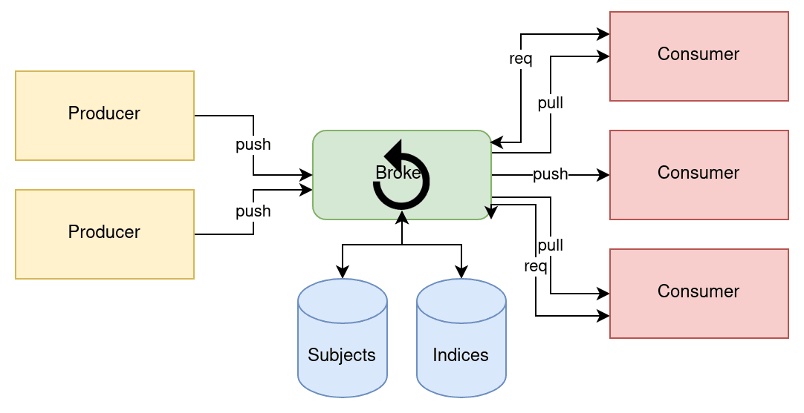

# NATS


---

Connective Technology for Adaptive Edge & Distributed Systems

---

## NATS

* message-oriented middleware (MOM)
* naprogramováno v Go
* nepersistentní/persistentní zprávy

---

## Ekosystém NATSu

* server
    - NATS core
    - NATS JetStream
    - security model
* rozhraní pro klienty
* NATS Connector Framework

---

## Komunikační strategie

* publish-subscribe
* push-pull
* request-reply
    - point to point
    - one to many
* streaming

---

## Publish-subscribe

* producenti zpráv
    - publishers, producers
* konzumenti zpráv
    - subscribers
* konzumenti se mohou kdykoli přihlásit a odhlásit
* producenti zpráv jsou zcela nezávislí na konzumentech
* (obecně platí, že zprávy nejsou persistentní)

---


---

## Mapování 1:1 až M:N

* počet producentů není nijak omezen
* ani počet konzumentů není nijak omezen

---


---

## Push-pull

* zprávy se posílají do fronty
* ta není persistentní!
* typicky se zprávy pošlou vždy jen jednomu konzumentu
* rozdělení práce

---


---

## Push-pull s příjmem stejných zpráv

* lze zvolit, že všichni konzumenti ze skupiny dostanou stejné zprávy
* a ideálně i ve stejném pořadí
* více front

---


---

## Poslání každé zprávy jen jednomu konzumentu

* round-robin

---


---

## Request-reply

* REQ-REP
* Server nebo více serverů(!)
* Libovolné množství klientů
* Server přijímá požadavky a odpovídá na ně
* Klienti mohou posílat požadavky více serverům
* Možnost využít fronty

---


---

## JetStream

* Persistence zpráv
* Konfigurovatelná retence
* Dva typy připojení konzumentů
* PUSH-PUSH
    - zprávy jsou posílány serverem
    - indexy zpráv jsou uloženy na serveru
* PUSH-PULL
    - konzumenti explicitně žádají o zprávy
* možnost "přehrání" starších zpráv

---


---



---

## NATS streaming

* persistence zpráv
* zaručení doručení zprávy
* omezení počtu čekajících zpráv
* možnost opětovného přehrání zpráv
    - zaručené pořadí

---

## Specifikace subjektu

* znak `*`
    - `orders.*.create`
    - `orders.*.cancel`
    - `orders.eu.sent`
    - `orders.jp.sent`
* znak `>`

---

## Další vlastnosti

* key-value databáze
    - může nahradit Redis
    - interně používá streaming
    - podpora retence
* databáze velkých objektů
    - varianta key-value databáze

---

## Komunikační protokol (1/3)

| Příkaz | Posílá |  Stručný popis |
|--------|--------|----------------|
| PING   |oba     | klasický systém ping-pong pro ověření, zda druhá strana (ještě) komunikuje |
| PONG   |oba     | odpověď na PONG |
| INFO   |server  | posláno klientovi po jeho připojení k serveru |
| CONNECT|klient  | žádost o připojení se specifikací jeho parametrů |

---

## Komunikační protokol (2/3)

| Příkaz | Posílá |  Stručný popis |
|--------|--------|----------------|
| PUB    |klient  | publikace zprávy klientem  |
| HPUB   |klient  | publikace zprávy klientem (+ hlavičky) |
| SUB    |klient  | přihlášení klienta k odebírání určitého tématu |
| UNSUB  |klient  | odhlášení klienta od odebírání určitého tématu 


---

## Komunikační protokol (3/3)

| Příkaz | Posílá |  Stručný popis |
|--------|--------|----------------|
| MSG    |server  | poslání zprávy serverem odebírateli |
| HMSG   |server  | poslání zprávy serverem odebírateli (+ hlavičky) |
| +OK    |server  | potvrzení zprávy či příkazu (+ je součástí příkazu) |
| -ERR   |server  | informace o tom, že poslaná zpráva nebo příkaz nemá správný formát (- je opět součástí příkazu) |

---

## Rozhraní pro klienty (1/2)

* Oficiálně podporované
* Neoficiálně podporované


---

## Rozhraní pro klienty (2/2)

* Zejména
    -  C
    -  C#
    -  Elixir
    -  Go
    -  Java
    -  Python (více možností)
    -  Ruby
    -  TypeScript

---

## Použité technologie

* Naprogramováno v Go
    - velmi rychlá inicializace
    - relativně malé paměťové nároky

---

## Praktická část

* Spuštění serveru
* CLI klient `nats`
* Klienti naprogramovaní v Pythonu

---

## Spuštění serveru

```
nats-server

nats-server --jetstream
```

---


## CLI klient `nats`

---

## Request-reply

```
nats reply subject "Hello from NUTS"
nats request subject "Budicek!"

nats reply subject "Prvni"
nats reply subject "Druhy"
nats request subject "Budicek!"

nats reply orders.*.cancel "cancel: ack"
nats request orders.eu.cancel "Order: 123"
```

---

## Publish-subscribe

```
nats sub subject
nats pub subject "foo"

nats sub subject --queue q1
nats pub subject "foo" --count=100 --sleep=1s

# demo: více publisherů i subscriberů
```

---

## Streams

```
nats stream ls

nats stream add
nats pub orders.x "foo"
```

---

## Konzumenti

```
ephemeral consumers
nats sub --stream test1
nats sub --stream test1 --new
nats sub --stream test1 --start-sequence=5

durable consumers
nats sub --stream test1 --durable d1
nats consumer ls
nats consumer info

pull consumers
nats consumer create
nats consumer next test1 c2
```

---

## Key-value databáze

```
nats kv ls
nats kv add mykv
nats kv put mykv klic hodnota
nats kv get mykv klic
nats kv watch mykv
```

---

## Databáze objektů

```
nats object ls

nats stream ls -a
```


---

## Klienti naprogramovaní v Pythonu

---

## Příklad číslo 1

* jednoduchý publisher a subscriber

---

```go
package main

import (
	"fmt"

	nats "github.com/nats-io/nats.go"
)

const Subject = "test1"

func main() {
	conn, _ := nats.Connect(nats.DefaultURL)
	fmt.Printf("Connected to %s\n", nats.DefaultURL)

	conn.Publish(Subject, []byte("Hello World"))
	fmt.Println("Message published")

	conn.Flush()
	fmt.Println("Done")
}
```

---

```go
package main

import (
	"fmt"
	"sync"

	nats "github.com/nats-io/nats.go"
)

const Subject = "test1"

func main() {
	conn, _ := nats.Connect(nats.DefaultURL)
	fmt.Printf("Connected to %s\n", nats.DefaultURL)

	wg := sync.WaitGroup{}
	wg.Add(1)

	conn.Subscribe(Subject, func(m *nats.Msg) {
		fmt.Printf("Received a message: %s\n", string(m.Data))
		wg.Done()
	})
	wg.Wait()
	fmt.Println("Finished waiting for message")
}
```

---

## Příklad číslo 2

* kontrola chyb v publisheru a subscriberu

---

```go
package main

import (
	"fmt"
	"log"

	nats "github.com/nats-io/nats.go"
)

const Subject = "test1"

func main() {
	conn, err := nats.Connect(nats.DefaultURL)
	if err != nil {
		log.Fatal(err)
	}

	defer conn.Close()
	fmt.Printf("Connected to %s\n", nats.DefaultURL)

	err2 := conn.Publish(Subject, []byte("Hello World"))
	if err2 != nil {
		log.Fatal(err2)
	}
	fmt.Println("Message published")

	conn.Flush()
	fmt.Println("Done")
}
```

---

```go
package main

import (
	"fmt"
	"log"
	"sync"

	nats "github.com/nats-io/nats.go"
)

const Subject = "test1"

func main() {
	conn, err := nats.Connect(nats.DefaultURL)

	if err != nil {
		log.Fatal(err)
	}

	defer conn.Close()
	fmt.Printf("Connected to %s\n", nats.DefaultURL)

	wg := sync.WaitGroup{}
	wg.Add(1)

	sub, err2 := conn.Subscribe(Subject, func(m *nats.Msg) {
		fmt.Printf("Received a message: %s\n", string(m.Data))
		wg.Done()
	})

	if err2 != nil {
		log.Fatal(err2)
	}

	fmt.Println("Subscribed", sub)

	wg.Wait()
	fmt.Println("Finished waiting for message")

	err3 := sub.Unsubscribe()
	if err3 != nil {
		log.Fatal(err3)
	}

	fmt.Println("Unsubscribed")
}
```

---

## Příklad číslo 3

* automatické odhlášení po přijetí N zpráv

---

```go
package main

import (
	"fmt"
	"log"

	nats "github.com/nats-io/nats.go"
)

const Subject = "test1"

func main() {
	conn, err := nats.Connect(nats.DefaultURL)
	if err != nil {
		log.Fatal(err)
	}

	defer conn.Close()
	fmt.Printf("Connected to %s\n", nats.DefaultURL)

	for i := 1; i < 10; i++ {
		message := fmt.Sprintf("Hello World #%d", i)
		err2 := conn.Publish(Subject, []byte(message))
		fmt.Println("Published", message)

		if err2 != nil {
			log.Fatal(err2)
		}

		conn.Flush()
	}

	fmt.Println("All messages sent")
}
```

---

```go
package main

import (
	"fmt"
	"log"
	"sync"

	nats "github.com/nats-io/nats.go"
)

const Subject = "test1"

func main() {
	conn, err := nats.Connect(nats.DefaultURL)

	if err != nil {
		log.Fatal(err)
	}

	defer conn.Close()
	fmt.Printf("Connected to %s\n", nats.DefaultURL)

	wg := sync.WaitGroup{}
	wg.Add(5)

	sub, err2 := conn.Subscribe(Subject, func(m *nats.Msg) {
		fmt.Printf("Received a message: %s\n", string(m.Data))
		wg.Done()
	})

	if err2 != nil {
		log.Fatal(err2)
	}

	fmt.Println("Subscribed", sub)

	err3 := sub.AutoUnsubscribe(5)

	if err3 != nil {
		log.Fatal(err3)
	}

	fmt.Println("Automatic unsubscribe after 5 messages")

	wg.Wait()

	fmt.Println("Finished waiting for messages")
}
```

---

## Streaming

* API se změnilo!

---

```python
# publisher
package main

import (
	"fmt"
	"log"

	"github.com/nats-io/nats.go"
)

const StreamName = "TEST"
const StreamSubjects = "TEST.*"

func main() {
	conn, _ := nats.Connect(nats.DefaultURL)
	fmt.Printf("Connected to %s\n", nats.DefaultURL)

	js, err := conn.JetStream(nats.PublishAsyncMaxPending(256))
	if err != nil {
		log.Fatal(err)
	}

	stream, err := js.StreamInfo(StreamName)

	if stream == nil {
		fmt.Printf("Creating stream: %s\n", StreamName)

		_, err = js.AddStream(&nats.StreamConfig{
			Name:     StreamName,
			Subjects: []string{StreamSubjects},
		})
		if err != nil {
			log.Fatal(err)
		}
	}

	_, err = js.Publish("TEST.xyz", []byte("foo bar baz"))
	if err != nil {
		log.Fatal(err)
	} else {
		fmt.Printf("Published")
	}
	conn.Close()

}

func CreateStream(jetStream nats.JetStreamContext) error {
	return nil
}
```

---

```python
# consumer
package main

import (
	"fmt"
	"log"

	"github.com/nats-io/nats.go"
)

func main() {
	conn, _ := nats.Connect(nats.DefaultURL)
	fmt.Printf("Connected to %s\n", nats.DefaultURL)

	js, err := conn.JetStream(nats.PublishAsyncMaxPending(256))
	if err != nil {
		log.Fatal(err)
	}

	_, err = js.Subscribe("TEST.xyz", func(m *nats.Msg) {
		err := m.Ack()

		if err != nil {
			log.Println("Unable to Ack", err)
			return
		}

		message := string(m.Data)
		if err != nil {
			log.Fatal(err)
		}

		fmt.Printf("Consumed %s\n", message)
	})

	if err != nil {
		log.Println("Subscribe failed")
		return
	}
	conn.Close()
}
```

---

## Děkuji za pozornost!

